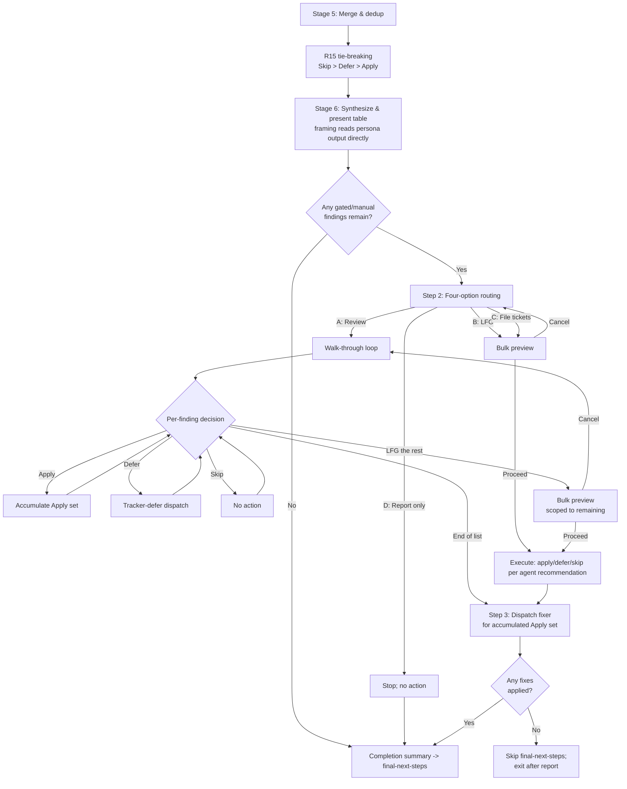

# feat: Add interactive judgment loop to ce:review

## Overview

Redesign `ce:review`'s Interactive mode post-review flow. The current single bucket-level policy question (Review and approve specific gated fixes / Leave as residual work / Report only) gets replaced with a four-option routing question (**Review** walk-through / **LFG** / **File** tickets / **Report** only). The Review path walks findings one at a time with plain-English framing and per-finding actions (Apply / Defer / Skip / LFG the rest). The LFG, File-tickets, and LFG-the-rest paths show a compact plan preview (Proceed / Cancel) before executing. Defer actions file tickets in the project's tracker (reasoning-based detection with GitHub Issues or harness task primitive as fallback).

A small framing-guidance upgrade to the shared reviewer subagent template ensures every user-facing surface — the walk-through, bulk preview, and ticket bodies — explains findings in plain English, observable behavior first, not code structure. The upgrade applies universally across all 16+ persona agents via a single file change, fixing both the null-`why_it_matters` schema violations observed in adversarial and api-contract and the code-structure-first framing observed in correctness and maintainability.

All other `ce:review` modes (Autofix, Report-only, Headless) and the existing merge/dedup pipeline, persona dispatch, and safe_auto fixer flow remain unchanged.

## Problem Frame

Today's Interactive mode mostly degrades into rubber-stamping or wholesale deferral:

1. **Judgment calls are hard to make.** When a finding needs human judgment, today's pipe-delimited table row rarely gives enough context to decide confidently. The user is asked to approve or defer a bucket of findings they haven't individually understood.
2. **High-volume feedback is unreason-able.** A review with 8-12 findings turns into a scrolling table. There's no way to respond to individual items meaningfully — only to "approve the whole bucket" or "defer the whole bucket."

The result: the `gated_auto` / `manual` routing tiers exist in the schema but are never actually exercised per-finding in practice. See origin document for the full problem frame.

## Requirements Trace

### Routing after `safe_auto` fixes

- R1. Four-option routing question replaces today's bucket-level policy question *(see origin)*
- R2. Zero-findings path skips the routing question and shows a completion summary
- R3. Routing question names the detected tracker inline only when detection is high-confidence
- R4. Four options: `Review each finding one by one...`, `LFG. Apply the agent's best-judgment action per finding`, `File a [TRACKER] ticket per finding...`, `Report only...`
- R5. Routing option C is a batch-defer shortcut — distinct from the walk-through's per-finding Defer

### Per-finding walk-through

- R6. Walk-through presents findings one at a time in severity order with a position indicator
- R7. Per-finding question content: plain-English problem, severity, confidence, proposed fix, reasoning
- R8. Per-finding options: Apply / Defer / Skip / LFG the rest
- R9. Advisory-only findings substitute `Acknowledge — mark as reviewed` for option A
- R10. Override = pick a different preset action; no inline freeform custom fixes
- N=1 adaptation: walk-through wording adapts and `LFG the rest` is suppressed

### LFG path

- R11. LFG applies the per-finding action the agent would recommend; top-level scope vs. walk-through D scope distinction
- R12. Single completion report with required fields after any LFG execution

### Bulk action preview

- R13. Compact preview with `Proceed` / `Cancel` before every bulk action (LFG, File tickets, LFG the rest)
- R14. Preview content grouped by intended action; one line per finding in compressed framing-quality form

### Recommendation tie-breaking

- R15. When reviewers disagree on per-finding action, synthesis picks the most conservative using `Skip > Defer > Apply`

### Defer behavior and tracker detection

- R16-R21. Defer files tickets in project's tracker; minimal reasoning-based detection; fallback to GitHub Issues then harness task primitive; failure surfaces inline; no-sink omits Defer entirely; internal `.context/` todo system explicitly out of fallback chain

### Framing quality (cross-cutting)

- R22-R26. All user-facing finding surfaces (walk-through questions, LFG completion reports, ticket bodies, bulk-preview lines) explain in plain English, observable-behavior-first, tight 2-4 sentences. Planning resolves: delivered by a small framing-guidance upgrade to the shared reviewer subagent template (Unit 2), applied once at the source rather than rewritten downstream. Per-persona file edits beyond the shared template are deferred as follow-up.

### Mode boundaries

- R27. Only Interactive mode changes behavior. Autofix / Report-only / Headless unchanged
- R28. Final-next-steps flow (push / PR / exit) runs only when one or more fixes landed in the working tree

## Scope Boundaries

- No new `ce:fix` skill. All changes live inside `ce:review`.
- No changes to the findings schema, merge/dedup routing beyond the recommended-action tie-breaking in R15, or autofix-mode residual-todo creation.
- Small framing-guidance updates to the shared reviewer subagent template are in scope (see Unit 2). Per-persona file edits are out of scope for v1 — the shared-template change affects all personas at once, which is deliberately the "small upgrade" chosen over a synthesis-time rewrite pass.
- No inline freeform fix authoring in the walk-through — the walk-through is a decision loop, not a pair-programming surface.
- The "approve intent, write a variant" case is unsupported in v1; user picks Skip and hand-edits.
- No changes to Autofix, Report-only, or Headless mode behavior.
- The pre-menu findings table format (pipe-delimited, severity-grouped) stays unchanged.
- The current bucket-level policy question wording is removed entirely — no backward-compatibility shim.

### Deferred to Separate Tasks

- **Per-persona file edits beyond the shared template:** deferred. Unit 2 updates the shared subagent template to add R22-R25 framing guidance, which applies universally to all personas. If post-ship sampling shows specific personas still produce weak framing, targeted per-persona file upgrades land as follow-up.
- **Phasing out the internal `.context/compound-engineering/todos/` todo system and the `/todo-create`, `/todo-triage`, `/todo-resolve` skills:** long-term direction acknowledged in origin. Separate cleanup.
- **Script-first architecture for the tracker defer dispatch and bulk preview rendering:** considered during planning. Deferred to v2 — current ce:review is entirely prose-based orchestration; adding new scripts expands redesign footprint and cross-language test surface. Re-evaluate after usage data.

## Context & Research

### Relevant Code and Patterns

**Current `ce:review` structure to modify:**
- `plugins/compound-engineering/skills/ce-review/SKILL.md` — single orchestrator, 744 lines. After Review section at lines 603-715 is the primary edit target.
- Current bucket policy question at `plugins/compound-engineering/skills/ce-review/SKILL.md:615-640`. The stem violates AGENTS.md third-person rule ("What should I do...") — the redesign fixes this.
- Stage 5 merge pipeline at `plugins/compound-engineering/skills/ce-review/SKILL.md:451-479`. Existing "most conservative route" rule at line 471 is extended for R15.
- Headless detail-tier enrichment at `plugins/compound-engineering/skills/ce-review/SKILL.md:568-572`. The walk-through reuses this exact matching rule verbatim.
- Safe_auto fixer dispatch at `plugins/compound-engineering/skills/ce-review/SKILL.md:664-671` ("Spawn exactly one fixer subagent..."). The walk-through's Apply actions accumulate and dispatch at the end of the walk-through to preserve this "one fixer, consistent tree" guarantee.
- Findings schema at `plugins/compound-engineering/skills/ce-review/references/findings-schema.json`. No schema changes; R15 tie-breaking operates on existing fields.

**Patterns to mirror:**
- Four-option menu format: `plugins/compound-engineering/skills/ce-ideate/references/post-ideation-workflow.md:137-150`. Front-loaded distinguishing words, self-contained labels, third-person agent voice.
- Per-item walk-through with progress header: `plugins/compound-engineering/skills/todo-triage/SKILL.md:20-29`. Uses numbered chat prompts; the ce:review walk-through must upgrade to `AskUserQuestion`.
- Per-agent review loop with Accept / Reject / Discuss: `plugins/compound-engineering/skills/ce-plan/references/deepening-workflow.md:195-216`.
- Pipe-delimited findings table rhythm for the pre-menu: `plugins/compound-engineering/skills/ce-review/references/review-output-template.md`.

**AGENTS.md rules that materially shape this plan:**
- `plugins/compound-engineering/AGENTS.md:122-134` — Interactive Question Tool Design (4-option cap; self-contained labels; third-person agent voice; front-loaded distinguishing words; target-named when ambiguous)
- `plugins/compound-engineering/AGENTS.md:117-119` — Cross-platform question tool phrasing. Every new question uses "the platform's blocking question tool (`AskUserQuestion` in Claude Code, `request_user_input` in Codex, `ask_user` in Gemini)" plus a fallback path.
- `plugins/compound-engineering/AGENTS.md:109-114` — Rationale discipline. Extract the walk-through, bulk preview, and tracker defer flows to `references/` because they are conditional (Interactive mode only) and would otherwise add ~200 lines to every invocation.
- `plugins/compound-engineering/AGENTS.md:155-165` — Platform-specific variables in skills. The walk-through state file path is pre-resolved from the existing run-id pattern.

### Institutional Learnings

- `docs/solutions/skill-design/compound-refresh-skill-improvements.md` — Phrase interactive-question-tool references as platform-agnostic ("`AskUserQuestion` in Claude Code, `request_user_input` in Codex") with explicit "stop to wait for the answer" language. Gate new interactive surfaces on explicit `mode:interactive` (the existing default), never on "no question tool = headless" auto-detection.
- `docs/solutions/skill-design/beta-promotion-orchestration-contract.md` — Mode contracts are load-bearing. `tests/review-skill-contract.test.ts` asserts the ce:review mode surface; any behavior change must ship the contract test update in the same PR.
- `docs/solutions/workflow/todo-status-lifecycle.md` — Apply outcomes in Interactive mode must continue routing through the existing `ready` todo pipeline (preserving the `downstream-resolver` contract). Defer routes to the new tracker path. Skip produces no downstream artifact. Do not invent a new `pending`-producing path.
- `docs/solutions/skill-design/git-workflow-skills-need-explicit-state-machines-2026-03-27.md` — Stateful per-item walkthroughs need explicit transitions. The walk-through's "no more findings" and "LFG the rest" are distinct terminal transitions; encode each explicitly rather than collapsing.
- `docs/solutions/best-practices/codex-delegation-best-practices-2026-04-01.md` — Skill body size is a multiplicative cost driver. Move Interactive-mode detail to `references/` because it runs on a minority of invocations.
- `docs/solutions/skill-design/pass-paths-not-content-to-subagents-2026-03-26.md` — If Defer invokes a sub-agent for ticket composition, pass paths (to merged findings artifact) rather than content. Also: "per-item walk" phrasing can cause 7x tool-call amplification in Claude Code vs. "bulk find, then filter" phrasing — the walk-through spec iterates over merged findings in memory, not by re-scanning per finding.

### External References

None used. Local patterns are strong; no framework/security/compliance unknowns.

## Key Technical Decisions

- **Extract walk-through, bulk preview, and tracker defer to `references/` files.** SKILL.md is already 744 lines; these three surfaces are conditional (Interactive mode, when gated/manual findings remain) and would inflate the body by ~200 lines paid on every invocation. Respects `plugins/compound-engineering/AGENTS.md:109-114`.

- **R15 tie-breaking extends the existing Stage 5 "most conservative route" rule.** The rule at `SKILL.md:471` already does this for `autofix_class` / `owner`. R15 adds the same discipline for the recommended *action* (Apply / Defer / Skip), using order `Skip > Defer > Apply`. Same Stage 5 sub-step, same philosophy — no new architectural seam.

- **R22-R25 framing quality is delivered by a small framing-guidance upgrade in the shared reviewer subagent template, not a synthesis-time rewrite pass.** Planning-phase sampling of 15+ recent review artifacts across 5 personas showed two distinct gaps:
  1. *Consistency gap:* `adversarial-reviewer` and `api-contract-reviewer` produced `why_it_matters: null` on every finding in at least one recent run (schema violation — field is required).
  2. *Quality gap:* `correctness-reviewer` and `maintainability-reviewer` populate `why_it_matters` but lead with code-structure-first framing; observable-behavior-first (R23) failed in roughly 5 of 7 sampled findings.

  Considered options: (a) synthesis-time rewrite pass (new Stage 5b with per-finding model dispatch) — rejected as over-engineered for the gap, adds recurring per-review cost, and papers over a schema violation rather than fixing it; (b) per-persona file upgrades across 5 personas — rejected as scope inflation for v1; (c) shared-template upgrade — chosen. One file change (the persona subagent template) adds framing guidance that every dispatched persona receives, fixing both gaps at the source with bounded scope. If post-ship sampling shows specific personas still fail, targeted per-persona edits land as follow-up.

- **Apply actions in the walk-through accumulate and dispatch at the end.** The walk-through collects Apply decisions in memory, and after the loop exits, dispatches one fixer subagent for the full accumulated set. Trade-off the user experiences: a fix failure surfaces at the end of the walk-through, not at the decision moment. The alternative — per-finding fixer dispatch — costs per-finding fixer overhead, spawns racey mid-walk-through processes, and complicates the user model (when is the Apply "real"?). The unified end-of-walk-through dispatch also means the fixer sees the whole set at once and can handle inter-fix dependencies (two Applies touching overlapping regions) in one pass rather than sequentially. The existing Step 3 fixer prompt needs a small update to acknowledge the heterogeneous queue (gated_auto + manual mix, not just safe_auto); tracked in Unit 3.

- **Tracker detection stays reasoning-based per R14 / R17.** No enumerated checklist of files. Agent reads `CLAUDE.md` / `AGENTS.md` and whatever else it judges relevant. When evidence is ambiguous, the label is generic ("File an issue per finding") and the agent confirms the tracker with the user before executing any Defer. GitHub Issues is the only concrete fallback named by the spec; the harness task primitive is a last-resort with a clear durability warning.

- **Prose-based v1, not script-first.** Deterministic logic (preview rendering, tracker dispatch) is a script-first candidate per `docs/solutions/skill-design/script-first-skill-architecture.md`. Deferred to v2 — current ce:review is entirely prose-based orchestration; adding two new scripts expands the redesign footprint and introduces cross-language test surface. Revisit after usage data.

- **Walk-through state is in-memory only, not persisted per-decision.** The walk-through accumulates Apply / Defer / Skip / Acknowledge decisions in orchestrator memory. Formal cross-session resumption is out of scope; an interrupted walk-through simply loses its in-flight state (prior Applies have not been dispatched yet since they batch at the end). Avoids the complexity of state-file schema design, external-edit staleness detection, and `.context/` lifecycle management — all for a feature (inspectable partial state) that has no consumer.

- **Tracker-availability probes run at most once per session, cached for the rest of the run.** When the routing question needs to decide whether to offer option C with a tracker name, a single probe sequence runs (e.g., read `CLAUDE.md` / `AGENTS.md`, then `gh auth status` if relevant, then any MCP-tracker availability checks). The `{ tracker_name, confidence, sink_available }` tuple is cached; subsequent Defer actions in the same session reuse it without re-probing. Probes fire only when the routing question is about to be asked — never speculatively at the start of a review.

- **Third-person voice in all new question stems and labels.** The current bucket question's stem ("What should I do...") violates `plugins/compound-engineering/AGENTS.md:127`. The redesign fixes this for the new surfaces — "What should the agent do next?" style.

## Open Questions

### Resolved During Planning

- **Do reviewer personas reliably produce framing-quality `why_it_matters` today?** No, with two distinct failure modes: (a) `adversarial` and `api-contract` produced `why_it_matters: null` on every finding in one recent run (schema violation); (b) `correctness` and `maintainability` populate the field but 5 of 7 sampled findings lead with code structure instead of observable behavior. Resolution: a small framing-guidance upgrade to the shared reviewer subagent template (Unit 2) addresses both gaps at the source — single file change, universal effect across all personas. Fixes the schema-violation bug inline; no separate deferred item needed.
- **Apply in walk-through: per-finding or batched?** Batched at end of walk-through. User experience: fix results surface at the end. Also gives the fixer the whole Apply set at once for dependency-aware application. The existing Step 3 fixer prompt needs a small update to acknowledge the heterogeneous queue (tracked in Unit 3).
- **Script-first for tracker dispatch and preview?** Deferred to v2. Prose-based for this work to match existing ce:review shape.
- **Where does R15 tie-breaking land in the pipeline?** In Stage 5 merge as an extension of the existing conservative-route rule, immediately after the current step 7 ("Normalize routing").
- **Extract new logic to `references/`?** Yes — three new reference files (walk-through, bulk preview, tracker defer).

### Deferred to Implementation

- **Exact `AskUserQuestion` label wording for `LFG the rest` and related bail-out moments.** Requirements pin semantics ("LFG the rest — apply the agent's best judgment to this and remaining findings"), but harness-specific label truncation behavior may require minor phrasing tweaks during authoring. Validate against each target platform during implementation.
- **Exact framing-guidance prose for the subagent template (Unit 2).** The block must be tight (add a paragraph or two, not pages), include a positive/negative example pair, and reinforce the required-field constraint. Word during implementation against recent artifacts.
- **GitHub Issues availability check command.** Left to the agent's reasoning at runtime per R14 / R17 (e.g., `gh auth status` + `gh repo view --json hasIssuesEnabled`, or cheaper signal). Not pre-specified.
- **Fixer subagent prompt updates for heterogeneous Apply queue.** Today's Step 3 fixer prompt was scoped to the safe_auto queue. The walk-through's Apply set may contain gated_auto or manual findings whose suggested_fix needs the same execution care. Prompt iteration during Unit 3 authoring; may become its own small prompt edit inside ce-review SKILL.md.
- **Whether reviewer-name attribution survives in per-finding questions.** Origin document defers this as a validation question. Keep in for v1 implementation and validate via usage after shipping.

## High-Level Technical Design

> *This illustrates the intended flow and is directional guidance for review, not implementation specification.*



The diagram shows the conceptual flow; exact prose sub-steps and `references/` delegation land in the implementation units below.

## Implementation Units

- [ ] **Unit 1: Add recommended-action tie-breaking to Stage 5 merge**

**Goal:** Extend the existing Stage 5 "most conservative route" rule to resolve conflicting per-finding recommendations (Apply / Defer / Skip) into a single deterministic value per merged finding, so LFG and walk-through Apply/Defer/Skip decisions are auditable.

**Requirements:** R15

**Dependencies:** None

**Files:**
- Modify: `plugins/compound-engineering/skills/ce-review/SKILL.md` (Stage 5, after existing step 7)
- Test: `tests/review-skill-contract.test.ts` — add assertion that the Stage 5 prose mentions the tie-breaking rule and the order `Skip > Defer > Apply`

**Approach:**
- Add a new sub-step (e.g., "7b. Recommended-action tie-breaking") immediately after the existing "Normalize routing" step at `SKILL.md:471`
- State the rule verbatim: when merged findings carry conflicting recommendations, pick the most conservative using `Skip > Defer > Apply`
- Reference the existing same-philosophy rule for `autofix_class` so the extension reads as continuation, not novelty

**Patterns to follow:**
- Existing conservative-route prose at `plugins/compound-engineering/skills/ce-review/SKILL.md:98` and `:471`
- The schema's `_meta.return_tiers` structure for what the merged finding carries

**Test scenarios:**
- *Happy path:* reviewer A recommends Apply and reviewer B recommends Defer on a merged finding -> merged recommendation is Defer
- *Happy path:* reviewer A Defer and reviewer B Skip -> merged recommendation is Skip
- *Happy path:* all contributing reviewers recommend Apply -> merged recommendation is Apply
- *Edge case:* single reviewer (no merge happened) -> that reviewer's recommendation passes through unchanged
- *Edge case:* a finding with only `autofix_class: advisory` carries no apply/defer/skip recommendation — the tie-breaking rule is a no-op (not an error)

**Verification:**
- The SKILL.md Stage 5 section names the rule and the order.
- `bun test tests/review-skill-contract.test.ts` passes.

---

- [ ] **Unit 2: Upgrade shared reviewer subagent template with R22-R25 framing guidance**

**Goal:** Add framing guidance for the `why_it_matters` field to the shared reviewer subagent template so all persona agents produce observable-behavior-first framing (fixing the R23 gap observed in correctness and maintainability) and never emit null `why_it_matters` (fixing the schema violation observed in adversarial and api-contract). One file change, universal effect across all 16+ persona agents.

**Requirements:** R22, R23, R24, R25, R26

**Dependencies:** None (can author in parallel with Unit 1)

**Files:**
- Modify: `plugins/compound-engineering/skills/ce-review/references/subagent-template.md` — add a dedicated framing-guidance block for the `why_it_matters` field
- Test: `tests/review-skill-contract.test.ts` — add assertions on the presence of the framing-guidance block and its key constraints

**Approach:**
- Current subagent template already instructs personas to return JSON per schema, but offers no guidance on *how* to write `why_it_matters` beyond the schema's one-line description ("Impact and failure mode -- not 'what is wrong' but 'what breaks'").
- Add a new `why_it_matters` guidance block to the template that the orchestrator dispatches verbatim to every persona. Content:
  - Lead with the observable behavior (what a user, attacker, or operator sees) — not the code structure. Function and variable names appear only when the reader needs them to locate the issue.
  - Explain *why* the recommended fix works, not just what it changes. When a similar pattern exists elsewhere in the codebase, reference it so the recommendation is grounded.
  - Tight: approximately 2-4 sentences plus the minimum code needed to ground it. Longer is a regression.
  - `why_it_matters` is required by the schema. Empty, null, or single-phrase entries are validation failures — always produce substantive content grounded in the evidence the reviewer collected.
- Include a positive/negative example pair so personas have a concrete calibration anchor.
- Because the shared template is loaded verbatim by every dispatched persona, this change fixes both gaps at the source for every reviewer in one edit — no per-persona file editing.

**Patterns to follow:**
- The existing structure of `plugins/compound-engineering/skills/ce-review/references/subagent-template.md` (the canonical template all personas receive via the dispatch path at `plugins/compound-engineering/skills/ce-review/SKILL.md:405-445`).
- The illustrative framing pair from `docs/brainstorms/2026-04-17-ce-review-interactive-judgment-requirements.md` (R22-R25 section). Reuse verbatim or paraphrase tightly.

**Test scenarios:**
- *Template structure:* the subagent template contains a dedicated section instructing personas on `why_it_matters` framing (observable-behavior-first, 2-4 sentences, grounded in evidence, required field).
- *Template example:* the template includes a positive/negative framing example pair.
- *Integration (post-merge sampling):* after the template change lands, sample one fresh review artifact from each of correctness, maintainability, adversarial, api-contract, security, reliability. Verify `why_it_matters` is populated (never null) and leads with observable behavior in the majority of cases.
- *Edge case:* a persona still produces weak framing on some subset of findings — not a regression of this unit; tracked as a per-persona follow-up.

**Verification:**
- The subagent template contains the framing-guidance block, the required-field reminder, and an example pair.
- A fresh review run's artifact files show populated `why_it_matters` for every finding (no null values).
- Spot-check the first sentence of `why_it_matters` across 5+ fresh findings: each leads with observable behavior, not code structure.

---

- [ ] **Unit 3: Author per-finding walk-through**

**Goal:** The `Review each finding one by one` path — present findings one at a time with the required per-finding content (R7), options (R8-R10), advisory variant (R9), mode+position indicator (R6), N=1 adaptation, R15 conflict surfacing, and no-sink handling. Hand off Apply decisions as a batch to the existing fixer subagent at end of loop. Implements R6-R12 (walk-through scope).

**Requirements:** R6, R7, R8, R9, R10, R11 (walk-through scope of LFG), R12 (completion report for the walk-through's Apply / Defer / Skip decisions)

**Dependencies:** Unit 2 (walk-through display reads persona-produced `why_it_matters` directly; the upgraded template ensures that content is R22-R25-quality)

**Files:**
- Create: `plugins/compound-engineering/skills/ce-review/references/walkthrough.md`
- Modify: `plugins/compound-engineering/skills/ce-review/SKILL.md` — add a sub-step under After Review Step 2 (e.g., Step 2c) that delegates to the reference
- Test: `tests/review-skill-contract.test.ts` — assertions on the existence of `references/walkthrough.md` and on the four-option label set for per-finding questions

**Approach:**
- Walk-through iterates merged findings in severity order (P0 → P3), reading each finding's `why_it_matters` and evidence directly from the persona artifact (same lookup rule headless mode uses at `SKILL.md:568-572`). Unit 2's template upgrade ensures persona output meets the framing bar; no synthesis-time rewrite happens here.
- Each question uses the platform's blocking question tool (`AskUserQuestion` / `request_user_input` / `ask_user`) with:
  - Stem: opens with a mode+position indicator ("Review mode — Finding 3 of 8 (P1):"), then the persona-supplied plain-English problem and the proposed fix
  - When R15 tie-breaking narrowed a conflict across reviewers, the stem surfaces that context briefly (e.g., "Correctness recommends Apply; Testing recommends Skip. Agent's recommendation: Skip.") so the user sees the orchestrator's final call and the disagreement context at once. The orchestrator's recommendation is what's labeled "recommended" on the option set.
  - Four options (R8): `Apply the proposed fix` / `Defer — file a [TRACKER] ticket` / `Skip — don't apply, don't track` / `LFG the rest — apply the agent's best judgment to this and remaining findings`
  - For advisory-only findings: option A becomes `Acknowledge — mark as reviewed` (R9). Remaining options unchanged.
- Per-finding routing:
  - Apply -> accumulate the finding id into an in-memory Apply set; advance
  - Defer -> invoke the tracker-defer flow (see Unit 5); on success record the tracker URL; on failure present Retry / Fall back / Convert-to-Skip. The walk-through position indicator stays on the current finding during this sub-flow.
  - Skip -> record Skip; advance
  - Acknowledge -> record Acknowledge; advance (advisory-only path)
  - LFG the rest -> exit the walk-through loop; dispatch the bulk preview (Unit 4) scoped to remaining findings, with already-decided count inline. If the preview's Cancel is picked, return the user to the current finding's per-finding question (not to the routing question).
- Walk-through state is in-memory only (not written to disk). An interrupted walk-through discards in-flight decisions; prior Applies have not been dispatched yet because Apply accumulates for end-of-walk-through batch dispatch.
- After the walk-through loop terminates (all findings decided, or user took LFG-the-rest Proceed, or all decisions were non-Apply), the unit hands off to the end-of-walk-through dispatch: one fixer subagent receives the accumulated Apply set; Defer set has already executed inline; Skip / Acknowledge no-op. The existing Step 3 fixer subagent prompt needs a small update acknowledging the queue is heterogeneous (gated_auto + manual mix, not just safe_auto) — tracked in this unit's approach even though the prompt lives outside this plan's edit surface today.
- N=1 adaptation: when exactly one gated/manual finding remains, the header wording is "Review the finding" rather than "Review each finding one by one"; `LFG the rest` is omitted from the option set (three options).
- No-sink adaptation: when Unit 5's detection returns `sink_available: false`, option B ("Defer — file a ticket") is omitted from the per-finding question. The stem tells the user why ("Defer unavailable on this platform — no tracker or task-tracking primitive detected.").
- Override clarification (R10): picking Defer or Skip instead of Apply is "override"; no inline freeform fix authoring; users who want a variant Skip and hand-edit.

**Completion report (shared with Unit 4 per T5):** when the walk-through terminates — or any bulk action (LFG / File tickets / LFG the rest) finishes executing, or the zero-findings path runs — emit one unified completion report per R12's minimum fields: per-finding entries (title, severity, action taken, tracker URL for Deferred, one-line reason for Skipped), summary counts by action, explicit failure callouts, and the existing end-of-review verdict. The report structure is identical across paths; only the data differs.

**Execution note:** The walk-through is operationally read-only except for two permitted writes — the in-memory Apply-set accumulator, and the tracker-defer dispatch (Unit 5). Persona agents remain strictly read-only.

**Patterns to follow:**
- `plugins/compound-engineering/skills/todo-triage/SKILL.md:20-29` — per-item prompt and progress header (model upgrade: use `AskUserQuestion` instead of numbered chat options)
- `plugins/compound-engineering/skills/ce-review/SKILL.md:568-572` — artifact lookup for persona-produced `why_it_matters` and evidence
- `plugins/compound-engineering/skills/ce-plan/references/deepening-workflow.md:195-216` — per-agent loop with third-person agent voice
- `plugins/compound-engineering/skills/ce-review/references/review-output-template.md` — severity-grouped rhythm (for consistency with the table preceding the menu)

**Test scenarios:**
- *Happy path:* 3-finding review, user picks Apply / Defer / Skip one per finding -> walk-through completes; end-of-walk-through fixer dispatch receives a 1-element Apply set; one Linear ticket was filed; completion report shows 1 applied / 1 deferred with URL / 1 skipped
- *Happy path N=1:* 1-finding review, question wording adapts and `LFG the rest` is suppressed (three options)
- *Advisory variant:* advisory-only finding -> option A reads `Acknowledge — mark as reviewed`
- *LFG the rest:* at finding 2 of 5, user picks LFG the rest -> walk-through exits, bulk preview is invoked scoped to findings 2-5 with "1 already decided" note; Cancel from the preview returns the user to finding 2, not to the routing question
- *Override:* user picks Skip on a finding with a concrete proposed fix -> walk-through records Skip (not Apply)
- *R15 conflict surface:* a finding where reviewers recommended different actions -> walk-through stem surfaces the conflict and the orchestrator's final recommendation; user picks the orchestrator's recommendation and moves on
- *Defer failure mid-walk-through:* user picks Defer on finding 3 of 5; `gh issue create` returns 403; Retry / Fall back / Convert-to-Skip sub-question appears; user picks Convert-to-Skip; position indicator stays at 3 of 5; completion report's failure callout names the finding and reason
- *Edge case (interruption):* user cancels the AskUserQuestion mid-walk-through -> prior in-memory Apply/Defer/Skip decisions are lost; any Defers that already executed remain in the tracker (they were external side effects); Skip/Acknowledge/Apply-pending states are discarded; no end-of-walk-through fixer dispatch runs
- *No-sink:* detection returns `sink_available: false` -> per-finding question shows three options (no Defer); stem explains why
- *Integration:* a walk-through Apply action adds the finding to the Apply set; after walk-through completes, Step 3's fixer subagent receives the accumulated set with a prompt update noting the heterogeneous queue

**Verification:**
- Running `ce:review` interactive on a 3+-finding fixture yields a walk-through where each question shows mode+position + framing + options correctly.
- The end-of-walk-through fixer dispatch runs once with all Apply decisions; no per-finding fixer calls during the loop.
- The unified completion report is emitted on every terminal path (walk-through complete, LFG-rest Proceed, LFG-rest Cancel followed by user picking Stop).

---

- [ ] **Unit 4: Author bulk action preview**

**Goal:** The compact plan preview shown before every bulk action (top-level LFG, top-level File tickets, and walk-through `LFG the rest`). Implements R13-R14 and the LFG half of R12 (the post-execution completion report is shared).

**Requirements:** R13, R14 (R12 completion report is shared with Unit 3 per T5)

**Dependencies:** Unit 2 (preview lines read persona-produced `why_it_matters` directly in compressed form; the upgraded subagent template ensures that content meets the framing bar)

**Files:**
- Create: `plugins/compound-engineering/skills/ce-review/references/bulk-preview.md`
- Modify: `plugins/compound-engineering/skills/ce-review/SKILL.md` — After Review Step 2 dispatches to this reference for options B and C; Unit 3's walk-through dispatches for `LFG the rest`
- Test: `tests/review-skill-contract.test.ts` — assert existence of the reference and that the preview contract uses exactly `Proceed` / `Cancel`

**Approach:**
- Preview renders findings grouped by the action the agent intends to take: `Applying (N):`, `Filing [TRACKER] tickets (N):`, `Skipping (N):`, `Acknowledging (N):`
- Each finding line: severity tag + file:line + compressed plain-English summary + action phrase. One line per finding, max ~80 columns
- Compressed framing follows R22-R25 spirit: observable behavior over code structure, no function/variable names unless needed to locate. Draw from the persona-produced `why_it_matters` (post-Unit 2 template upgrade) in condensed form; the preview line is essentially the first sentence of the finding's framing
- For `LFG the rest`: preview header reads "LFG plan — N remaining findings (K already decided)"; already-decided findings are not included in the preview
- Question: `AskUserQuestion` / `request_user_input` / `ask_user` with exactly two options:
  - `Proceed`
  - `Cancel — back to routing` (for top-level) or `Cancel — back to walk-through` (for LFG the rest)
- Cancel returns to the originating question without changing state
- Proceed dispatches the plan: Apply set -> Step 3 fixer; Defer set -> tracker-defer flow (Unit 5); Skip/Acknowledge -> no action; then flows to completion report

**Technical design:** *(directional)*

Preview layout:

```
LFG plan — 8 findings (tracker: Linear):

Applying (4):
  [P0] orders_controller.rb:42 — Add ownership guard before order lookup
  [P1] webhook_handler.rb:120 — Raise on unhandled error instead of swallowing
  [P2] user_serializer.rb:14 — Drop internal_id from serialized response
  [P3] string_utils.rb:8 — Rename ambiguous helper for clarity

Filing Linear tickets (2):
  [P2] billing_service.rb:230 — N+1 on refund batch (no concrete fix)
  [P2] session_helper.rb:12 — Session reset behavior needs discussion

Skipping (2):
  [P2] report_worker.rb:55 — Recommendation is speculative; low confidence
  [P3] readme.md:14 — Style preference, subjective

A) Proceed
B) Cancel
```

**Patterns to follow:**
- Compact tabular rhythm from `plugins/compound-engineering/skills/ce-review/references/review-output-template.md`
- Third-person labels and front-loaded distinguishing words per `plugins/compound-engineering/AGENTS.md:122-134`
- Conditional visual aid guidance from `docs/solutions/best-practices/conditional-visual-aids-in-generated-documents-2026-03-29.md`

**Test scenarios:**
- *Happy path (LFG, top-level):* 8 findings mixed across actions -> preview shows grouped buckets with correct counts; Proceed advances to dispatch; Cancel returns to routing
- *Happy path (File tickets, top-level):* every finding appears under `Filing [TRACKER] tickets (N):` regardless of the agent's natural recommendation, because option C is batch-defer
- *Happy path (LFG the rest):* walk-through has decided 3 findings; preview scopes to 5 remaining with "3 already decided" in header
- *Edge case:* zero findings in a bucket -> that bucket header is omitted from the preview (no empty `Skipping (0):` line)
- *Edge case:* all findings map to a single bucket -> preview still shows the bucket header; Proceed/Cancel still offered
- *Advisory preview:* for advisory-only findings appearing under `Acknowledging (N):`, the action phrase is "Mark as reviewed"
- *Cross-platform:* when the platform has no blocking question tool, preview falls back to numbered options and waits for user input

**Verification:**
- Three call sites (Step 2 option B, Step 2 option C, walk-through `LFG the rest`) render the preview correctly.
- Cancel returns to the originating question; Proceed executes the plan.
- Preview lines all meet the compressed framing bar.

---

- [ ] **Unit 5: Author tracker detection and defer execution**

**Goal:** Tracker detection, fallback chain, ticket body composition, failure path, and the no-sink case. Implements R16-R21 and R3's tracker-name-inline-when-confident rule.

**Requirements:** R3 (partial — tracker naming), R13 (partial — tracker name in preview), R16, R17, R18, R19, R20, R21

**Dependencies:** None (can be authored in parallel with Units 3 and 4)

**Files:**
- Create: `plugins/compound-engineering/skills/ce-review/references/tracker-defer.md`
- Modify: `plugins/compound-engineering/skills/ce-review/SKILL.md` — After Review Step 2 references this file for tracker-name-in-label logic and for Defer execution
- Test: `tests/review-skill-contract.test.ts` — assertions on reference existence and on R21's "internal `.context/` todos out of fallback chain" being explicit in the prose

**Approach:**
- **Detection (reasoning-based per R14 / R17):** Agent reads project documentation — primarily `CLAUDE.md` / `AGENTS.md` — and determines the tracker from whatever evidence is obvious. No enumerated checklist. A tracker can be surfaced via MCP tool (e.g., Linear MCP), CLI (e.g., `gh`), or direct API — all are acceptable. When the tracker is named explicitly (e.g., "issues go in Linear", a Linear URL, a project board link), confidence is high. When the signal is conflicting or absent, confidence is low.
- **Probe timing and caching (T3):** Availability probes (e.g., `gh auth status`, MCP-tracker reachability) run at most once per session and only when the routing question is about to be asked — not speculatively at review start, not per-Defer, not per-walk-through-finding. The resulting `{ tracker_name, confidence, sink_available }` tuple is held in orchestrator memory for the rest of the run. If a named tracker's availability is uncertain from documentation alone (tracker mentioned but no MCP/CLI invocation visible to the agent), the probe resolves the uncertainty once.
- **Label logic (R3):** If confidence is high AND the tracker's sink is available, the routing question and walk-through Defer label include the tracker name verbatim (e.g., `File a Linear ticket per finding`). If confidence is low or sink is uncertain, labels read generically (`File an issue per finding`) and the agent confirms the tracker with the user before executing any Defer.
- **Fallback chain (R18 principle-based):** Prefer durable external trackers over in-session-only primitives. Concrete fallbacks in order of preference: named tracker (MCP / CLI / API the agent can invoke) -> GitHub Issues via `gh` if authenticated and the repo has issues enabled -> the harness's task-tracking primitive (`TaskCreate` in Claude Code, `update_plan` in Codex) with an explicit durability notice to the user. Never fall back to `.context/compound-engineering/todos/` (R21 — explicit out-of-scope).
- **No-sink case (R20):** When no external tracker is detectable and no harness primitive is available (e.g., CI, converted targets without task binding), Defer is not offered as a menu option. Routing option C is omitted; walk-through option B is omitted; the agent tells the user why.
- **Ticket composition:** Title = merged finding's title. Body uses the persona-produced `why_it_matters` and evidence (read from the per-agent artifact via the same rule as headless enrichment at `SKILL.md:568-572`), plus severity, confidence, reviewer attribution, and finding_id. Labels include severity tag when the tracker supports labels.
- **Failure path (R19):** On ticket-creation failure, surface the error inline via a blocking question: `Retry` / `Fall back to next available sink` / `Convert to Skip (record the failure)`. The completion report captures the failure. When a high-confidence named tracker fails at execution, the session's cached `sink_available` for that tracker is invalidated so subsequent Defers in the same session fall through to the next tier rather than retrying a confirmed-broken sink.
- **Once-per-session confirmation:** When the fallback to harness task primitive is in effect, confirm once per session before the first Defer action: "No documented tracker and `gh` unavailable — will create in-session tasks that won't survive this session. Proceed for this and subsequent Defer actions?"

**Patterns to follow:**
- `plugins/compound-engineering/skills/report-bug-ce/SKILL.md:104-122` — only existing `gh issue create` usage; pattern for optional labels and fallback body
- `plugins/compound-engineering/skills/ce-debug/SKILL.md:40-42` — consuming tracker URLs (Linear / Jira) via MCP tools or URL fetching; the principle-based "try, fall back, ask" style transposed to write-path
- `plugins/compound-engineering/AGENTS.md:117-119` — cross-platform question phrasing for the failure-path follow-up and the harness-fallback confirmation
- `docs/solutions/integrations/cross-platform-model-field-normalization-2026-03-29.md` — per-tracker behavior matrix as a model for stating Linear / GitHub Issues / harness primitive / no-tracker behavior explicitly

**Test scenarios:**
- *Happy path, named tracker:* `CLAUDE.md` mentions "file bugs in Linear" -> routing label reads "File a Linear ticket per finding"; Defer dispatch creates a Linear ticket
- *Happy path, GitHub Issues fallback:* no tracker documented, `gh` authenticated and issues enabled -> Defer creates a GitHub issue; label reads "File an issue per finding"; agent confirms the tracker choice before executing
- *Happy path, harness fallback:* no tracker documented, `gh` unavailable -> once-per-session confirmation with durability warning; Defer calls `TaskCreate` / `update_plan` per platform
- *No-sink:* no tracker, no `gh`, no harness primitive -> routing option C is omitted; walk-through option B is omitted; the user is told why in the routing question's stem
- *Failure path:* `gh issue create` returns 403 -> inline `Retry / Fall back / Convert to Skip` question; completion report captures the failure
- *Label confidence:* `CLAUDE.md` says "bugs in Linear, features in GitHub Issues" -> ambiguous. Label is generic; agent confirms before dispatch
- *Integration:* persona-produced `why_it_matters` (post-Unit 2 template upgrade) is used in the ticket body; reviewer attribution and finding_id are included
- *Probe timing:* tracker probes do not fire for a review whose routing question is skipped (R2 zero-findings case) — the probe only runs when option C is a candidate to present
- *Edge case:* ticket body exceeds a tracker's max length -> truncate with "…(continued in ce-review run artifact: <path>)" and include the finding_id for reference

**Verification:**
- The reference file covers detection, label logic, fallback chain, failure path, no-sink, and harness-fallback confirmation in that order.
- Running Interactive mode against a repo with Linear documented produces a routing label naming Linear and creates a Linear-shaped ticket on Defer.

---

- [ ] **Unit 6: Restructure After Review Step 2 as four-option routing**

**Goal:** Replace the current bucket-level policy question with the four-option routing question that dispatches to the walk-through (Unit 3), bulk preview (Unit 4), or tracker-defer (Unit 5). Implements R1-R5 and R27 (mode boundary — only Interactive changes).

**Requirements:** R1, R2, R3, R4, R5, R27

**Dependencies:** Units 3, 4, 5 (routing dispatches to all three)

**Files:**
- Modify: `plugins/compound-engineering/skills/ce-review/SKILL.md` — After Review section (lines ~603-715); replace current Step 2 entirely
- Test: `tests/review-skill-contract.test.ts` — add assertions on the four-option set, stem voice, and tracker-name-conditional behavior; preserve existing assertions on Autofix / Report-only / Headless behavior

**Approach:**
- Rewrite the "Choose policy by mode" subsection for Interactive mode only. Autofix / Report-only / Headless prose is unchanged
- New Interactive mode flow:
  1. Apply `safe_auto -> review-fixer` findings automatically without asking (unchanged)
  2. **R2 zero-check:** If no `gated_auto` / `manual` findings remain after safe_auto, show a one-line completion summary ("All findings resolved — N safe_auto fixes applied.") and proceed to Step 5 (final-next-steps)
  3. **R3 tracker pre-detection:** Dispatch to the tracker detection logic from `references/tracker-defer.md`; receive a `{ tracker_name, confidence, sink_available }` tuple
  4. **R1 routing question** via the platform's blocking question tool with:
     - Stem (third-person, per AGENTS.md:127): "What should the agent do with the remaining N findings?"
     - Four options (R4) — only options with sinks are shown (R20):
       - (A) `Review each finding one by one — accept the recommendation or choose another action`
       - (B) `LFG. Apply the agent's best-judgment action per finding`
       - (C) `File a [TRACKER] ticket per finding without applying fixes` (label uses the concrete tracker name only when confidence is high; otherwise reads "File an issue per finding"; omitted entirely when `sink_available == false`)
       - (D) `Report only — take no further action`
  5. Dispatch on selection:
     - A -> `references/walkthrough.md`
     - B -> `references/bulk-preview.md` (LFG plan scoped to all gated/manual findings) -> on Proceed, execute Apply set via Step 3, Defer set via Unit 5, Skip/Acknowledge no-op
     - C -> `references/bulk-preview.md` (all findings under `Filing [TRACKER] tickets`) -> on Proceed, execute Defer set via Unit 5 for every finding; no fixes applied
     - D -> skip to Step 5 (final-next-steps) with no action
- Remove the current bucket policy question and its routing blocks entirely (no shim — origin document Scope Boundary "no backward-compatibility shim")

**Patterns to follow:**
- Four-option routing label patterns from `plugins/compound-engineering/skills/ce-ideate/references/post-ideation-workflow.md:137-150`
- Existing After Review mode-routing structure at `plugins/compound-engineering/skills/ce-review/SKILL.md:615-662` (replace the Interactive branch; leave Autofix / Report-only / Headless branches untouched)
- Cross-platform question phrasing at `plugins/compound-engineering/AGENTS.md:117-119`

**Test scenarios:**
- *Happy path:* a review with 5 gated/manual findings and Linear tracker detected -> routing question shows all four options, option C reads "File a Linear ticket per finding", stem is third-person
- *R2 zero-case:* all findings resolved by safe_auto -> routing question is skipped; completion summary is shown; Step 5 runs
- *R3 low-confidence tracker:* ambiguous documentation -> option C label is generic ("File an issue per finding"); agent confirms the tracker before Defer on option C selection
- *R20 no-sink:* no tracker, no gh, no harness primitive -> option C is omitted; three options presented instead of four
- *Option A:* walk-through is dispatched with all findings
- *Option B:* bulk preview is dispatched scoped to all findings; Proceed executes
- *Option C:* bulk preview is dispatched with all findings under the Filing bucket
- *Option D:* Step 5 runs with no action taken
- *Third-person voice:* stem uses "the agent" not "I" / "me"
- *Mode isolation (R27):* same fixture under `mode:autofix` / `mode:report-only` / `mode:headless` shows unchanged behavior

**Verification:**
- `bun test tests/review-skill-contract.test.ts` passes with new assertions.
- The After Review section no longer contains the old bucket policy question wording.
- Dispatch to `references/walkthrough.md`, `references/bulk-preview.md`, and `references/tracker-defer.md` is explicit.

---

- [ ] **Unit 7: Condition Step 5 final-next-steps on applied fixes**

**Goal:** The existing "final next steps" flow (push fixes / create PR / exit) only runs when at least one fix landed in the working tree. Skips for options C, D, and for LFG / walk-through completions with no Apply action. Implements R28.

**Requirements:** R28

**Dependencies:** Unit 6 (the routing flow must track whether any fix was applied)

**Files:**
- Modify: `plugins/compound-engineering/skills/ce-review/SKILL.md` — Step 5 (lines ~697-715)
- Test: `tests/review-skill-contract.test.ts` — assertions on the Step 5 gating prose

**Approach:**
- After Unit 6's routing resolves and Unit 3 / Unit 4 / Unit 5 execute, the flow tracks a `fixes_applied_count` (incremented when Step 3 fixer succeeds on any Apply decision)
- Step 5's existing prompt is gated: if `fixes_applied_count == 0`, skip Step 5 entirely and exit the skill after the completion report
- Explicit skip conditions:
  - Option C ran (File tickets per finding): no fixes landed; skip Step 5
  - Option D ran (Report only): no fixes landed; skip Step 5
  - LFG ran but the agent's recommendations contained no Apply: no fixes landed; skip Step 5
  - Walk-through completed with all Skip / Defer / Acknowledge: no fixes landed; skip Step 5
- When fixes did land, Step 5 runs exactly as today — PR mode / branch mode / on-main mode

**Patterns to follow:**
- Existing Step 5 mode-aware phrasing at `plugins/compound-engineering/skills/ce-review/SKILL.md:697-715`

**Test scenarios:**
- *Happy path:* walk-through with 2 Apply decisions -> fixer runs -> Step 5 runs (offers push/PR/exit)
- *Option D:* Report only -> Step 5 is skipped; skill exits after report
- *Option C:* File tickets -> tickets filed, no fixes applied -> Step 5 is skipped
- *LFG with zero Applies:* all recommendations were Defer or Skip -> Step 5 is skipped
- *Walk-through all Skip:* no Apply decisions -> Step 5 is skipped
- *Mixed walk-through:* 1 Apply + 2 Defer + 1 Skip -> Step 5 runs

**Verification:**
- The SKILL.md Step 5 section names the gating condition.
- `bun test tests/review-skill-contract.test.ts` passes with the new gating assertions.
- Running Interactive mode with option D or C exits after the report; running with Apply decisions offers Step 5 as today.

---

- [ ] **Unit 8: Update orchestration contract test**

**Goal:** `tests/review-skill-contract.test.ts` encodes the updated ce:review contract for all modes, so callers (`lfg`, `slfg`, any future orchestrator) stay validated.

**Requirements:** R27 (mode boundary assertions), plus contract assertions from Units 1, 2, 3, 4, 5, 6, 7

**Dependencies:** Units 1-7

**Files:**
- Modify: `tests/review-skill-contract.test.ts`
- Verify (no change): `plugins/compound-engineering/skills/ce-review/SKILL.md` (already updated by Units 1-7)

**Approach:**
- Add **structural assertions** (check for presence of landmarks and files, not exact copy): 
  - Stage 5 prose mentions a tie-breaking rule for conflicting recommendations (Unit 1). Assert presence of the three action tokens (`Skip`, `Defer`, `Apply`) and the word `conservative` in Stage 5; do not lock to a specific punctuation between them so prose can be edited for clarity.
  - `references/walkthrough.md` exists (Unit 3).
  - `references/bulk-preview.md` exists (Unit 4).
  - `references/tracker-defer.md` exists and states `.context/compound-engineering/todos/` is not in the fallback chain (Unit 5).
  - `references/subagent-template.md` contains a framing-guidance block for `why_it_matters` (Unit 2). Assert presence of "observable behavior" and the required-field reminder; do not lock to exact copy of the example pair.
  - After Review Step 2 (Interactive branch) presents four options (Unit 6). Assert the four distinguishing words appear (`Review`, `LFG`, `File`, `Report`) as standalone tokens; do not lock the full option label copy.
  - After Review Step 2's stem does not contain first-person "I" / "me" (Unit 6, AGENTS.md:127).
  - Step 5 prose gates on fixes-applied (Unit 7). Assert presence of a conditional landmark; do not lock to exact phrasing.
- Preserve existing assertions for Autofix / Report-only / Headless mode prose (R27). These branches are unchanged by this work; the test locks that in.
- Confirm no reference to legacy `todos/` in the fallback chain.
- **Philosophy:** the contract test is a regression guard, not authoring ossification. Assert presence of stable landmarks (file paths, required tokens, mode branches) rather than exact prose. Wording improvements in future PRs should not break the test.

**Patterns to follow:**
- Existing assertion style in `tests/review-skill-contract.test.ts:1-257`
- `bun:test` conventions and the existing `parseFrontmatter` helper

**Test scenarios:**
- *Happy path:* `bun test tests/review-skill-contract.test.ts` passes after Units 1-7 land
- *Regression guard:* removing a routing option entirely (dropping one of the four distinguishing words) fails the test; re-wording a label for clarity does NOT fail the test
- *Regression guard:* re-introducing first-person "I" / "me" in the Step 2 stem fails the test
- *Mode isolation:* removing or modifying Autofix / Report-only / Headless prose fails the test (ensures R27 is enforced in the contract)

**Verification:**
- The test suite passes after all units land.
- The test file is the single source of truth for the Interactive-mode contract shape.

## System-Wide Impact

- **Interaction graph:** The new After Review Step 2 dispatches to three new reference files (`walkthrough.md`, `bulk-preview.md`, `tracker-defer.md`). Framing quality is delivered upstream via the shared subagent template (Unit 2) — no new orchestrator-owned inline stage. The existing Step 3 fixer subagent is called once at the end of Apply accumulation (walk-through path) or once after Proceed (LFG path). Step 5 becomes conditional on `fixes_applied_count > 0`.
- **Error propagation:** Tracker failures surface inline via a Retry / Fallback / Convert-to-Skip follow-up question. When a high-confidence named tracker fails at execution, its cached sink-available state is invalidated for the rest of the session. Fixer failures continue to use today's bounded-rounds retry.
- **State lifecycle risks:** Walk-through state is in-memory only; an interrupted walk-through discards in-flight decisions and no fixer dispatch runs. Defer actions that already executed during the walk-through remain in the tracker (external side effects cannot be rolled back). The tracker-detection tuple is cached in orchestrator memory for the run.
- **API surface parity:** All new questions use `AskUserQuestion` / `request_user_input` / `ask_user` with fallback prose for platforms that lack the tool. Third-person agent voice applies uniformly.
- **Integration coverage:** The `lfg`, `slfg`, and other ce:review callers operate in `mode:autofix`, `mode:report-only`, or `mode:headless` — all three are unchanged. Unit 8's contract test asserts this explicitly. No behavior change for those callers.
- **Unchanged invariants:** Findings schema, persona dispatch (Stage 3-4), merge pipeline routing logic beyond R15, safe_auto fixer flow, run-id generation, headless output envelope, headless detail-tier artifact enrichment rule, the existing bucket policy question behavior under modes other than Interactive (it is removed, but since it only existed in the Interactive branch this is an in-mode change), and the pre-menu findings table format.

## Risks & Dependencies

| Risk | Mitigation |
|------|------------|
| Unit 2 template upgrade doesn't land the framing quality we want (personas still produce code-structure-first `why_it_matters`) | The change is a single file edit, so iterating the prose is cheap. Post-merge sampling verifies uptake; if specific personas still fail, targeted per-persona edits land as follow-up (deferred-tasks list) |
| Unit 2 template change causes unintended behavior changes in other review fields | The framing guidance is scoped to `why_it_matters` only. Other schema fields (title, severity, evidence, etc.) are untouched in the template edit. Contract test asserts the other fields' existing instructions are preserved |
| Tracker detection confidently names the wrong tracker at runtime | R3 label-confidence qualifier: only name the tracker inline when detection is high-confidence AND sink-available. On execution failure, cached sink-available state is invalidated so fallback fires on the next Defer rather than retrying a confirmed-broken sink. Failure path always offers the user a path out (Retry / Fall back / Skip) |
| Tracker probes add latency before the routing question appears | Probes run at most once per session and only when option C is a candidate (skipped on zero-findings path). Acceptable added latency: single `gh auth status` call plus MCP dispatch checks |
| Apply set from the walk-through is heterogeneous (gated_auto + manual), differing from the safe_auto queue the fixer was designed for | Unit 3 calls out the small Step 3 fixer prompt update needed to acknowledge the heterogeneous queue. Prompt iteration lands alongside Unit 3 |
| Scope spans 8 units across SKILL.md, shared subagent template, and 3 new reference files | Unit boundaries keep individual changes focused. Units 1, 2, 3, 4, 5 can author in parallel; Unit 6 is the integration point that depends on 3/4/5; Units 7/8 follow. Single-PR shipping acceptable given the reduced scope (no Stage 5b) |
| Cross-platform test regression in `tests/review-skill-contract.test.ts` from prose-wording improvements | Unit 8 uses structural assertions (landmarks, file paths, required tokens, mode branches) rather than exact prose. Wording improvements in future PRs should not break the test (philosophy documented in the unit approach) |
| The "approve intent, write a variant" edge case surfaces user friction in v1 | Documented in Scope Boundaries and in the walk-through's override rule (R10). Track as candidate for v2 |
| Four-option routing menu has no headroom for a future fifth intent | Documented in Dependencies / Assumptions. A future fifth intent would require promoting a follow-up sub-question or demoting one of the four options — both are acceptable follow-up costs |

## Documentation / Operational Notes

- Update `plugins/compound-engineering/README.md` if the redesign changes the skill's externally visible capabilities (the routing question stem and options will appear in user-facing help). Defer the README change to an end-of-PR unit; the skill-level docs are the source of truth.
- No rollout, feature flag, or monitoring changes needed — this is a prose-level skill authoring change behind `mode:interactive` (the default). Callers using other modes are unaffected.
- Run `bun run release:validate` as part of verification; the plugin.json descriptions/counts are not changed by this work, but the validator catches regressions if they appear.

## Sources & References

- **Origin document:** [docs/brainstorms/2026-04-17-ce-review-interactive-judgment-requirements.md](../brainstorms/2026-04-17-ce-review-interactive-judgment-requirements.md)
- Primary edit targets: `plugins/compound-engineering/skills/ce-review/SKILL.md` (After Review section, Stage 5) and `plugins/compound-engineering/skills/ce-review/references/subagent-template.md` (framing guidance for `why_it_matters`)
- New reference files: `plugins/compound-engineering/skills/ce-review/references/{walkthrough.md,bulk-preview.md,tracker-defer.md}`
- Findings schema: `plugins/compound-engineering/skills/ce-review/references/findings-schema.json` (no changes)
- Contract test: `tests/review-skill-contract.test.ts`
- Project standards: `plugins/compound-engineering/AGENTS.md` (§Interactive Question Tool Design, §Cross-Platform User Interaction, §Rationale Discipline)
- Institutional learnings: `docs/solutions/skill-design/compound-refresh-skill-improvements.md`, `beta-promotion-orchestration-contract.md`, `workflow/todo-status-lifecycle.md`, `skill-design/git-workflow-skills-need-explicit-state-machines-2026-03-27.md`, `best-practices/codex-delegation-best-practices-2026-04-01.md`, `skill-design/pass-paths-not-content-to-subagents-2026-03-26.md`
- Related prior work: `plugins/compound-engineering/skills/todo-triage/SKILL.md` (per-item walk-through precedent), `plugins/compound-engineering/skills/ce-ideate/references/post-ideation-workflow.md` (four-option menu precedent), `plugins/compound-engineering/skills/ce-plan/references/deepening-workflow.md` (per-agent loop precedent)
