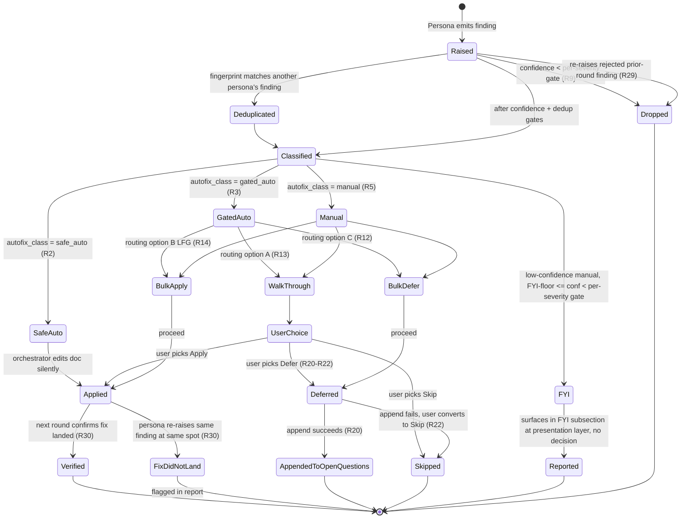
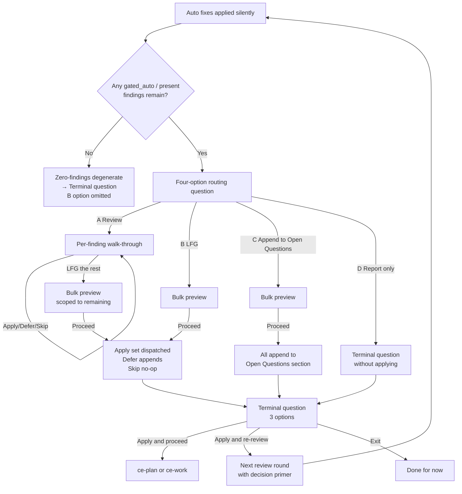

# ce-doc-review Autofix and Interaction Overhaul

## Overview

Overhaul `ce-doc-review` to match the interaction quality and auto-fix leverage of `ce-code-review` (post-PR #590). Today, ce-doc-review surfaces too many findings as "needs user judgment" when one clear fix exists, nitpicks at low confidence, and ends with a binary question that forces re-review when the user wants to apply fixes and move on. This plan expands the autofix classification from binary (`safe_auto` / `manual`) to three tiers (`safe_auto` / `gated_auto` / `manual`) using ce-code-review-aligned names, raises and severity-weights the confidence gate, ports the per-finding walk-through + bulk-preview + routing-question pattern from `ce-code-review`, adds in-doc deferral, introduces multi-round decision memory, rewrites `learnings-researcher` to handle domain-agnostic institutional knowledge, and expands the `ce-compound` frontmatter `problem_type` enum to absorb the `best_practice` overflow. **Advisory-style findings** (low-confidence observations worth surfacing but not worth a decision) render as a distinct FYI subsection of the `manual` bucket at the presentation layer rather than a separate schema tier.

The plan ships in phases so lower-risk foundation work (enum expansion, agent rewrite) can land and stabilize before the interaction-model port. Each implementation unit is atomic and can ship as its own PR.

## Problem Frame

See origin document for full problem framing. In brief, a real-world review surfaced **14 findings all routed to `manual`**, including five P3s at 0.55–0.68 confidence, three concrete mechanical fixes that a competent implementer would arrive at independently, and one subjective observation with no right answer. Under the revised rules the same review produces 4 auto-applied fixes, 1 FYI entry, 4 real decisions, and 5 dropped — the user engages with 4 items instead of 14.

## Requirements Trace

38 requirements from the origin document. Full definitions live there; listed here for traceability.

- **Classification tiers:** R1–R5 (three tiers — add `gated_auto`; keep `safe_auto` / `manual`; advisory-style findings become presentation-layer FYI subsection of manual, not a distinct enum value)
- **Classification rule sharpening:** R6–R8 (strawman-aware rule with safeguard, consolidated promotion patterns, shared framing-guidance block)
- **Per-severity confidence gates:** R9–R11 (P0 0.50 / P1 0.60 / P2 0.65 / P3 0.75; drop residual promotion; low-confidence manual findings surface in a distinct FYI subsection without being dropped)
- **Interaction model:** R12–R16 (4-option routing, per-finding walk-through, bulk preview, tie-break)
- **Terminal question:** R17–R19 (three-option split: apply-and-proceed / apply-and-re-review / exit)
- **In-doc deferral:** R20–R22 (append to `## Deferred / Open Questions` section)
- **Framing quality:** R23–R25 (observable consequence, why-the-fix-works, tight)
- **Cross-cutting:** R26–R27 (AskUserQuestion pre-load, headless preservation)
- **Multi-round memory:** R28–R30 (cumulative decision primer, suppression, fix-landed verification)
- **learnings-researcher agent rewrite:** R36–R42 (domain-agnostic, `<work-context>`, dynamic category probe, optional critical-patterns read) — benefits `/ce-plan`'s existing usage
- **Frontmatter enum expansion:** R43 (add `architecture_pattern`, `design_pattern`, `tooling_decision`, `convention`)

**Dropped from scope:** R31–R35 (learnings-researcher integration into ce-doc-review). See Key Technical Decisions and Alternative Approaches Considered for the rationale. **In scope:** R36–R42 (learnings-researcher domain-agnostic rewrite, Unit 2) and R43 (frontmatter enum expansion, Unit 1), which benefit `/ce-plan`'s existing usage even though learnings-researcher is not dispatched from ce-doc-review.

## Scope Boundaries

- Not introducing external tracker integration. Document-review's Defer analogue is an in-doc section.
- Not changing persona activation/selection logic. The 7 personas and their conditional activation signals stay as-is.
- Not adding `requires_verification` or a batch fixer subagent. Document fixes apply inline.
- Not addressing iteration-limit guidance. "After 2 refinement passes, recommend completion" stays.
- Not persisting decision primers across interactive sessions (matches `ce-code-review` walk-through state rules).
- Not redesigning the frontmatter schema dimensions. Enum expansion only — no new `learning_category` field alongside `problem_type`.

### Deferred to Separate Tasks

- Frontmatter validation test. Adding a pre-commit or CI check that enforces `problem_type` enum membership is valuable (`correctness-gap` slipped through today) but is additive and can ship as a follow-up.
- Updating the frontmatter `component` enum. It's heavily Rails-focused and would benefit from expansion for non-Rails work, but that's out of scope for this overhaul.

## Context & Research

### Relevant Code and Patterns

**Port-from targets (`ce-code-review`):**
- `plugins/compound-engineering/skills/ce-code-review/references/walkthrough.md` — per-finding walk-through (terminal output block + blocking question split, fixed-order options, `(recommended)` marker, LFG-the-rest escape, N=1 adaptation, unified completion report)
- `plugins/compound-engineering/skills/ce-code-review/references/bulk-preview.md` — grouped Apply/Filing/Skipping/Acknowledging preview with `Proceed` / `Cancel`
- `plugins/compound-engineering/skills/ce-code-review/references/subagent-template.md:51-73` — framing-guidance block for personas
- `plugins/compound-engineering/skills/ce-code-review/SKILL.md:75` — AskUserQuestion pre-load directive
- `plugins/compound-engineering/skills/ce-code-review/SKILL.md:477` (stage 5 step 7b) — recommendation tie-break order `Skip > Defer > Apply > Acknowledge`

**Target surfaces (`ce-doc-review`):**
- `plugins/compound-engineering/skills/ce-doc-review/SKILL.md` — orchestrator
- `plugins/compound-engineering/skills/ce-doc-review/references/subagent-template.md` — framing-guidance block lands here
- `plugins/compound-engineering/skills/ce-doc-review/references/synthesis-and-presentation.md` — tier routing, confidence gate, decision primer, and headless envelope updates
- `plugins/compound-engineering/skills/ce-doc-review/references/findings-schema.json` — `autofix_class` enum expansion
- `plugins/compound-engineering/agents/document-review/ce-*.agent.md` — 7 persona files (mostly unchanged)

**Caller contracts:**
- `plugins/compound-engineering/skills/ce-brainstorm/SKILL.md:188-194` — invokes interactively on requirements doc
- `plugins/compound-engineering/skills/ce-brainstorm/references/handoff.md:29,56,65` — surfaces residual P0/P1 adjacent to menus; offers re-review
- `plugins/compound-engineering/skills/ce-plan/references/plan-handoff.md:5-17` — phase 5.3.8; interactive normally, `mode:headless` in pipeline

**Schema surfaces:**
- `plugins/compound-engineering/skills/ce-compound/references/schema.yaml` (canonical) and `yaml-schema.md` (human-readable) — `problem_type` enum definitions + category mapping
- `plugins/compound-engineering/skills/ce-compound-refresh/references/schema.yaml` and `yaml-schema.md` — **duplicate** copies, must update in sync
- `plugins/compound-engineering/skills/ce-compound/SKILL.md` — author steering language
- `plugins/compound-engineering/skills/ce-compound-refresh/SKILL.md` — refresh steering language

**Agent to rewrite:**
- `plugins/compound-engineering/agents/research/ce-learnings-researcher.agent.md` — domain-agnostic rewrite

**Test surfaces:**
- `tests/pipeline-review-contract.test.ts:279-352` — asserts ce-doc-review is invoked with `mode:headless` in pipeline mode. Will need extension for new tier visibility in headless envelope.
- `tests/converter.test.ts:417-438` — OpenCode 3-segment → flat name rewrite for ce-doc-review agent refs. Unaffected.
- No dedicated test file for ce-doc-review itself. Adding one is in scope (Unit 8).

### Institutional Learnings

Seven directly applicable learnings from `docs/solutions/`:

- `docs/solutions/best-practices/ce-pipeline-end-to-end-learnings-2026-04-17.md` — **Mandatory read.** Authored from the `ce-code-review` PR #590 redesign this plan ports. Documents the bulk-preview vs. walk-through distinction, the 4-option `AskUserQuestion` cap as a structural constraint, the "two semantic meanings in one flag" risk, and the "sample 10-20 real artifacts before accepting research-agent architectural recommendations" rule.
- `docs/solutions/skill-design/compound-refresh-skill-improvements.md` — Six-item skill-review checklist (no hardcoded tool names, no contradictory phase rules, no blind questions, no unsatisfied preconditions, no shell in subagents, autonomous-mode opt-in). The "borderline cases get marked stale in autonomous mode" template informs how `advisory` findings behave in headless runs.
- `docs/solutions/skill-design/research-agent-pipeline-separation-2026-04-05.md` — Classifies `learnings-researcher` as ce-plan-owned (HOW / implementation-context). **Drove the decision to remove R31–R35 from scope entirely:** rather than dispatch from ce-doc-review in any form (always-on or conditional), keep the agent in its ce-plan pipeline lane. ce-doc-review does not dispatch it. Users who want institutional memory should invoke ce-plan.
- `docs/solutions/skill-design/pass-paths-not-content-to-subagents-2026-03-26.md` — Default to path-passing; 7× tool-call difference from prompt phrasing. Relevant to Unit 2's learnings-researcher rewrite — the `<work-context>` input should pass paths and compressed context, not full documents.
- `docs/solutions/skill-design/beta-skills-framework.md` + `beta-promotion-orchestration-contract.md` + `ce-work-beta-promotion-checklist-2026-03-31.md` — Beta-skill pattern for major overhauls. Considered and rejected for this work (see Alternative Approaches below).
- `docs/solutions/skill-design/git-workflow-skills-need-explicit-state-machines-2026-03-27.md` — **High severity for this plan.** Model tier/confidence/deferral as an explicit state machine; re-read state at each transition boundary. Directly shapes Unit 4 (synthesis pipeline) structure.
- `docs/solutions/skill-design/discoverability-check-for-documented-solutions-2026-03-30.md` — When enum expands, update instruction-discovery surface (schema reference, learnings-researcher prompt, AGENTS.md) in the same PR. Shapes Unit 1 and Unit 2.

### External References

No external research was needed — the work is internal plugin refactoring with strong local patterns (ce-code-review post-PR #590 is the canonical reference).

## Key Technical Decisions

- **Port the ce-code-review walk-through / bulk-preview pattern rather than invent a new one.** Same menu shape, same tie-break rule, same AskUserQuestion pre-load pattern. Users who've experienced ce-code-review's new flow will find ce-doc-review consistent. **Tier naming aligned with ce-code-review** (`safe_auto`, `gated_auto`, `manual`) so cross-skill mental model is consistent.
- **Three tiers, not four — advisory is a display treatment, not an enum value.** ce-code-review has four tiers (adds `advisory`) because code reviews have a meaningful "report-only, release/human-owned" category (rollout notes, residual risk, learnings). Document reviews rarely produce that shape — FYI observations are typically just low-confidence manual findings that don't need a decision. Collapsing to three tiers + FYI-subsection presentation drops a schema value without losing the user-facing distinction between "needs decision" and "FYI, move on." Cognitive load lower; schema simpler.
- **Interaction-surface convergence with ce-code-review is intentional; keep the skills separate.** Post-plan, ce-doc-review and ce-code-review share interaction mechanics (walk-through shape, bulk preview, routing question, tie-break order) but evaluate genuinely different things: the personas are different (coherence/feasibility/scope-guardian for docs vs correctness/security/performance for code), the inputs are different (prose vs diff), and the failure modes are different. Shared interaction scaffold, distinct review content. Unifying into one skill would smear the focused-review value each delivers today.
- **Ship without a `ce-doc-review-beta` fork.** See Alternative Approaches.
- **Do not dispatch `learnings-researcher` from ce-doc-review at all.** The agent is ce-plan-owned (implementation-context per `research-agent-pipeline-separation-2026-04-05.md`). When ce-doc-review runs inside ce-plan, the agent has already fired and its output lives in the plan. When ce-doc-review runs inside ce-brainstorm, the context is WHY (product-framing), not HOW (implementation) — running an implementation-context agent would be a pipeline violation. When ce-doc-review runs standalone, the personas already cover coherence, feasibility, and scope — institutional memory is a nice-to-have that adds dispatch cost without proportional value. Users who want institutional memory for a doc should invoke `/ce-plan`, where that lookup is a first-class pipeline stage.
- **Put R1–R8 classification changes in the shared subagent template**, not in each persona. One file edit propagates to all 7 personas. Matches how `ce-code-review` shipped the same quality upgrade.
- **Keep R9–R11 confidence gates in synthesis** (`synthesis-and-presentation.md` step 3.2), not in personas. Personas keep their existing HIGH/MODERATE/<0.50 calibration.
- **No diff passed in multi-round primer (R28).** Fixed findings self-suppress (evidence gone); regressions surface as normal findings; rejected findings use pattern-match suppression. The diff would add prompt weight without changing what the agent can detect.
- **Enum expansion values go on the knowledge track**, not the bug track. All four new values (`architecture_pattern`, `design_pattern`, `tooling_decision`, `convention`) are knowledge-track per the two-track schema in `schema.yaml:12-31`.
- **Update duplicate schema files in both `ce-compound` and `ce-compound-refresh`** in the same commit. They are intentional duplicates; divergence is a known pitfall.
- **Model tier/confidence/deferral as an explicit state machine** (per `git-workflow-skills-need-explicit-state-machines` learning). See High-Level Technical Design for the state diagram.

## Open Questions

### Resolved During Planning

- **Beta fork vs phased ship?** Phased ship without beta. The overhaul is large but cleanly phaseable; each phase is independently testable; callers stay compatible via the preserved headless envelope contract (R27).
- **Dispatch learnings-researcher from ce-doc-review?** No. Dropped from scope (R31–R35 removed). The agent is ce-plan-owned; users who want institutional memory should invoke ce-plan, which has it as a first-class pipeline stage. Unit 2 still rewrites the agent to be domain-agnostic — that benefits ce-plan's existing usage.
- **Diff in multi-round primer?** No. Decision metadata alone is sufficient.
- **Defer destination for docs?** In-doc `## Deferred / Open Questions` section, not a sibling file. See origin document R20.

### Deferred to Implementation

- **How many existing `best_practice` entries map to each new enum value?** Research suggests ~11 candidates; final mapping happens when migrating.
- **Exact wording of the `gated_auto` / `manual` labels in the AskUserQuestion menus.** Draft wording exists in origin document R12–R13; final phrasing validated against harness rendering during implementation.
- **Exact line-count budget for the subagent-template framing-guidance block.** Target ~40-50 lines per research findings; adjust as needed to stay under the ~150-line `@` inclusion threshold.
- **Whether to extend `tests/pipeline-review-contract.test.ts` or add a new `tests/ce-doc-review-contract.test.ts`.** Decide during Unit 8 based on assertion overlap.

## High-Level Technical Design

> *This illustrates the intended approach and is directional guidance for review, not implementation specification. The implementing agent should treat it as context, not code to reproduce.*

### Finding lifecycle state machine

Per the `git-workflow-skills-need-explicit-state-machines` learning, the tier/confidence/deferral interactions form a state machine that must be modeled explicitly — prose-level carry-forward silently breaks.



This diagram models ce-doc-review persona findings only. Learnings-researcher findings (R31–R35) are out of scope — ce-doc-review does not dispatch the agent (see Key Technical Decisions and Alternative Approaches Considered).

Transitions to verify explicitly in synthesis (not carry forward as prose):

- Classified → one of four buckets (tier routing, step 3.7 rewrite)
- Rejected-in-prior-round → Dropped (R29 suppression, new synthesis step)
- Applied → Verified or FixDidNotLand (R30, new synthesis step)
- Auto / GatedAuto → Applied (separate paths; Auto is silent, GatedAuto goes through walk-through or bulk)

### Three interaction surfaces



The walk-through, bulk preview, and routing question are ports of the same-named `ce-code-review` references with ce-doc-review specific adaptations (Defer = in-doc append; no batch fixer subagent; terminal question routes to pipeline stages instead of PR/push).

## Implementation Units

- [ ] **Unit 1: Frontmatter enum expansion + migration**

**Goal:** Add four knowledge-track values (`architecture_pattern`, `design_pattern`, `tooling_decision`, `convention`) to the `problem_type` enum, update both duplicate schema files, migrate existing `best_practice` overflow entries, resolve the one `correctness-gap` schema violation, and update instruction-discovery surfaces so new values are discoverable.

**Requirements:** R43

**Dependencies:** None (foundation)

**Files:**
- Modify: `plugins/compound-engineering/skills/ce-compound/references/schema.yaml`
- Modify: `plugins/compound-engineering/skills/ce-compound/references/yaml-schema.md`
- Modify: `plugins/compound-engineering/skills/ce-compound-refresh/references/schema.yaml`
- Modify: `plugins/compound-engineering/skills/ce-compound-refresh/references/yaml-schema.md`
- Modify: `plugins/compound-engineering/skills/ce-compound/SKILL.md` (author-steering language toward narrower values)
- Modify: `plugins/compound-engineering/skills/ce-compound-refresh/SKILL.md` (refresh steering language)
- Modify: `plugins/compound-engineering/AGENTS.md` (discoverability line that names `problem_type` values)
- Migrate: the ~8–11 existing `best_practice` entries under `docs/solutions/` that fit a narrower value (see repo-research report for the candidate list — some entries may stay `best_practice` if no narrower value applies; the final count is a small range, not a fixed number)
- Migrate: `docs/solutions/workflow/todo-status-lifecycle.md` (`correctness-gap` → valid enum value)

**Approach:**
- Add four values to both schema.yaml files under the knowledge track
- Add four category mappings to both yaml-schema.md files (`architecture_pattern → docs/solutions/architecture-patterns/`, etc.)
- Keep `best_practice` valid but document it as the fallback, not the default
- Author-steering language in ce-compound SKILL body should name the new values with one-line descriptions so authors pick the narrower value when applicable
- Category directory creation on first use — don't pre-create empty dirs
- Migration pass: re-classify the ~11 existing `best_practice` entries per the research findings, and move `todo-status-lifecycle.md` off `correctness-gap`

**Patterns to follow:**
- `schema.yaml` existing two-track structure (bug / knowledge)
- `yaml-schema.md` existing "Category Mapping" section format
- ce-compound existing author-steering prose in section naming problem types

**Test scenarios:**
- Happy path: a fixture knowledge-track doc with `problem_type: architecture_pattern` parses and validates
- Happy path: a fixture knowledge-track doc with `problem_type: design_pattern` parses and validates
- Edge case: a doc with `problem_type: best_practice` still validates (backward compat)
- Edge case: a doc with an unknown value (e.g., `problem_type: xyz-invalid`) is flagged
- Integration: ce-compound steering guidance names the new values in its output when classifying an appropriate learning

**Verification:**
- Both schema files contain all 4 new values and the category mappings
- Every `best_practice` entry under `docs/solutions/` that fits a narrower value has been reclassified (final count is the subset of ~8–11 candidates that genuinely fit a narrower tier; some may legitimately remain `best_practice`)
- `docs/solutions/workflow/todo-status-lifecycle.md` carries a valid enum value
- AGENTS.md references the new categories so future agents discover them

---

- [ ] **Unit 2: learnings-researcher domain-agnostic rewrite**

**Goal:** Rewrite the `learnings-researcher` agent to treat `docs/solutions/` as domain-agnostic institutional knowledge. Accept a structured `<work-context>` input, replace hardcoded category tables with dynamic probing, expand keyword extraction beyond bug-shape taxonomy, and make the `critical-patterns.md` read optional.

**Requirements:** R36, R37, R38, R39, R40, R41, R42

**Dependencies:** Unit 1 for taxonomy-aware output framing only. The dynamic category probe itself has no schema dependency (it reads `docs/solutions/` subdirectories at runtime), so Unit 2 can be drafted in parallel; only the final author-visible framing benefits from Unit 1's enum landing first.

**Files:**
- Modify: `plugins/compound-engineering/agents/research/ce-learnings-researcher.agent.md`
- Test: No agent-specific test exists. Extend or add a fixture under `tests/fixtures/` if needed to validate the dispatch contract across platforms — defer to Unit 8 if non-trivial.

**Approach:**
- Rewrite the opening identity/framing: "domain-agnostic institutional knowledge researcher" (not bug-focused)
- Replace `feature/task description` input format with structured `<work-context>` block (description + concepts + decisions + domains + optional domain hint)
- Replace hardcoded category-to-directory table with a dynamic probe: at invocation time, list subdirectories under `docs/solutions/` and use the discovered set
- Expand keyword extraction taxonomy: existing four dimensions plus Concepts, Decisions, Approaches, Domains
- Make Step 3b (critical-patterns.md read) conditional on file existence
- Rewrite output framing to "applicable past learnings" / "related decisions and their outcomes" from "gotchas to avoid during implementation"
- Update Integration Points to include `/ce-plan` and standalone use (ce-doc-review is explicitly not a caller per this plan's Key Technical Decisions — the rewrite's consumer is `/ce-plan`)

**Execution note:** After rewriting, sample 3-5 real invocations on current codebase learnings to verify the domain-agnostic rewrite produces relevant output for non-code queries (e.g., skill-design questions, workflow questions). Per the ce-pipeline learnings doc: "sample real artifacts before accepting research-agent architectural recommendations."

**Patterns to follow:**
- `ce-code-review` shared subagent template (`references/subagent-template.md`) for the new `<work-context>` block shape
- Existing `learnings-researcher.md` grep-first filtering strategy (Step 3) — preserve it, it's already efficient
- `docs/solutions/skill-design/research-agent-pipeline-separation-2026-04-05.md` classification to keep the agent in its pipeline-stage lane

**Test scenarios:**
- Happy path: invoke with a code-bug work-context → returns bug-relevant learnings matching existing behavior
- Happy path: invoke with a skill-design work-context → returns skill-design learnings (previously would have lumped under `best_practice` with weaker matches)
- Edge case: `docs/solutions/` is empty or absent → fast-exit returns "No relevant learnings" without errors
- Edge case: `docs/solutions/patterns/critical-patterns.md` absent → agent proceeds without warning
- Edge case: `<work-context>` has no domain hint → agent falls back to general keyword extraction across all discovered categories
- Integration: converter tests (`tests/codex-writer.test.ts:329` and siblings) still pass — the agent's dispatch string is preserved, only the inner prompt changes

**Verification:**
- Running the agent on a skill-design question returns results pointing to `docs/solutions/skill-design/` entries, not miscategorized matches from `best-practices/`
- The hardcoded category table is gone; the agent probes `docs/solutions/` at invocation time
- Output framing does not say "gotchas to avoid during implementation" or code-bug-biased language
- Missing `critical-patterns.md` does not cause errors or warnings
- Cross-platform converter tests still pass
- **ce-plan-side validation per #14 review feedback:** run ce-plan's existing Phase 1.1 dispatch flow (on any in-repo plan target) against the rewritten agent and verify (a) the agent's output is consumable by ce-plan's current synthesis step without errors, (b) dispatch-string/contract across Codex, Gemini, and Claude converters is preserved, (c) output shape for a representative code-implementation query matches or improves on pre-rewrite relevance. Document the comparison briefly in the PR description so owners of ce-plan can audit the regression check.

---

- [ ] **Unit 3: ce-doc-review subagent template upgrade: framing, classification rule, tier expansion**

**Goal:** Upgrade the shared ce-doc-review subagent template with an observable-consequence-first framing guidance block, a strawman-aware classification rule, consolidated auto-promotion patterns, and the new three-tier `autofix_class` enum aligned with ce-code-review names. This is the single file change that propagates improved output across all 7 personas.

**Requirements:** R1, R2, R3, R4, R5, R6, R7, R8

**Dependencies:** None (parallel to Units 1-2)

**Files:**
- Modify: `plugins/compound-engineering/skills/ce-doc-review/references/subagent-template.md`
- Modify: `plugins/compound-engineering/skills/ce-doc-review/references/findings-schema.json` (rename + expand `autofix_class` enum)
- Test: (deferred to Unit 8 — contract test assertion against template structure)

**Approach:**
- Rename and expand `autofix_class` enum in `findings-schema.json` from `[auto, present]` to `[safe_auto, gated_auto, manual]`. Matches ce-code-review's first three tiers exactly. Does not adopt ce-code-review's fourth `advisory` tier — low-confidence FYI findings render as a distinct FYI subsection of the `manual` bucket at the presentation layer (Unit 4 handles that).
- Add tier definitions in the subagent template with one-sentence descriptions and examples per R2–R5. Three tiers: `safe_auto` (apply silently, one clear correct fix); `gated_auto` (concrete fix, user confirms); `manual` (requires user judgment).
- Add a strawman-aware classification rule per R6: "a 'do nothing / accept the defect' option is not a real alternative — it's the failure state the finding describes. Count only alternatives a competent implementer would genuinely weigh." Include a positive/negative example pair.
- **Strawman safeguard per #11 review feedback:** any finding classified `safe_auto` via strawman-dismissal of alternatives must name the dismissed alternatives in `why_it_matters`. When alternatives exist at all (even if reviewer judges them weak), the finding defaults to `gated_auto` (one-click apply in walk-through) rather than silent `safe_auto`. `safe_auto` stays reserved for truly single-option fixes (typo, wrong count, stale cross-reference, missing mechanical step).
- **Persona exclusion of `## Deferred / Open Questions` section per #8 review feedback:** the template instructs personas to exclude any `## Deferred / Open Questions` section and its subheadings from the review scope — those entries are review output from prior rounds, not part of the document being reviewed. Prevents the round-2 feedback loop where personas flag the deferred section as a new finding or quote its text as evidence.
- Consolidate auto-promotion patterns per R7 into an explicit rule set: factually incorrect behavior, missing standard security/reliability controls, codebase-pattern-resolved fixes, framework-native-API substitutions, mechanically-implied completeness additions
- Add framing-guidance block per R8: observable-consequence-first, why-the-fix-works grounding, 2-4 sentence budget, required-field reminder, positive/negative example pair (modeled on `ce-code-review`'s block at `subagent-template.md:51-73`)
- Respect the ~150-line `@` inclusion threshold; if the template exceeds it, switch to a backtick path reference in the SKILL.md (unlikely given current 52-line size + ~40-50 line addition)

**Patterns to follow:**
- `ce-code-review` subagent template (`subagent-template.md:51-73`) framing-guidance block structure
- Existing subagent template `<output-contract>` section for where new rules live

**Test scenarios:**
- Happy path: a persona agent receives the new template and produces findings with one of the four valid `autofix_class` values
- Edge case: a finding with only strawman alternatives (e.g., "accept the defect") is classified as `safe_auto`, not `manual`
- Edge case: a finding that would previously have been `manual` because "there's more than one way to fix it" is now `gated_auto` when the fix is concrete and the non-primary options are strawmen
- Edge case: an FYI-grade observation (subjective, no decision) gets classified as `manual` but routes to the FYI subsection at the presentation layer because confidence falls below the per-severity gate yet above the FYI floor
- Integration: all 7 personas produce output that validates against the expanded `findings-schema.json` — no schema violations

**Verification:**
- Template includes a framing-guidance block, classification rule, and consolidated auto-promotion patterns
- `findings-schema.json` enum includes all 4 new values
- Subagent template stays under ~150 lines and continues to be loaded via `@` inclusion

---

- [ ] **Unit 4: Synthesis pipeline: per-severity gates, tier routing, auto-promotion, state-machine discipline**

**Goal:** Rewrite the synthesis pipeline to route the four new tiers correctly, apply per-severity confidence gates, drop residual promotion in favor of cross-persona agreement boost, and make tier/confidence/deferral state transitions explicit (per the git-workflow state-machine learning). This is the load-bearing synthesis change.

**Requirements:** R9, R10, R11 + synthesis updates for R2–R5 tier routing

**Dependencies:** Unit 3 (new `autofix_class` enum must exist before synthesis routes to it)

**Files:**
- Modify: `plugins/compound-engineering/skills/ce-doc-review/references/synthesis-and-presentation.md`
- Create: `tests/fixtures/ce-doc-review/seeded-plan.md` — test-fixture plan doc with seeded findings across tier shapes (see validation gate in Approach)

**Approach:**
- Step 3.2 (confidence gate): replace flat 0.50 with per-severity table (P0 ≥0.50, P1 ≥0.60, P2 ≥0.65, P3 ≥0.75). Low-confidence manual findings that don't pass the gate but are above a FYI floor (0.40) surface in an FYI subsection at the presentation layer rather than being dropped — keeps observational value without forcing decisions.
- Step 3.4 (residual promotion): delete. Replaced by a cross-persona agreement boost (+0.10, capped at 1.0) applied after the gate, matching `ce-code-review` stage 5 step 4. Residual concerns surface in Coverage only.
- Step 3.5 (contradictions): keep; adapt terminology for three-tier routing
- Step 3.6 (pattern-resolved promotion): expand per R7's consolidated promotion patterns
- Step 3.7 (route by autofix class): rewrite for three tiers. `safe_auto` → apply silently. `gated_auto` → walk-through with Apply as recommended. `manual` → walk-through with user-judgment framing, or FYI subsection when low-confidence.
- **R30 fix-landed matching predicate per #10 review feedback:** when determining whether a round-2 persona's finding is a re-raise of a round-1 Applied finding at the same location, use the existing dedup fingerprint (`normalize(section) + normalize(title)`) augmented with an evidence-substring overlap check. Section renames count as "different location" — treat as new finding. Specify explicitly in the synthesis step so the implementer doesn't invent a predicate.
- **Validation gate per #3 + #7 review feedback:** before merging Unit 4, run the new synthesis pipeline against two artifacts and log the result in the PR description:
  1. **A seeded test-fixture plan doc** — create one under `tests/fixtures/ce-doc-review/seeded-plan.md` with known issues planted across each tier (target seed: ~3 safe_auto candidates, ~3 gated_auto candidates, ~5 manual candidates, ~5 FYI-tier candidates at confidence 0.40–0.65, ~3 drop-worthy P3s at confidence 0.55–0.74). This is the rigorous validation — existing plans in `docs/plans/` have already been through review and would make the pipeline look falsely clean.
  2. **The brainstorm doc** (`docs/brainstorms/2026-04-18-ce-doc-review-autofix-and-interaction-requirements.md`), which went through document-review via the OLD pipeline — re-running under the NEW pipeline is a valid before/after comparison.

  **Numeric pass criteria (soft, not absolute):**
  - Seeded fixture: ≥2 of the 3 seeded safe_auto candidates get applied silently; ≥2 of the 3 seeded gated_auto show up in the walk-through bucket with `(recommended)` Apply; all 3 drop-worthy P3s at 0.55–0.74 get dropped by the per-severity gate; ≥3 of the 5 FYI candidates surface in the FYI subsection; zero false auto-applies on manual-shaped seeds.
  - Brainstorm re-run: no P0/P1 findings that the old pipeline applied are regressed (i.e., the new pipeline doesn't drop what the old one kept as important); total user-facing decision count (gated_auto + manual after gate) should be meaningfully lower than the old pipeline produced.

  If a seed classification fires outside its intended tier, investigate before merging — may indicate threshold or strawman-rule calibration issue.
- Add explicit state-machine narration referencing the diagram in High-Level Technical Design. Every transition ("Raised → Classified," "Classified → SafeAuto," etc.) is a named step in synthesis prose, not an implied carry-forward.
- **Headless envelope extension lands here per #12 sequencing fix:** this unit is the first to produce `gated_auto` findings in headless mode, so the envelope must support the new bucket headers before shipping. Extend `synthesis-and-presentation.md:93-119` headless output to include `Gated-auto findings` and `FYI observations` sections alongside existing `Applied N safe_auto fixes` count and `Manual findings` section. Preserves existing bucket structure so callers that only read the old buckets continue to work (forward-compat; ce-brainstorm and ce-plan surface P0/P1 residuals adjacent to menus, unchanged). Unit 8 adds the contract test for this envelope later.

**Patterns to follow:**
- `ce-code-review` stage 5 merge pipeline (`SKILL.md:456-484`) for confidence-gate, dedup, cross-reviewer agreement boost structure
- Existing `synthesis-and-presentation.md` step numbering — preserve step IDs to avoid churning cross-references

**Test scenarios:**
- Happy path: a P3 finding at 0.60 confidence is dropped by the per-severity gate (under the current 0.50 flat gate it would survive)
- Happy path: a P0 finding at 0.52 confidence survives the gate
- Happy path: two personas flagging the same issue get a +0.10 boost, lifting one from 0.55 (below P1 gate) to 0.65 (above)
- Edge case: a low-confidence `manual` finding at 0.45 (above the 0.40 FYI floor, below the severity gate) surfaces in the FYI subsection, not dropped
- Edge case: a `gated_auto` finding with only strawman alternatives gets auto-promoted to `safe_auto` per R7 consolidated patterns — but if ANY alternatives exist (even weak), defaults to `gated_auto` per the strawman safeguard
- Edge case: contradiction handling — two personas with opposing actions on the same finding route to `manual` with both perspectives
- Integration: routing the calibration-example case from the origin document (14 findings → 4 manual + 3 gated_auto + 1 safe_auto + 1 FYI + 5 dropped) produces a reasonable bucket distribution
- Integration: seeded-fixture test (`tests/fixtures/ce-doc-review/seeded-plan.md`) meets the numeric pass criteria in the Approach section — seeded safe_auto/gated_auto/manual/FYI candidates land in their intended tiers; drop-worthy P3s are dropped; no false-auto on manual-shaped seeds
- Integration: brainstorm-doc re-run (`docs/brainstorms/2026-04-18-ce-doc-review-autofix-and-interaction-requirements.md`) shows meaningful decision-count reduction without regressing previously-applied P0/P1 fixes

**Verification:**
- Confidence gate is per-severity, documented in step 3.2 of synthesis
- Residual-promotion step is removed; cross-persona agreement boost is its replacement
- Each state transition in the finding lifecycle has a named synthesis step
- Routing the origin document's real-world example reproduces the expected 14→4 decisions split

---

- [ ] **Unit 5: Interaction model: routing question + per-finding walk-through + bulk preview**

**Goal:** Port the per-finding walk-through, bulk preview, and four-option routing question from `ce-code-review`. Adapt for ce-doc-review (no batch fixer, no tracker integration). This is the biggest behavioral change and where most of the user-visible UX improvement lives.

**Requirements:** R12, R13, R14, R15, R16, R26

**Dependencies:** Unit 4 (routing uses new tiers and confidence-gated finding set)

**Files:**
- Create: `plugins/compound-engineering/skills/ce-doc-review/references/walkthrough.md`
- Create: `plugins/compound-engineering/skills/ce-doc-review/references/bulk-preview.md`
- Modify: `plugins/compound-engineering/skills/ce-doc-review/SKILL.md` (add Interactive mode rules section at top, AskUserQuestion pre-load directive)
- Modify: `plugins/compound-engineering/skills/ce-doc-review/references/synthesis-and-presentation.md` (Phase 4 presentation hands off to walkthrough.md; add routing question stage)

**Approach:**
- Add an "Interactive mode rules" section at the top of `SKILL.md` modeled on `ce-code-review/SKILL.md:73-77`. Include the `AskUserQuestion` pre-load directive and the numbered-list fallback rule.
- Create `walkthrough.md` by adapting `ce-code-review/references/walkthrough.md`. **Tier alignment:** ce-doc-review uses the first three ce-code-review tier names verbatim — `safe_auto`, `gated_auto`, `manual` — so no rename in the port. ce-code-review's fourth `advisory` tier has no ce-doc-review equivalent in the walk-through; advisory-style findings render in a presentation-layer FYI subsection (Unit 4's concern), not as a walk-through option. **Keep from the source:** terminal-block + question split, four-option menu shape (Apply / Defer / Skip / LFG-the-rest), `(recommended)` marker, LFG-the-rest escape, N=1 adaptation, unified completion report, post-tie-break recommendation rendering. **Remove from the source:** fixer-subagent-batch-dispatch (ce-doc-review has no batch fixer per scope boundary), `[TRACKER]` label substitution logic, tracker-detection tuple (`named_sink_available`, `any_sink_available`, confidence-based label substitution), render-time Defer→Skip remap on `any_sink_available: false`, `.context/compound-engineering/ce-code-review/{run_id}/{reviewer_name}.json` artifact-lookup paths (ce-doc-review's agents don't write run artifacts), advisory-variant `Acknowledge` option (no advisory tier here). **Replace:** "file a tracker ticket" → "append to Open Questions section" (Unit 6 implements the append mechanic).
- Create `bulk-preview.md` by adapting `ce-code-review/references/bulk-preview.md`: keep the grouped buckets, Proceed/Cancel options, scope-summary header. Adapt bucket labels (`Applying (N):`, `Appending to Open Questions (N):`, `Skipping (N):`). Drop the `Acknowledging (N):` bucket — no advisory tier means no Acknowledge action. Remove tracker-label substitution.
- Update `synthesis-and-presentation.md` Phase 4: after auto-fixes are applied, route to the new routing question (if any `gated_auto` / `manual` findings remain). Load `walkthrough.md` for option A, `bulk-preview.md` for options B and C. Option D = report only. Use R16 tie-break order (`Skip > Defer > Apply > Acknowledge`) for per-finding recommendations.

**Execution note:** Port the Interactive Question Tool Design rules verbatim from AGENTS.md — third-person voice, front-loaded distinguishing words, ≤4 options. Verify each menu's labels at the rendering surface during implementation; harness label truncation is a known failure mode (ce-pipeline learnings doc §5).

**Patterns to follow:**
- `ce-code-review/references/walkthrough.md` — structural template
- `ce-code-review/references/bulk-preview.md` — structural template
- `ce-code-review/SKILL.md:73-77` — Interactive mode rules section
- `plugins/compound-engineering/AGENTS.md` → "Interactive Question Tool Design" section — menu design rules
- The state machine in High-Level Technical Design above

**Test scenarios:**
- Happy path: 3 `gated_auto` findings + 1 `manual` finding → routing question offers all 4 options; picking A enters walk-through; each finding presented one at a time with recommended action marked
- Happy path: N=1 (exactly one pending finding) → walk-through wording drops "Finding N of M," LFG-the-rest option suppressed
- Happy path: user picks LFG-the-rest at finding 2 of 8 → bulk preview scoped to findings 3-8, header notes "2 already decided"
- Edge case: all findings are low-confidence `manual` (FYI subsection only) → routing question skipped (no gated_auto / present-above-gate remain), flows to terminal question with no walk-through; FYI content still renders in the report
- Edge case: bulk-preview Cancel from LFG-the-rest returns to the current finding, not to the routing question
- Edge case: routing Cancel from option B / C returns to the routing question with no side effects
- Integration: recommendation tie-break (R16) — two personas flag the same finding with conflicting actions (Apply / Skip); walk-through marks the post-tie-break value (Skip) with `(recommended)`; R15-conflict context line surfaces the disagreement in the question stem

**Verification:**
- `walkthrough.md` and `bulk-preview.md` exist with adapted content
- SKILL.md has an Interactive mode rules section with AskUserQuestion pre-load
- Synthesis Phase 4 routes to the walkthrough/bulk-preview references after auto-fixes
- Menus pass the Interactive Question Tool Design review (third-person, ≤4 options, self-contained labels)

---

- [ ] **Unit 6: In-doc Open Questions deferral + append mechanic**

**Goal:** Implement the Defer action's in-doc append mechanic. When a user chooses Defer on a finding, append an entry to a `## Deferred / Open Questions` section at the end of the document under review.

**Requirements:** R20, R21, R22

**Dependencies:** Unit 5 (walk-through's Defer option is where this fires)

**Files:**
- Create: `plugins/compound-engineering/skills/ce-doc-review/references/open-questions-defer.md`
- Modify: `plugins/compound-engineering/skills/ce-doc-review/references/walkthrough.md` (reference the Defer mechanic from Unit 5's walkthrough.md)

**Approach:**
- Create `open-questions-defer.md` describing:
  - Detection: does the doc already have a `## Deferred / Open Questions` section at the end?
  - Heading creation if absent
  - Subsection structure: `### From YYYY-MM-DD review` (timestamped to the review invocation — creates per-review grouping even when run multiple times on the same doc)
  - Entry format per R21: title, severity, reviewer attribution, confidence, `why_it_matters` framing. Excludes `suggested_fix` and `evidence` (those live in the run artifact if one exists; pointer to run artifact included when relevant)
  - Append location: end of doc, after existing content. If the doc has a trailing horizontal rule or separator, add above it to avoid visual drift.
- Failure handling per R22: document is read-only / path issue / write failure → surface inline with Retry / Fallback-to-completion-report-only / Convert-to-Skip sub-question. No silent failure.
- Walkthrough.md references this file when the user picks Defer; the walkthrough itself doesn't reimplement the append logic.

**Patterns to follow:**
- `ce-code-review/references/tracker-defer.md` — **only** for the failure-path sub-question structure (Retry / Fallback / Convert to Skip). Do not carry over tracker-detection, sink-availability, or label-substitution logic — none apply to in-doc append.

**Test scenarios:**
- Happy path: doc has no Open Questions section → append creates the `## Deferred / Open Questions` heading and a `### From YYYY-MM-DD review` subsection with the deferred entry
- Happy path: doc already has the Open Questions section at the end → append adds under a new `### From YYYY-MM-DD review` subsection (keep prior review entries distinguishable)
- Happy path: two Defer actions in the same review session → both entries land under the same `### From YYYY-MM-DD review` subsection
- **Shadow path (mid-doc heading) per #13 review feedback:** doc has a `## Deferred / Open Questions` heading somewhere in the middle (not the end) → append finds it and lands under it at its existing location, does not create a duplicate section at the end
- **Shadow path (same-title collision) per #13:** round 2 within the same day defers a finding whose title matches an existing round-1 entry under the same `### From YYYY-MM-DD review` subsection → append is idempotent on title (skip duplicate entry), records the no-op in the completion report
- **Shadow path (frontmatter-only doc):** doc has frontmatter and no body content → append creates the heading after the frontmatter block, not at byte 0
- **Shadow path (concurrent editor writes):** re-read the doc from disk immediately before the append to reduce the window for user-in-editor concurrent-write collisions; log mtime before and after append and abort + surface retry if changed during the write
- Edge case: doc is read-only → append fails, user is offered Retry / Fall-back-to-report-only / Convert-to-Skip; Convert-to-Skip records the Skip reason in the completion report
- Edge case: doc has a trailing `---` or other separator → append lands above it
- Integration: deferred entries from a walk-through round 1 are visible in the doc when round 2 runs; the decision primer (Unit 7) correctly identifies them as prior-round decisions; personas exclude the section from review scope per the subagent template instruction (Unit 3)

**Verification:**
- `open-questions-defer.md` exists and describes the append mechanic + failure handling
- Walk-through's Defer option invokes the mechanic correctly
- Deferred findings accumulate under timestamped subsections across reviews
- No silent failures — every failure surfaces inline with user-actionable options

---

- [ ] **Unit 7: Terminal question restructure + multi-round decision memory**

**Goal:** Replace the current Phase 5 binary question (`Refine — re-review` / `Review complete`) with a three-option terminal question that separates "apply decisions" from "re-review," and introduce the multi-round decision primer that carries prior-round decisions into subsequent rounds.

**Requirements:** R17, R18, R19, R28, R29, R30

**Dependencies:** Unit 5 (walkthrough captures the decisions the primer carries forward), Unit 6 (Defer decisions contribute to the primer)

**Files:**
- Modify: `plugins/compound-engineering/skills/ce-doc-review/SKILL.md` (Phase 2 dispatch passes cumulative primer)
- Modify: `plugins/compound-engineering/skills/ce-doc-review/references/synthesis-and-presentation.md` (Phase 5 terminal question + R29 suppression rule + R30 fix-landed verification)
- Modify: `plugins/compound-engineering/skills/ce-doc-review/references/subagent-template.md` (persona instructions to honor the primer — suppress re-raising rejected findings, respect fix-landed verification context)

**Approach:**
- Replace Phase 5 terminal question with three options per R17: `Apply decisions and proceed to <next stage>` (default / recommended when fixes were applied), `Apply decisions and re-review`, `Exit without further action`. The `<next stage>` text uses the document type: `ce-plan` for requirements docs, `ce-work` for plan docs.
- R19 zero-actionable-findings degenerate case: skip option B (re-review), offer only "Proceed to <next stage>" / "Exit." **Label adapts:** when there are no decisions to apply (zero-actionable case, or a routing path where every finding was Acknowledge/Skip), drop the "Apply decisions and" prefix — the label should match what the system is doing. Only when at least one Apply was queued does the label remain "Apply decisions and proceed to <next stage>".
- R18 rendering rule: terminal question is distinct from mid-flow routing question. Don't merge them.
- Multi-round decision primer per R28–R30:
  - The orchestrator maintains an in-memory decision list across rounds within a single session (rejected findings with title/evidence/reason; applied findings with title/section)
  - Passed to every persona in round 2+ as part of the subagent template variable bindings
  - **Primer structure per #9 review feedback:** the primer is a single text block injected into `{decision_primer}` slot at the top of the `<review-context>` block. Shape:
    ```
    <prior-decisions>
    Round 1 — applied (N entries):
    - {section}: "{title}" ({reviewer}, {confidence})
    Round 1 — rejected (N entries):
    - {section}: "{title}" — {Skipped|Deferred} because {reason or "no reason provided"}
    </prior-decisions>
    ```
    Round 1 (no primer) renders as an empty `<prior-decisions>` block or omits the block entirely — implementation-detail choice driven by which reads better to personas during calibration. The subagent template gets a matching `{decision_primer}` slot.
  - Persona-level suppression rule per R29: don't re-raise a finding whose title and evidence pattern-match a rejected finding unless current doc state makes the concern materially different
  - Synthesis-level fix-landed verification per R30: for each applied finding, confirm the specific issue no longer appears at the referenced section. If a persona re-surfaces the same finding at the same location (same section fingerprint + evidence-substring overlap per Unit 4's matching predicate), flag as "fix did not land" in the report rather than treating it as new.
- **Caller-context handling per #6 review feedback:** interactive-mode nested invocations (ce-brainstorm → ce-doc-review, ce-plan → ce-doc-review) rely on the model reading conversation context to interpret the terminal question correctly, rather than an explicit `nested:true` argument. Rationale: the caller's conversation is visible to the sub-skill's orchestrator, so when the user picks "Proceed to <next stage>" from inside ce-plan's 5.3.8 flow, the agent does not fire a nested `/ce-plan` dispatch — it returns control to the caller's flow which continues its own logic. When invoked standalone, "Proceed to <next stage>" dispatches the appropriate next skill. `mode:headless` stays explicit because headless is deterministic programmatic behavior, but interactive-mode caller-context is handled by model orchestration. **No caller-side change required for ce-brainstorm or ce-plan.** If this implicit handling proves unreliable in practice, add an explicit `nested:true` flag as a follow-up.
- Cross-session persistence is out of scope per the scope boundary.

**Execution note:** Model the decision-primer flow as part of the state machine diagram. Every round-2-persona-dispatch transition explicitly reads from the primer — this is not a prose-level "personas should remember" assumption.

**Patterns to follow:**
- `ce-code-review/SKILL.md` Step 5 final-next-steps for the mode-driven terminal question structure (but adapt PR/push verbs to pipeline-stage verbs)
- State machine diagram in High-Level Technical Design — every prior-round-decision transition is named

**Test scenarios:**
- Happy path: round 1 user applies 2 findings and skips 1; round 2 persona re-raises the skipped finding → synthesis drops it per R29 with a note in Coverage
- Happy path: round 1 user applies a finding; round 2 persona does NOT re-raise it (fix self-suppressed because evidence is gone) → synthesis reports "fix verified"
- Happy path: round 1 user applies a finding; round 2 persona re-raises it at the same location (fix didn't actually land) → synthesis flags "fix did not land" in the final report
- Happy path: terminal question after round 1 with fixes applied → three options; user picks "Apply and proceed" → hand off to ce-plan or ce-work
- Edge case: zero actionable findings after auto-fixes → terminal question has 2 options (re-review suppressed)
- Edge case: user deferred a finding in round 1 (R22); round 2 persona re-raises same concern → suppressed per R29 (defer counts as rejection for suppression purposes)
- Edge case: re-review triggered → round 2 decision primer includes all rounds 1's decisions; flow re-enters Phase 2 dispatch with primer passed to personas
- Integration: multi-round primer state is in-memory; exiting the session discards it; starting a new session on the same doc is a fresh round 1

**Verification:**
- Terminal question has three options (or two in the zero-actionable case)
- Round-2 dispatch passes the cumulative primer to every persona
- R29 suppression drops re-raised rejected findings with Coverage note
- R30 fix-landed verification flags fixes that didn't land
- Cross-session persistence is not implemented (verified by the boundary)

---

- [ ] **Unit 8: Framing polish + contract test extension**

**Goal:** Apply framing quality rules (R23–R25) uniformly across all user-facing surfaces that weren't already updated by Units 3–7, and extend `pipeline-review-contract.test.ts` to lock in the new-tier envelope shape. (The headless-envelope extension itself moves earlier per the #12 sequencing fix — see below.)

**Requirements:** R23, R24, R25, R27 *(R27's envelope shape landed in Unit 4 per the sequencing fix; this unit adds the contract test for it)*

**Dependencies:** Units 3, 4, 5, 6, 7

**Files:**
- Modify: `plugins/compound-engineering/skills/ce-doc-review/references/synthesis-and-presentation.md` (R23–R25 framing rules applied across output surfaces)
- Modify: `tests/pipeline-review-contract.test.ts` (extend to assert new tiers appear distinctly in headless envelope)
- Consider: `tests/ce-doc-review-contract.test.ts` (new) if assertions don't fit cleanly in pipeline-review-contract — decide during implementation

**Approach:**
- **R23–R25 framing rules:** applied at every user-facing surface — walk-through terminal blocks, bulk-preview lines, Open Questions entries, headless envelope. Observable-consequence-first, why-the-fix-works grounding, 2-4 sentence budget. Because the framing-guidance block at the subagent template (Unit 3) already shapes persona output at the source, this pass is about ensuring the presentation surfaces carry the framing forward without dilution (e.g., the walk-through's terminal block shouldn't re-wrap the persona's `why_it_matters` in code-structure-first prose).
- **Test extension:** `pipeline-review-contract.test.ts:279-352` currently asserts `mode:headless` invocation from ce-brainstorm and ce-plan. Extend to assert the new tiers appear distinctly in the headless output without breaking existing pattern matches. Structural assertions only — do not lock exact prose, so future wording improvements don't ossify the test. Also assert the `nested:true` flag invocation from both callers (Unit 7 landing).
- No "Past Solutions" section in output — learnings-researcher is not invoked from ce-doc-review (see Key Technical Decisions).
- **Sequencing per #12 review feedback:** the actual headless envelope extension (new tier bucket headers) lands in Unit 4's PR, not this unit. Rationale: Unit 4 is the first unit that produces non-`safe_auto` / non-`manual` findings in headless mode. If Unit 4 ships before the envelope is updated, callers (ce-plan in `mode:headless`) would see `gated_auto` findings demoted into legacy buckets or emitted in a shape callers can't parse. Landing the envelope change with Unit 4 keeps each phase independently consumable.

**Patterns to follow:**
- `ce-code-review` headless envelope (`SKILL.md:510-572`) structure — grouped by `autofix_class`, metadata header, per-finding detail lines
- Existing ce-doc-review headless output in `synthesis-and-presentation.md:93-119`

**Test scenarios:**
- Happy path: headless mode run with findings across all 3 tiers → envelope contains distinct `Applied N safe_auto fixes` count + `Gated-auto findings` + `Manual findings` sections (+ `FYI observations` subsection when present) in that order
- Happy path: headless mode with only safe_auto fixes applied → envelope shows the count and omits the finding-type sections
- Happy path: headless mode with zero findings at all → envelope collapses to "Review complete (headless mode). No findings."
- Edge case: headless mode with only FYI-subsection content → envelope shows the subsection only, no decision-requiring buckets
- Integration: ce-plan phase 5.3.8 headless invocation continues to work with new envelope; new tier sections are visible to the caller for residual-P0/P1 surfacing decisions (`plan-handoff.md:13`)
- Integration: `nested:true` flag is respected — when set, terminal question omits the "Proceed to <next stage>" option; verifiable via contract test
- Integration: framing of a single finding is consistent across walk-through terminal block, bulk-preview line, Open Questions append entry, and headless envelope — verify by reviewing a test fixture doc's output at all four surfaces

**Verification:**
- All user-facing surfaces meet the R23–R25 framing bar
- Pipeline contract test extended and passing (covers new-tier envelope + `nested:true` caller-hint behavior)
- No learnings-researcher dispatch code in ce-doc-review (verified by grep)

## System-Wide Impact

- **Interaction graph:** `ce-brainstorm` Phase 3.5 + Phase 4 handoff re-review paths, `ce-plan` Phase 5.3.8 + 5.4 post-generation menu, LFG/SLFG pipeline invocations, direct user invocation. All consume `"Review complete"` terminal signal — unchanged by this work. **No caller-side diff required:** the terminal question's "Proceed to <next stage>" hand-off is interpreted contextually by the agent from the visible conversation state — when invoked from inside another skill's flow, it returns control to the caller; when standalone, it dispatches the next stage. If implicit handling proves unreliable, add an explicit `nested:true` token as a follow-up.
- **Error propagation:** Append failures in Defer (Unit 6) must surface inline with retry/fallback/skip options. Headless mode failures (e.g., a persona times out) must return partial results with Coverage note, never block the whole review.
- **State lifecycle risks:** Multi-round decision primer (Unit 7) is in-memory only. User exits mid-session → primer discarded → next session is fresh round 1. In-doc Open Questions mutations (Unit 6) persist on disk — re-running ce-doc-review on a modified doc sees those mutations as part of doc state.
- **API surface parity:** Headless envelope (R27) is the machine-readable contract. Adding new tiers changes envelope content but not the terminal signal or the `mode:headless` invocation shape. Backward-compatible for existing callers; forward-compatible requires callers to handle new tier sections (ce-brainstorm and ce-plan both currently surface P0/P1 residuals adjacent to menus — no change needed for that behavior).
- **Integration coverage:** Cross-layer behaviors mocked tests won't prove — end-to-end tests with a realistic plan doc against ce-plan's 5.3.8 headless invocation flow catch tier-envelope compatibility issues.
- **Unchanged invariants:**
  - Persona activation/selection logic (the 7 persona files' conditional triggers)
  - `"Review complete"` terminal signal for callers
  - Headless mode's structural contract (mutate-then-return with structured text; callers own routing)
  - Cross-platform converter behavior (OpenCode 3-segment name rewrite, dispatch-string preservation)
  - `ce-code-review` itself — this plan touches ce-doc-review only, not ce-code-review

## Alternative Approaches Considered

- **Ship as `ce-doc-review-beta` parallel skill.** The learnings-researcher recommended this path given ce-doc-review is chained into brainstorm→plan flows. **Rejected** because the overhaul is phaseable; each phase's blast radius is bounded (Units 1-2 don't touch ce-doc-review's contract at all; Units 3-7 preserve the headless envelope per R27); and beta forking would double the surface area (two skill directories, mirrored references, promotion PR needed). A phased single-track ship carries less risk-per-week and delivers user value earlier. If a phase later proves riskier than anticipated, fork to beta at that point rather than upfront.
- **Minimal `review-time` mode flag on learnings-researcher instead of domain-agnostic rewrite.** A smaller patch: add a `review-time` invocation context hint that adapts keyword extraction and output framing. **Rejected** because it accumulates special cases rather than fixing the root mismatch. `ce-compound` and `ce-compound-refresh` already capture non-code learnings; the agent's taxonomy should reflect that. A full rewrite removes the drift; a mode flag ossifies it.
- **Dispatch learnings-researcher from ce-doc-review (original R31–R35).** Considered as always-on dispatch, then as conditional dispatch (skip when ce-plan is the caller). **Both rejected.** The agent is ce-plan-owned (implementation-context per `research-agent-pipeline-separation-2026-04-05.md`); running it from ce-doc-review is a pipeline violation in the ce-brainstorm and standalone contexts and a redundant dispatch in the ce-plan context. Conditional-dispatch added "is the caller ce-plan?" detection logic that was fragile and solved a problem better avoided. Users who want institutional memory for a doc can invoke `/ce-plan`, where the lookup is a first-class pipeline stage. Keeping the dispatch out of ce-doc-review entirely preserves clean pipeline-stage ownership and removes complexity.
- **Add `learning_category` field orthogonal to `problem_type`.** A cleaner long-term schema split, but requires migrating every existing entry and teaching authors to pick both. **Rejected** in favor of enum expansion — minimal migration, keeps authoring flow stable, absorbs the `best_practice` overflow directly.
- **Pass a diff in multi-round decision primer.** Would give personas before/after comparison for each round. **Rejected** — fixed findings self-suppress (evidence gone), regressions surface as normal current-state findings, rejected findings are handled by pattern-match suppression. The diff adds prompt weight without changing what the agent can detect.

## Risks & Dependencies

| Risk | Likelihood | Impact | Mitigation |
|------|-----------|--------|------------|
| Caller flows break because the headless envelope changes shape | Low | High | R27 preserves existing envelope structure; extend `pipeline-review-contract.test.ts` in Unit 8 to assert new tiers appear distinctly without breaking existing match patterns; run ce-brainstorm and ce-plan end-to-end against the updated skill before merge |
| Strawman-aware classification rule (R6) is too aggressive, auto-applying fixes users want to review | Medium | Medium | Framing-guidance block includes a conservative positive/negative example pair; tiers preserve user control via `gated_auto` walk-through for anything with a concrete fix that changes doc meaning; calibration against the origin document's real-world example is a required validation step |
| Per-severity confidence gates drop genuinely valuable P3 findings | Low | Low | P3 gate at 0.75 is conservative; the FYI floor (0.40) on low-confidence `manual` findings keeps genuinely-noteworthy observations surfacing below the gate; if real-world calibration shows drops, the threshold is a single number change |
| Multi-round primer re-raises the same findings because personas don't reliably suppress | Medium | Medium | Synthesis-level enforcement (R29) is authoritative — orchestrator drops re-raised rejected findings regardless of whether the persona suppressed. Persona-level suppression is the hint; orchestrator is the gate. |
| Walk-through UX friction at high finding counts despite `LFG the rest` escape | Low | Medium | Walk-through's LFG-the-rest option bounds friction after initial calibration; bulk-preview Proceed gives an atomic commit point; N=1 adaptation handles the degenerate case cleanly |
| Duplicate schema files in ce-compound / ce-compound-refresh drift | Low | High | Unit 1 explicitly updates both in the same commit; future divergence detection is a follow-up test opportunity (deferred item) |
| learnings-researcher rewrite regresses ce-plan's existing usage | Medium | High | Unit 2 execution note requires sampling 3-5 real invocations before merge; cross-platform converter tests assert dispatch-string preservation; `<work-context>` is additive, callers with old calling conventions continue to work because the agent probes for structured input and falls back to free-form description when absent |
| Dynamic category probe hits a weird repo with unexpected directory structure | Low | Low | Probe falls through to "no categories detected, do broad search across docs/solutions/" — this is already the agent's current behavior when the hardcoded table misses |

## Documentation / Operational Notes

- No additional runtime infrastructure — this is a plugin skill change with no user data, no external APIs.
- After Unit 1 lands, existing authors using `ce-compound` will see new enum options in the steering language; authors writing new solution docs can pick the narrower value immediately.
- After Unit 2 lands, `/ce-plan` users will see the agent's output reflect the broader taxonomy (non-code learnings surfacing more appropriately).
- After Units 5–7 land, interactive ce-doc-review users will see the new routing question, walk-through, and terminal question on their next review. The flow mirrors the `ce-code-review` experience users already have — low learning-curve.
- The `plugins/compound-engineering/README.md` reference-file counts table will need an update once the new `references/` files land in Units 5–6. `bun run release:validate` catches drift.
- AGENTS.md discoverability updates (Unit 1) need to include the four new `problem_type` values so agents reading AGENTS.md know the narrower categories are available.

## Phased Delivery

Each unit can ship as its own PR. Recommended sequence:

### Phase 1 — Foundation (Units 1, 2)
- Unit 1 (enum expansion + migration)
- Unit 2 (learnings-researcher rewrite)

These are independently valuable and low-risk. They benefit `/ce-plan`'s existing usage even before ce-doc-review changes land.

### Phase 2 — Classification + Synthesis (Units 3, 4)
- Unit 3 (subagent template upgrade + findings-schema tier expansion)
- Unit 4 (synthesis pipeline per-severity gates + tier routing)

Depends on Unit 1's enum values being available (not Unit 2 — that's a parallel Phase 1 deliverable for ce-plan). Within Phase 2, Unit 3 must complete before Unit 4 because Unit 4's synthesis routing depends on Unit 3's tier definitions. Changes ce-doc-review's internal shape but preserves the headless envelope contract.

### Phase 3 — Interaction Model (Units 5, 6, 7)
- Unit 5 (routing question + walk-through + bulk preview)
- Unit 6 (in-doc Open Questions deferral)
- Unit 7 (terminal question + multi-round memory)

Biggest UX surface change. Callers unchanged due to preserved headless contract; interactive users see the port of the `ce-code-review` flow.

### Phase 4 — Integration + Polish (Unit 8)
- Unit 8 (framing polish across all surfaces, pipeline-review-contract test extension)

Final polish pass. The headless envelope extension itself lands earlier (in Unit 4's PR, per the #12 sequencing fix) so callers never observe an interstitial state where new tiers are produced but the envelope can't carry them. Unit 8 locks the envelope shape in via the contract test and finishes the framing-polish sweep.

## Sources & References

- **Origin document:** `docs/brainstorms/2026-04-18-ce-doc-review-autofix-and-interaction-requirements.md`
- **Pattern source (ce-code-review PR #590):** https://github.com/EveryInc/compound-engineering-plugin/pull/590
- Related code:
  - `plugins/compound-engineering/skills/ce-code-review/references/walkthrough.md`
  - `plugins/compound-engineering/skills/ce-code-review/references/bulk-preview.md`
  - `plugins/compound-engineering/skills/ce-code-review/references/subagent-template.md`
  - `plugins/compound-engineering/skills/ce-code-review/SKILL.md`
  - `plugins/compound-engineering/skills/ce-doc-review/SKILL.md`
  - `plugins/compound-engineering/skills/ce-doc-review/references/synthesis-and-presentation.md`
  - `plugins/compound-engineering/skills/ce-doc-review/references/subagent-template.md`
  - `plugins/compound-engineering/skills/ce-doc-review/references/findings-schema.json`
  - `plugins/compound-engineering/agents/research/ce-learnings-researcher.agent.md`
  - `plugins/compound-engineering/skills/ce-compound/references/schema.yaml`
  - `plugins/compound-engineering/skills/ce-compound/references/yaml-schema.md`
  - `plugins/compound-engineering/skills/ce-compound-refresh/references/schema.yaml`
- Related institutional learnings:
  - `docs/solutions/best-practices/ce-pipeline-end-to-end-learnings-2026-04-17.md`
  - `docs/solutions/skill-design/compound-refresh-skill-improvements.md`
  - `docs/solutions/skill-design/research-agent-pipeline-separation-2026-04-05.md`
  - `docs/solutions/skill-design/pass-paths-not-content-to-subagents-2026-03-26.md`
  - `docs/solutions/skill-design/git-workflow-skills-need-explicit-state-machines-2026-03-27.md`
  - `docs/solutions/skill-design/discoverability-check-for-documented-solutions-2026-03-30.md`
  - `docs/solutions/skill-design/beta-skills-framework.md`
- Related tests:
  - `tests/pipeline-review-contract.test.ts:279-352`
  - `tests/converter.test.ts:417-438`
