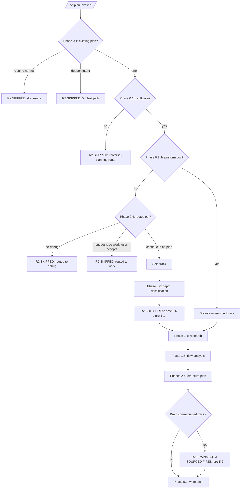

# feat: Surface scope earlier in ce-brainstorm and ce-plan via synthesis summaries

## Overview

Add a synthesis-summary mechanism to both ce-brainstorm and ce-plan that surfaces the agent's interpretation (Stated / Inferred / Out-of-scope) to the user before doc-write. This addresses scope under-visibility — the upstream cause of artifact bloat and rework downstream. Plus a short anti-expansion posture in ce-plan that reinforces scope discipline at implementation time by routing tangential cleanup to deferred items.

The plan introduces no new mode, flag, or user-facing classification question. Density-control tools (calibrated exemplars, brevity passes) are explicitly deferred — see Scope Boundaries — so this iteration tests whether scope discipline upstream dissolves density problems downstream before we add tools that target the symptom directly.

---

## Problem Frame

Issue #676 reports symptoms: 300+ line brainstorms, defensive artifacts, persistent 1000+ line PRs in brownfield codebases. The originating brainstorm worked through the causal hierarchy: scope under-visibility is the upstream cause, artifact density and PR diff size are downstream symptoms.

Both ce-brainstorm and ce-plan synthesize user input + agent inference into an interpretation, but the user doesn't see that synthesis until the doc lands. The user agrees to many individual things in dialogue but never sees the whole; the agent makes substantial inferences (especially in ce-plan solo invocation, where Phase 0.4 bootstrap is brief by design) and then writes against an unverified scope. Surprise at write-time means rework, and the rework looks like artifact bloat and oversized diffs downstream.

**Fix the cause and the symptoms abate. If they don't, density-control tools become a follow-up — but shipping them now alongside the cause fix would entangle attribution, add maintenance surface for value that may not be needed, and chase symptoms before testing whether the cause fix dissolves them.**

---

## Requirements Trace

- R1. ce-brainstorm synthesis summary (all tiers, post-Phase 2 / pre-Phase 3). Headless mode omits the "Inferred" list.
- R2. ce-plan synthesis summary, invocation-context-aware:
  - Solo invocation: post-Phase 0.4 bootstrap / pre-Phase 1 research
  - Brainstorm-sourced invocation: post-Phase 1 research / pre-Phase 5.2 plan-write
  - Headless mode omits the "Inferred" list in both variants
- R3. Anti-expansion clause routing scope creep AND tangential refactors to deferred items

**Origin actors:** A1 (ce-brainstorm agent — modified by U1), A2 (ce-plan agent — modified by U2, U3, U4), A3 (end-user developer — observable behavior change in all units).

**Origin acceptance examples:**
- AE1 (covers R1) — referenced in U1 test scenarios
- AE2 (covers R2 solo) — referenced in U2 test scenarios
- AE3 (covers R2 brainstorm-sourced) — referenced in U3 test scenarios

---

## Scope Boundaries

- Not adding a new mode, flag, command, or user-facing classification question
- Not changing existing Lightweight/Standard/Deep tier classification
- Not adding diff-size budgets or PR-size gates (Goodhart concerns)
- Not modifying ce-work or its handoff
- Not duplicating ce-brainstorm dialogue inside ce-plan's solo synthesis (R2 solo is a synthesis checkpoint, not a brainstorm-style interview)
- Not touching auto-deepening (Phase 5.3) — preserved as load-bearing depth
- Not introducing automated validation for headless-mode embedded synthesis (human PR reviewer is the safety net; documented limitation)
- Not extending ce-doc-review to validate synthesis sections

### Deferred to Follow-Up Work

- **Depth-calibration mechanisms.** Calibrated tier exemplars in `references/`, brevity passes for defensive sections (ce-brainstorm Outstanding Questions / Deferred to Planning) and template-tail sections (ce-plan Sources & References / Operational Notes), tier-aware observable output. These are density-control tools that target output density directly. Under the working hypothesis that scope under-visibility is the upstream cause, density should follow naturally from disciplined scope. Revisit only if post-rollout signals (see Validation) show density problems persist after this iteration ships.
- **Validation methodology and fixture matrix.** Real validation comes from post-rollout user feedback. If post-rollout signals warrant deeper validation, a fixture matrix (N≥3 trials per tier × invocation × mode cell) becomes a follow-up.
- **Frontmatter test extension.** A `tests/frontmatter.test.ts`-style assertion that synthesis-summary references exist in expected locations. Defer until a regression actually occurs.

---

## Context & Research

### Relevant Code and Patterns

**ce-brainstorm structure** (`plugins/compound-engineering/skills/ce-brainstorm/SKILL.md`):
- Phase 1.3 dialogue (lines 168-182) is "prose, not menus" (line 175) — direct precedent for R1's open prose
- Phase 2 (approaches): lines 184-210 — boundary at line 210/212 is the R1 insertion point
- Phase 3 (capture): lines 212-216, delegates to `references/requirements-capture.md`
- **No pipeline-mode handling exists today** — R1 introduces the pattern in this skill

**ce-plan structure** (`plugins/compound-engineering/skills/ce-plan/SKILL.md`):
- Phase 0.1 fast paths: lines 62-79 (resume / deepen-intent) — R2 must NOT fire on these
- Phase 0.2 brainstorm doc detection: lines 89-98 — distinguishes solo from brainstorm-sourced
- Phase 0.3 origin doc consumption: lines 100-117 — must handle a brainstorm doc whose first section is the new synthesis (Phase 0.3 compatibility check, owned by U3)
- Phase 0.4 planning bootstrap: lines 119-142 (routes to ce-debug or recommends ce-work at lines 139-142) — R2 solo must NOT fire if Phase 0.4 routes out
- Phase 0.6 depth assessment: lines 158-166 — R2 solo insertion point is between Phase 0.6 and Phase 1.1 (line 168)
- Phase 1 (research): lines 168-281
- Phase 5.2 plan-write: line 765 — R2 brainstorm-sourced fires just before this
- Phase 5.3 auto-deepening: lines 783-827 (preserved unchanged)
- Existing pipeline-mode callouts: lines 781, 798, 847 — all use the phrase *"If invoked from an automated workflow such as LFG, SLFG, or any `disable-model-invocation` context"*. **SLFG no longer exists as a skill** (verified — no `plugins/compound-engineering/skills/slfg/`); these references are stale and U2 folds in a small cleanup to drop SLFG from those three lines.

**Skill-isolation enforcement** (`AGENTS.md` "File References in Skills"):
- A SKILL.md may only reference files inside its own directory tree
- Synthesis-summary content must be duplicated between ce-brainstorm and ce-plan; no shared file
- Existing `visual-communication.md` is duplicated between the two skills with skill-tailored content — direct precedent

**Open prose feedback precedent:** ce-brainstorm Phase 1.3 rigor probes are "prose, not menus" (line 175). Interaction Rule 5(a) explicitly carves out open-prose responses when option sets would bias the answer. Cite this rule inline at R1/R2 prompt sites to prevent future "fix" back to a menu.

### Institutional Learnings

- `docs/solutions/best-practices/ce-pipeline-end-to-end-learnings-2026-04-17.md` §2 — each pipeline stage catches a different class of issue. Synthesis catches scope errors *before* the artifact is written; doc-review catches contradictions *after*. Make this explicit in SKILL.md to prevent future "deduplication."
- `docs/solutions/skill-design/compound-refresh-skill-improvements.md` — explicit headless detection beats auto-detection; "no blind user questions"; platform-agnostic interactive prompt phrasing.
- `docs/solutions/skill-design/research-agent-pipeline-separation-2026-04-05.md` — WHAT (brainstorm) vs HOW (plan) separation justifies R2's two-variant timing.
- `docs/solutions/skill-design/git-workflow-skills-need-explicit-state-machines-2026-03-27.md` — "whack-a-mole regressions" risk when adding new phases without explicit state-machine review. High-severity for our work; addressed via explicit guards in U1, U2, U3.
- `docs/solutions/skill-design/pass-paths-not-content-to-subagents-2026-03-26.md` — phrasing matters more than meta-rules; standalone-fallback pattern (R2 brainstorm-sourced graceful handling of pre-R1 brainstorms).

---

## Key Technical Decisions

- **Working hypothesis: scope under-visibility is the upstream cause; density is downstream.** Post-rollout signals (see Validation) are the actual validation. If real-user feedback surfaces density problems persisting despite synthesis discipline, density-control tools become a follow-up.
- **Two distinct synthesis-summary mechanisms (R1, R2), not one shared one.** ce-brainstorm has substantial pre-write dialogue; its summary is shorter and serves as synthesis confirmation + transition checkpoint. ce-plan has minimal pre-write interview in solo mode; its summary fires earlier (pre-research) and is more elaborate. Same Stated/Inferred/Out structure, different timing and shape per skill.
- **R2 timing is asymmetric by invocation context.** Solo R2 fires *pre-research* because research effort would be wasted if scope is wrong. Brainstorm-sourced R2 fires *pre-write* because the brainstorm doc already validated WHAT and plan-time decisions emerge during research.
- **State-machine guards explicit in SKILL.md, not implicit.** R2 does NOT fire on Phase 0.1 fast paths (resume / deepen-intent) or when Phase 0.4 routes out (ce-debug, ce-work, universal-planning). Each guard is a stated conditional in SKILL.md to prevent regressions.
- **Synthesis is always embedded** as the first section of the doc, both interactive and headless. Self-describing artifact for human PR reviewers. **Headless mode omits the "Inferred" list** — pipelines (LFG and any other `disable-model-invocation` caller) consume the doc without human review, so propagating un-validated agent inferences as authoritative is unsafe; Stated and Out-of-scope are kept (input the user gave, scope the agent deliberately excluded).
- **Pipeline propagation limitation is documented.** Even with the Inferred-omission, headless runs propagate the synthesis without correction. The plan does not introduce automated downstream validation — the failure mode is left to the human PR reviewer who eventually reads the resulting code. Future maintainers should not expect a safety net that does not exist.
- **R1/R2 use open prose, not AskUserQuestion.** Cite Interaction Rule 5(a) inline in SKILL.md.
- **Headless detection is implicit caller-context**, identical wording to existing ce-plan precedent (with SLFG dropped — see U2): *"If invoked from an automated workflow such as LFG or any `disable-model-invocation` context."*
- **Soft-cut fires on circularity, not iteration count.** Track which items the user touched per round; soft-cut fires when the same item is revised twice. Revising different aspects of a wrong synthesis (e.g., Stated then Inferred) is exactly what the mechanism should support.
- **Self-redirect support without explicit fork.** Users who realize they're in the wrong skill (e.g., "this is too big, brainstorm first") self-redirect from the synthesis. The agent stops, suggests the alternative, offers to load it in-session.
- **Phased delivery: Phase A (ce-brainstorm) lands first; Phase B (ce-plan) follows.** Phase A is structurally simpler — validates the synthesis mechanism in the smaller surface before the more complex ce-plan flow with two timing variants.
- **Pre-Phase-A gate: Phase 0.3 compatibility check.** Phase A modifies `requirements-capture.md` to embed the synthesis as the first section. ce-plan Phase 0.3 (origin-doc carry-forward) must handle the new structure gracefully; if not, the fix lands in Phase A alongside R1.
- **Density-control tools deferred.** Calibrated exemplars and brevity passes target output density directly; under the working hypothesis they're solving a symptom that scope discipline prevents. Shipping them speculatively alongside the cause fix would entangle attribution and add maintenance surface for value that may not be needed.
- **Rejected: diff budgets** (Goodhart failure mode).
- **Rejected: extend-over-invent posture** (was an earlier R3). Pressure-tested during plan revision: a "default to extending existing code" bias risks perpetuating bad patterns when existing code is the problem (extending a 500-line god-function makes it worse; gluing onto a mixed-concerns module preserves the mess). R2's brainstorm-sourced synthesis already surfaces extend-vs-invent as a plan-time decision the user sees and can correct, so the bias is redundant. R3 (anti-expansion) handles the legitimate scope-creep concern; the architectural extend-vs-invent judgment stays with the agent and is surfaced via R2 synthesis when material. If post-rollout signals show invention-bias is a real problem, revisit with process-level framing ("the synthesis must explicitly state extend-vs-invent reasoning per major component") rather than conclusion-level bias.

---

## Open Questions

### Deferred to Implementation

- [Affects U1, U2, U3][Technical] Exact wording of synthesis-summary prompt templates. Per `pass-paths-not-content-to-subagents`, phrasing matters; iterate during implementation.
- [Affects U2, U3][Technical] Whether `ce-plan/references/synthesis-summary.md` is one file with both solo and brainstorm-sourced templates, or two files. Default: one file with two clearly-labeled sections.
- [Affects U2][Technical] Whether the solo R2 prompt uses `AskUserQuestion` (blocking) or chat-output-with-natural-interrupt (visibility-first). Tradeoff: blocking is more reliable but adds friction. Decide during planning.

---

## High-Level Technical Design

> *This illustrates the intended R1/R2 firing rules and is directional guidance for review, not implementation specification.*

R1 fires unconditionally for all tiers in ce-brainstorm except on the Phase 0.1b non-software (universal-brainstorming) route. R2 has more state-machine branching:



Solo R2: full-breadth synthesis (problem frame, intended behavior, success criteria, in/out scope) with explicit "Inferred" list because Phase 0.4 bootstrap involves substantial inference. Brainstorm-sourced R2: plan-time decisions only (which files/modules to touch, which patterns extended vs. left alone, test scope, refactor scope). Brainstorm-validated WHAT is assumed.

Both variants: open prose feedback, soft-cut on circularity (not iteration count), always-embed in plan doc, headless skips prompt and omits Inferred list.

---

## Implementation Units

- U1. **ce-brainstorm R1 synthesis summary (Phase 2.5)**

  **Goal:** Insert new Phase 2.5 in `ce-brainstorm/SKILL.md` that surfaces synthesis (Stated / Inferred / Out-of-scope) before doc-write, with all-tier coverage and pipeline-mode handling. Introduces pipeline-mode pattern in `ce-brainstorm` for the first time.

  **Requirements:** R1

  **Dependencies:** None

  **Files:**
  - Modify: `plugins/compound-engineering/skills/ce-brainstorm/SKILL.md` — insert new `### Phase 2.5: Synthesis Summary` between current line 210 (end of Phase 2 prose) and current line 212 (`### Phase 3: Capture the Requirements`)
  - Modify: `plugins/compound-engineering/skills/ce-brainstorm/references/requirements-capture.md` — accommodate the new synthesis section as the first section of the rendered doc (template + ID/layout rules)
  - Create: `plugins/compound-engineering/skills/ce-brainstorm/references/synthesis-summary.md` — template, framing, Stated/Inferred/Out structure rules, soft-cut handling, headless behavior

  **Approach:**
  - Phase 2.5 fires for all tiers including Lightweight (transition checkpoint value)
  - Stated/Inferred/Out three-bucket structure; items may appear in two buckets when meaningfully both
  - Open prose feedback prompt (cite Interaction Rule 5(a) inline in SKILL.md)
  - Soft-cut fires on circularity (same item revised twice), not iteration count. Track which items the user touched per round.
  - Always embed synthesis as first section of requirements doc — interactive AND headless. **Headless mode omits the "Inferred" list** (Stated and Out are kept).
  - Pipeline-mode handling: skip prompt, embed synthesis with the headless shape. Conditional opening verbatim from `ce-plan/SKILL.md:781` (with SLFG dropped per U2's cleanup): *"If invoked from an automated workflow such as LFG or any `disable-model-invocation` context,"* — action clause skill-tailored: *"skip the user prompt and embed the synthesis as the first section of the requirements doc, omitting the Inferred list."*
  - Skip Phase 2.5 entirely on the Phase 0.1b non-software (universal-brainstorming) route
  - Self-redirect: if user says "this is too small, just /ce-work it" or similar, agent stops ce-brainstorm, suggests alternative skill, offers to load in-session
  - Modify `references/requirements-capture.md` to expect a synthesis section as the first section of the rendered doc

  **Execution note:** State-machine review per `git-workflow-skills-need-explicit-state-machines-2026-03-27.md`. Walk through 8 cells (4 tiers × {interactive, headless}) before considering U1 complete.

  **Technical design:** *(Synthesis prompt template, directional — actual phrasing to be authored during implementation.)*

  ```
  Based on our dialogue and approach selection, here's the scope I'm proposing for the requirements doc:

  Stated (from your input and our dialogue):
  - [item]

  Inferred (gaps I filled with assumptions):
  - [item — explicit so you can correct]

  Out of scope (deliberately excluded):
  - [item]

  Does this match your intent? Tell me what to add, remove, redirect, or that I got wrong — or just confirm to proceed.
  ```

  **Patterns to follow:**
  - `ce-plan/SKILL.md:781,798,847` (pipeline-mode wording precedent — verbatim conditional clause, skill-tailored action clause)
  - `ce-brainstorm/SKILL.md:175` (Phase 1.3 rigor probes are "prose, not menus" — same justification)
  - `plugins/compound-engineering/skills/ce-plan/references/deepening-workflow.md:206-211` (Interactive Finding Review Accept/Reject/Discuss pattern is the closest precedent for the soft-cut blocking question)

  **Test scenarios:**
  - **Covers AE1. Happy path Lightweight × interactive:** /ce-brainstorm on a small task — synthesis fires (paragraph + brief lists), user confirms or revises, embedded as first section
  - **Covers AE1. Happy path Standard × interactive:** /ce-brainstorm on a medium task — synthesis fires (paragraph + lists), embedded post-revision
  - **Covers AE1. Happy path × headless:** ce-brainstorm under LFG context — no prompt, synthesis embedded with Inferred omitted
  - **Edge case circularity soft-cut:** User revises the same Inferred item twice — soft-cut blocking question fires (proceed-as-revised vs. stop-and-redirect)
  - **Edge case multi-bucket revision:** User revises Stated, then Inferred (different items) — proceeds without soft-cut
  - **Edge case unparseable response:** User responds with a clarification question — agent treats as clarification, re-prompts
  - **Edge case self-redirect:** User says "this should just be a quick fix" — agent stops, suggests `/ce-work`
  - **Edge case Stated/Out overlap:** Item the user explicitly said but agent inferred should be excluded — appears in both buckets
  - **Edge case universal-brainstorming route:** Non-software brainstorm — Phase 2.5 skipped entirely
  - **Integration:** Synthesis embedded as first section; `requirements-capture.md` template accommodates it

  **Verification:**
  - Phase 2.5 present in `ce-brainstorm/SKILL.md` between current line 210 and 212
  - `synthesis-summary.md` reference file exists with template and full guidance
  - Pipeline-mode language present (LFG only, SLFG dropped); Inferred-omission rule present
  - Interaction Rule 5(a) citation present in Phase 2.5
  - State-machine review noted (8 cells confirmed)

- U2. **ce-plan R2 solo synthesis summary (Phase 0.7) + SLFG cleanup**

  **Goal:** Insert new Phase 0.7 that surfaces synthesis pre-research in solo invocation, catching scope errors before sub-agent dispatch is spent. Includes explicit state-machine guards. Folds in cleanup of stale SLFG references in existing ce-plan/SKILL.md (SLFG skill no longer exists; the cleanup is small and U2 already touches that file).

  **Requirements:** R2 (solo branch)

  **Dependencies:** None mechanically (parallel to U3; both share `synthesis-summary.md`)

  **Files:**
  - Modify: `plugins/compound-engineering/skills/ce-plan/SKILL.md` — insert new `### Phase 0.7: Solo-Mode Scope Summary` between current line 166 (end of Phase 0.6) and current line 168 (`### Phase 1: Gather Context`); also drop "SLFG" from existing pipeline-mode references at lines 781, 798, 847
  - Create: `plugins/compound-engineering/skills/ce-plan/references/synthesis-summary.md` — template covering both solo and brainstorm-sourced variants (U3 will extend with brainstorm-sourced section)

  **Approach:**
  - Fires only when:
    - Phase 0.2 found no upstream brainstorm doc (solo invocation)
    - AND Phase 0.4 stayed in ce-plan (did not route to ce-debug, ce-work, or universal-planning)
    - AND Phase 0.5 cleared (no unresolved blockers)
    - AND not on Phase 0.1 fast paths (resume normal, deepen-intent)
  - Each guard is an explicit conditional in SKILL.md
  - Stated/Inferred/Out structure with full breadth: problem frame, intended behavior, success criteria, in/out scope
  - "Inferred" list especially load-bearing in interactive mode — Phase 0.4 bootstrap involves substantial inference
  - Open prose feedback (cite Interaction Rule 5(a))
  - Soft-cut on circularity, not iteration count
  - Always embed in plan doc as first section. **Headless mode omits the "Inferred" list.**
  - Pipeline-mode handling: conditional opening verbatim from line 781 (with SLFG removed); action clause skill-tailored: *"skip the user prompt and embed the synthesis as the first section of the plan doc, omitting the Inferred list."*
  - Self-redirect to /ce-brainstorm: stop ce-plan, suggest, offer to load in-session
  - **SLFG cleanup (folded edit):** `ce-plan/SKILL.md` lines 781, 798, 847 currently reference "LFG, SLFG, or any `disable-model-invocation` context." SLFG is no longer a skill. Drop "SLFG" from each — keep "LFG" and "any `disable-model-invocation` context."

  **Execution note:** State-machine review. Walk through 6 firing cells (3 tiers × {interactive, headless}) plus 4 non-firing categories (resume, deepen, route-to-ce-debug, route-to-ce-work) before considering U2 complete.

  **Patterns to follow:**
  - `ce-plan/SKILL.md:781` (pipeline-mode wording — verbatim conditional, with SLFG removed)
  - U1 (ce-brainstorm R1 — synthesis-summary.md content duplicated per skill-isolation, with ce-plan-tailored variant guidance)

  **Test scenarios:**
  - **Covers AE2. Happy path Lightweight × interactive solo:** /ce-plan with thin one-line input — synthesis fires pre-research with explicit "Inferred" list
  - **Covers AE2. Happy path Standard × interactive solo:** /ce-plan with substantial prior conversation, no brainstorm doc — synthesis fires with conversation-aware Stated/Inferred split
  - **Covers AE2. Happy path × headless solo:** /ce-plan under LFG with no brainstorm — no prompt, synthesis embedded with Inferred omitted
  - **Negative resume path:** /ce-plan on existing-plan path — Phase 0.7 SKIPPED
  - **Negative deepen path:** /ce-plan with "deepen" intent — Phase 0.7 SKIPPED
  - **Negative route-to-ce-debug:** /ce-plan with symptom-without-root-cause — Phase 0.4 routes to ce-debug; Phase 0.7 SKIPPED
  - **Negative brainstorm-sourced path:** /ce-plan with matching brainstorm doc — Phase 0.7 SKIPPED (defers to U3's variant)
  - **Edge case self-redirect:** User says "this is bigger than I thought" — agent suggests /ce-brainstorm
  - **Edge case circularity soft-cut:** Same as U1 pattern
  - **Verification post-cleanup:** ce-plan/SKILL.md lines 781, 798, 847 no longer contain "SLFG"

  **Verification:**
  - Phase 0.7 present in SKILL.md between lines 166 and 168
  - All four guards explicit in SKILL.md (resume, deepen, route-out, brainstorm-sourced)
  - Pipeline-mode language present, LFG-only (SLFG removed everywhere it appeared)
  - Interaction Rule 5(a) citation present
  - State-machine review noted (10 cells confirmed)

- U3. **ce-plan R2 brainstorm-sourced synthesis summary (pre-Phase 5.2) + Phase 0.3 compatibility check**

  **Goal:** Insert synthesis just before Phase 5.2 plan-write when ce-plan was invoked with an upstream brainstorm doc. Surfaces plan-time decisions (file scope, pattern extension, test scope, refactor scope) that the brainstorm didn't validate. Owns the Phase 0.3 carry-forward compatibility check.

  **Requirements:** R2 (brainstorm-sourced branch)

  **Dependencies:** U2 (shares `synthesis-summary.md` references file — U3 extends with brainstorm-sourced section). **Phase 0.3 compatibility check portion runs pre-Phase-A** (see Phased Delivery).

  **Files:**
  - Modify: `plugins/compound-engineering/skills/ce-plan/SKILL.md` — insert just before current line 765 (`#### 5.2 Write Plan File`). Section heading: `#### 5.1.5 Brainstorm-Sourced Scope Summary`.
  - Modify: `plugins/compound-engineering/skills/ce-plan/references/synthesis-summary.md` — extend with brainstorm-sourced variant template
  - Possibly modify: `plugins/compound-engineering/skills/ce-plan/SKILL.md` Phase 0.3 (lines 100-117) — only if the compatibility check reveals incompatibility (see below)

  **Approach:**
  - Fires only when:
    - Phase 0.2 found upstream brainstorm doc (brainstorm-sourced invocation)
    - AND not on Phase 0.1 fast paths
  - Synthesis focuses on plan-time decisions:
    - Which files/modules to touch (and not touch)
    - Which patterns extended vs. introduced new
    - Test scope — which existing-but-untested code is in/out of test scope for this work
    - Refactor scope — which adjacent cleanup goes to deferred items vs. active diff
  - Brainstorm-validated WHAT is assumed and not re-stated
  - Graceful fallback: if origin brainstorm doc lacks the R1 synthesis section (older brainstorms, hand-written ones), R2 brainstorm-sourced runs as normal — its content is independent of origin synthesis presence. One-liner note in SKILL.md.
  - Same Stated/Inferred/Out structure, open prose, soft-cut on circularity, always-embed, pipeline-mode handling as U2 (Inferred omitted in headless).
  - **Phase 0.3 compatibility check (owned by this unit, runs pre-Phase-A):** read ce-plan SKILL.md Phase 0.3 (lines 100-117) and confirm the origin-doc-consumption path handles a brainstorm doc whose first section is the new synthesis summary — either by being section-agnostic or by explicitly surfacing/skipping it. **This check must complete before Phase A merges**, because Phase A modifies `requirements-capture.md` to embed the synthesis as the first section. If the check reveals an incompatibility, the relevant Phase 0.3 fix is folded into Phase A alongside R1, not deferred to Phase B.

  **Execution note:** State-machine walk through 6 cells (3 tiers × {interactive, headless}) before considering U3 complete.

  **Patterns to follow:**
  - U2 (solo R2 — same mechanism, different content focus)
  - `ce-plan/SKILL.md:765` (Phase 5.2 file-write — insertion point reference)

  **Test scenarios:**
  - **Covers AE3. Happy path interactive:** /ce-plan with matching brainstorm doc — synthesis fires post-research, pre-write; user can revise plan-time scope
  - **Covers AE3. Happy path × headless:** /ce-plan brainstorm-sourced under LFG — no prompt, synthesis embedded with Inferred omitted
  - **Edge case origin lacks R1 section:** /ce-plan with hand-written or pre-R1 brainstorm — graceful fallback runs as normal
  - **Edge case scope expansion request:** User says "wait, also touch the audit logging" — agent revises synthesis, surfaces, proceeds
  - **Negative solo path:** /ce-plan with no brainstorm — Phase 5.1.5 SKIPPED (defers to U2)
  - **Negative resume / deepen:** /ce-plan on existing-plan paths — Phase 5.1.5 SKIPPED
  - **Integration:** Phase 5.1.5 runs after Phase 5.1 review and before Phase 5.2 write-file
  - **Pre-Phase-A:** Phase 0.3 compatibility check completed; verification outcome (passes as-is, or fix folded into Phase A) documented in Phase A PR description

  **Verification:**
  - Phase 5.1.5 present in SKILL.md just before line 765
  - Graceful-fallback note present
  - Pipeline-mode language consistent with U2 (LFG-only, Inferred omitted in headless)
  - State-machine review noted (6 cells)
  - Phase 0.3 compatibility check completed pre-Phase-A; outcome documented

- U4. **ce-plan R3 anti-expansion posture**

  **Goal:** Add the anti-expansion clause (R3) to `ce-plan/SKILL.md` as posture guidance — a short addition to Phase 3.6, not a new phase or audit table. Routes tangential cleanup and scope expansions to deferred items.

  **Requirements:** R3

  **Dependencies:** None mechanically

  **Files:**
  - Modify: `plugins/compound-engineering/skills/ce-plan/SKILL.md` — add R3 to Phase 3.6 (lines 404-412) or Planning Rules (around line 720)

  **Approach:**
  - One paragraph extending existing planning-time/implementation-time separation guidance: tangential refactors AND scope expansions ("while we're here, we could also...") go to the existing `Deferred to Follow-Up Work` subsection in Scope Boundaries, not active Implementation Units. Cleanup spotted in touched files → deferred. Adjacent improvements → deferred. Scope-adjacent nice-to-haves → deferred.
  - Frame as posture reinforcement of R2's synthesis discipline, not as new enforcement. R2 already surfaces scope to the user; R3 sets the default that scope-creep belongs in deferred items rather than the active diff.
  - Keep concise. No required audit table; no new phase. Resist adding extend-vs-invent bias — that decision is the agent's judgment, surfaced to the user via R2 synthesis when material.

  **Pre-authoring cross-check (required):** Before authoring, read Phase 3.6 (lines 404-412), Planning Rule 4 (line 38), and the Deferred to Follow-Up Work subsection (lines 528-535) to verify the new paragraph extends rather than restates or contradicts existing text. Phase 3.6 already names "Refactors that may become unnecessary once implementation starts" as an explicit deferred example; R3 must reinforce that, not duplicate it.

  **Patterns to follow:**
  - Existing posture instructions in Phase 3.6 (lines 404-412) and Planning Rules (lines 720-730)
  - `Deferred to Follow-Up Work` subsection precedent in Phase 4.2 Core Plan Template (lines 528-535)

  **Test scenarios:**
  - **Happy path:** /ce-plan on task with adjacent cleanup opportunity (e.g., a `// TODO` nearby in a touched file) — plan defers to `Deferred to Follow-Up Work` rather than including in active Implementation Units
  - **Edge case:** User explicitly asks for refactor — R3 doesn't override user intent; the explicit ask makes refactor in-scope
  - **Negative:** Plans for genuinely scoped work (no adjacent cleanup discovered) — R3 doesn't manufacture deferred items; the section stays empty when there's nothing to defer

  **Verification:**
  - R3 instruction present in Phase 3.6 or Planning Rules
  - References to existing `Deferred to Follow-Up Work` subsection correct
  - No new required phase or audit table added
  - No extend-over-invent bias introduced (architectural extend-vs-invent decisions remain agent judgment, surfaced via R2 synthesis)

---

## System-Wide Impact

- **Interaction graph:** R1 introduces pipeline-mode handling in ce-brainstorm for the first time. `lfg/SKILL.md` runs with `disable-model-invocation: true` and currently calls ce-plan directly — if any pipeline ever calls ce-brainstorm, R1's pipeline-mode handling becomes load-bearing. Today no such pipeline exists; R1 is forward-compatible scaffolding.
- **API surface parity:** `requirements-capture.md` template is modified to accommodate the synthesis section as the first section. ce-plan Phase 0.3 (origin-doc carry-forward) must handle the new structure gracefully — verified pre-Phase-A by U3.
- **Error propagation:** If `synthesis-summary.md` is missing or malformed, the wiring in SKILL.md must fail loudly rather than silently writing without synthesis.
- **State lifecycle risks:** R1/R2 add three new state-machine edges (Phase 2.5 in ce-brainstorm; Phase 0.7 and Phase 5.1.5 in ce-plan). Each has explicit guards (skip on resume/deepen, skip on route-out, skip on universal-planning). State-machine review per `git-workflow-skills-need-explicit-state-machines-2026-03-27.md` is mandatory before each phase merges.
- **Unchanged invariants:** ce-work's plan-consumption logic; auto-deepening (Phase 5.3); `mode:headless` argument-parsing in ce-doc-review/ce-code-review; tier classification; frontmatter schema.

---

## Risks & Dependencies

| Risk | Mitigation |
|------|------------|
| State-machine regressions when adding Phase 2.5 / 0.7 / 5.1.5 — "whack-a-mole" pattern from `git-workflow-skills-need-explicit-state-machines-2026-03-27.md` | Walk all firing/non-firing cells per unit (8 for U1, 10 for U2, 6 for U3) before merging. Make guards explicit in SKILL.md, not implicit. |
| Synthesis summary becomes its own bloat | Tier-aware shape: Lightweight is one paragraph; Standard/Deep adds lists. Soft-cut on circularity (not iteration count). Always-embed but content is small. |
| Headless synthesis is wrong and propagates through pipelines without correction | **Mitigated, not eliminated:** R1/R2 omit the "Inferred" list in headless mode so un-validated agent inferences don't propagate as authoritative. Stated and Out kept (input the user gave; scope deliberately excluded). The residual failure mode propagates uncorrected through pipelines until a human PR reviewer reads the resulting code. Conscious accepted risk; documented in SKILL.md so future maintainers don't expect a safety net that doesn't exist. |
| Cross-skill duplication of synthesis-summary content drifts over time | Skill-isolation rule documented; `visual-communication.md` precedent shows duplication can stay coherent with reviewer attention. Future drift between ce-brainstorm and ce-plan content is a real signal that one skill's needs diverged, not a bug. |
| ce-brainstorm pipeline-mode handling is novel (first in this skill) | Use exact wording from ce-plan precedent (with SLFG dropped). Pipeline-mode is forward-compatible scaffolding; if it ever fires, behavior matches ce-plan precedent. |
| Open-prose feedback "fixed" back to AskUserQuestion by future maintainer | Cite Interaction Rule 5(a) inline at each prose-prompt point. The justification is documented in the skill itself, not just commit messages. |
| R2 brainstorm-sourced fires when origin has malformed or missing synthesis section | Graceful fallback: R2 brainstorm-sourced content is independent of origin synthesis section presence. One-liner in SKILL.md. |
| Working hypothesis (scope discipline upstream → density follows downstream) is wrong | Real validation comes from post-rollout signals (see Validation). If signals show density problems persist, depth-calibration mechanisms become a follow-up. The risk of being wrong is small (we ship a smaller change; the follow-up is additive). |

---

## Validation

**Direct validation (pre-merge):** structural assertions per `bun test`, manual walk through every state-machine cell per phase (see Phase A and Phase B below), and the Phase 0.3 compatibility check (owned by U3, runs pre-Phase-A).

**Post-rollout signals (real validation of the causal claim):** the brainstorm explicitly noted that PR-diff-size and rewrite-frequency reductions are downstream consequences expected from upstream scope discipline, validated by real-user feedback rather than pre-implementation gates. Signals to watch:

- **Synthesis-correction rate:** percentage of R1/R2 prompts where the user revises (vs. silently approves) the synthesis. **Healthy range:** 15-50% in early weeks. Persistent rate <10% across 30+ invocations suggests the synthesis prompt has become ritual; investigate whether tier-specific behavior should change. Persistent rate >70% suggests synthesis is consistently misaligned with intent; investigate prompt phrasing.
- **Self-redirect rate:** percentage of solo R2 prompts where the user redirects to /ce-brainstorm. **Healthy range:** 5-20%. Higher rates indicate users routinely picked the wrong skill — surface as recommendation in ce-plan's Phase 0.4 bootstrap.
- **Same-task PR-diff trend:** for users with comparable task workloads pre-/post-rollout, observe PR-diff distribution. The original signal from #676 (jrdncstr's persistent 1000+ line PRs) is the canonical case. Directional improvement is the win.
- **Time-to-doc-write:** median time from `/ce-brainstorm` invocation to written brainstorm doc, pre-/post-rollout. R1 adds a synthesis step; if median time grows by more than ~2x, the friction cost may exceed the scope-accuracy benefit.
- **Density signal:** if post-rollout artifacts continue showing defensive Outstanding Questions / Deferred to Planning padding or placeholder template-tail content despite synthesis discipline, the working hypothesis was incomplete and depth-calibration mechanisms (deferred — see Scope Boundaries) become a follow-up.

**Validation methodology — what the team does post-rollout:** review session logs and PR data for the signals above at 30/60/90-day intervals after Phase A ships. If signals are favorable at 30 days, ship Phase B; if mixed, hold Phase B and revisit prompt design; if negative, revert or scope down.

---

## Phased Delivery

### Pre-Phase-A: Phase 0.3 compatibility check

Owned by U3. Run **before Phase A merges**. Phase A modifies `requirements-capture.md` to embed the synthesis as the first section of every brainstorm doc; if ce-plan Phase 0.3 doesn't gracefully consume the new structure, Phase A would ship with broken consumer compatibility. Read ce-plan SKILL.md Phase 0.3 (lines 100-117) and verify graceful handling of unknown first sections (section-agnostic behavior, or explicit surface/skip). If incompatible, the fix folds into Phase A alongside R1.

### Phase A: ce-brainstorm (U1)

- One PR
- Pre-merge: Phase 0.3 compatibility verification completed (see above)
- Validate manually across 8 cells (4 tiers × {interactive, headless})
- `bun test` passes; `bun run release:validate` passes

### Phase B: ce-plan (U2 + U3 + U4)

Land atomically after Phase A is validated.

**Intra-phase sequencing:** **U2 must be authored before U3** — U2 creates `synthesis-summary.md`; U3 extends it. **U4 is independent** and may proceed in parallel with U2 or U3.

- One PR or one tightly-coupled small series
- Validate manually across 16 cells (3 tiers × 2 invocation contexts × 2 modes + 4 non-firing categories)
- `bun test` passes; `bun run release:validate` passes

### Why this order

- Phase A is structurally simpler — validates the synthesis mechanism in the smaller surface first
- Phase B's R2 has two timing variants and more state-machine guards (resume / deepen / route-out) — validating R1 first reduces compound risk
- Phase 0.3 compatibility check moves to pre-Phase-A so consumer compatibility is verified before producer change ships

---

## Documentation / Operational Notes

- **No release-version bump in routine PR.** Per `plugins/compound-engineering/AGENTS.md`, release-please owns plugin version.
- **No CHANGELOG entry in routine PR.** Release-please generates the changelog.
- **Commit prefix:** `feat:` (introduces new visibility behavior). Per-unit scopes: `feat(ce-brainstorm): ...` for U1; `feat(ce-plan): ...` for U2, U3, U4.
- **Validation commands** before each merge: `bun test`, `bun run release:validate`.
- **Per `plugins/compound-engineering/AGENTS.md` "Validating Agent and Skill Changes":** behavioral changes need skill-creator's eval workflow because plugin agent and skill definitions cache at session start.
- **No legacy-cleanup registry update needed.** This work adds files; doesn't remove.
- **Beta sync check:** Neither ce-brainstorm nor ce-plan has a `-beta` counterpart. No sync decision required.

---

## Sources & References

- **Origin document:** `docs/brainstorms/2026-04-24-surface-scope-earlier-requirements.md`
- **Related issue:** [GitHub Issue #676](https://github.com/EveryInc/compound-engineering-plugin/issues/676)
- **Skill files modified:**
  - `plugins/compound-engineering/skills/ce-brainstorm/SKILL.md`
  - `plugins/compound-engineering/skills/ce-brainstorm/references/requirements-capture.md`
  - `plugins/compound-engineering/skills/ce-plan/SKILL.md`
- **Skill files created:**
  - `plugins/compound-engineering/skills/ce-brainstorm/references/synthesis-summary.md`
  - `plugins/compound-engineering/skills/ce-plan/references/synthesis-summary.md`
- **Repo conventions:**
  - `AGENTS.md` (root) — commit conventions, skill-isolation rule
  - `plugins/compound-engineering/AGENTS.md` — references inclusion conventions, AskUserQuestion design rules
- **Institutional learnings:**
  - `docs/solutions/best-practices/ce-pipeline-end-to-end-learnings-2026-04-17.md`
  - `docs/solutions/skill-design/compound-refresh-skill-improvements.md`
  - `docs/solutions/skill-design/research-agent-pipeline-separation-2026-04-05.md`
  - `docs/solutions/skill-design/git-workflow-skills-need-explicit-state-machines-2026-03-27.md`
  - `docs/solutions/skill-design/pass-paths-not-content-to-subagents-2026-03-26.md`
