# Gugu Agent

<p align="center">
  
</p>

<div align="center">

[](https://gitee.com/xiyouwangluo/claude-code-gugu/stargazers)
[](https://gitee.com/xiyouwangluo/claude-code-gugu/members)
[](https://gitee.com/xiyouwangluo/claude-code-gugu/releases)
[](https://gugu.guxingyao.com/)
[](README.md)

</div>

Gugu Agent is a ready-to-use desktop AI Agent. After installation, users can start with the built-in Gugu Managed route without first configuring model providers, API keys, or file parsing services. Advanced users can still switch to custom configuration and connect their own providers, models, MCP servers, Agents, skills, and plugins.

It is designed for everyday coding, bug fixing, document reading, planning, long-running tasks, and teams that want to package Claude Code-style agent capabilities into a visual, lower-friction product.

<p align="center">
  <a href="#desktop-preview">Desktop Preview</a> ·
  <a href="#why-gugu-agent">Why Gugu Agent</a> ·
  <a href="#core-capabilities">Core Capabilities</a> ·
  <a href="#architecture-overview">Architecture</a> ·
  <a href="#download-and-installation">Download</a> ·
  <a href="#trial-and-subscription">Subscription</a> ·
  <a href="#development">Development</a>
</p>

---

## Desktop Preview

<p align="center">
  <a href="https://gitee.com/xiyouwangluo/claude-code-gugu/releases"></a>
  &nbsp;
  <a href="docs/desktop/04-installation.md"></a>
</p>

<table>
  <tr>
    <td align="center" width="33%">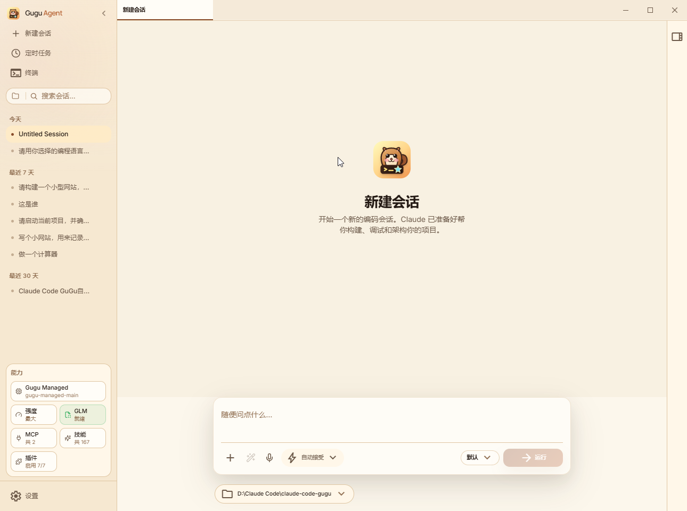<br><b>New Session</b></td>
    <td align="center" width="33%">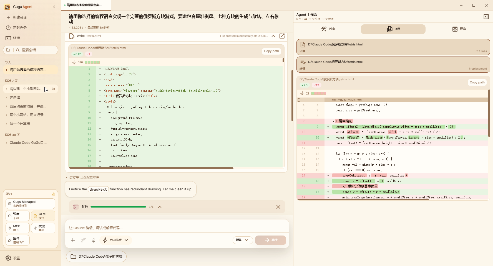<br><b>Agent Workspace & Diff</b></td>
    <td align="center" width="33%">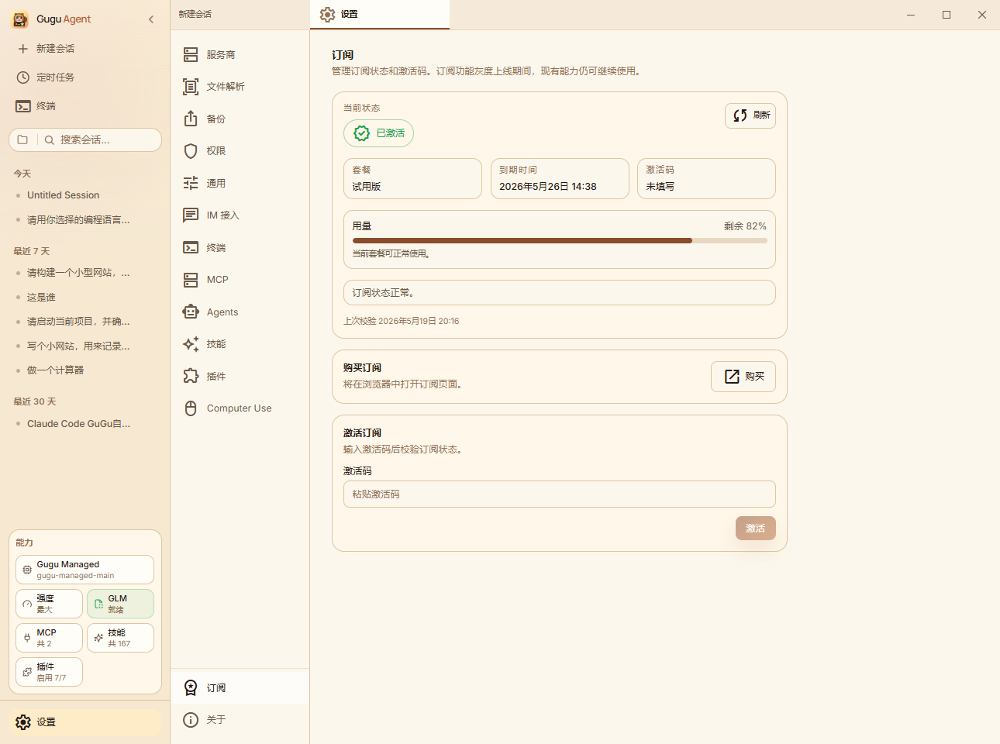<br><b>Subscription & Usage</b></td>
  </tr>
</table>

---

## Why Gugu Agent

- **Ready to use**: Gugu Managed provides the default model route, file parsing, quota, and subscription flow so regular users can start immediately.
- **No provider setup required**: Users do not need to understand Base URLs, model IDs, API keys, OCR, or multimodal parsing before their first run.
- **Still fully configurable**: Power users can connect third-party providers, custom models, MCP servers, Agents, skills, and plugins.
- **Built for real work**: Chat, planning, code edits, Diff review, permission checks, file parsing, and long-running tasks all live in one desktop workspace.
- **Friendly to non-technical users**: Complex agent capabilities are packaged into clearer controls, status surfaces, subscription flows, and review panels.

---

## Core Capabilities

- **Gugu Managed route**: Built-in managed model capability, currently using DeepSeek V4 with GLM for files, images, OCR, and long-document parsing.
- **Default / Plan / CE modes**: Default mode for everyday chat and execution, Plan mode for clarifying work before changes, and CE mode for structured engineering workflows.
- **File parsing**: Supports images, OCR, long-document summaries, and file understanding.
- **Permission control**: Commands, file writes, and risky operations are surfaced for confirmation before execution.
- **Agent workspace**: Activity, Diff, preview, tool calls, and file edits are visible in one place.
- **Agents / Skills / Plugins**: Manage built-in, project, and plugin-provided agents and skill packs.
- **Custom providers**: Keep the advanced provider configuration path for teams that want to use their own model resources.
- **Subscription and usage**: The desktop app shows plan status, expiry time, and remaining usage percentage, then guides users into purchase, renewal, and activation.

---

## Architecture Overview

<table>
  <tr>
    <td align="center" width="25%">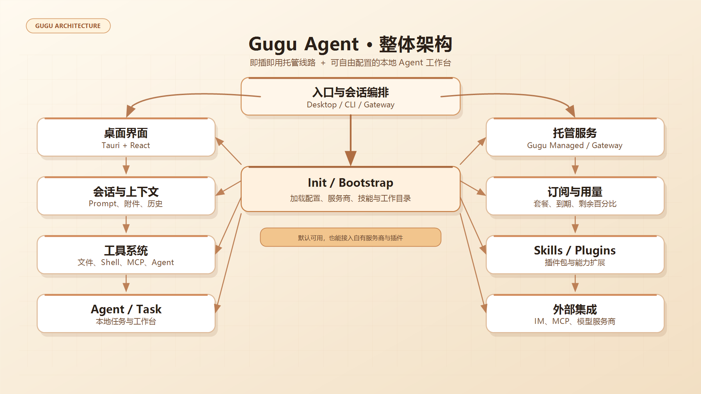<br><b>Overall Architecture</b></td>
    <td align="center" width="25%">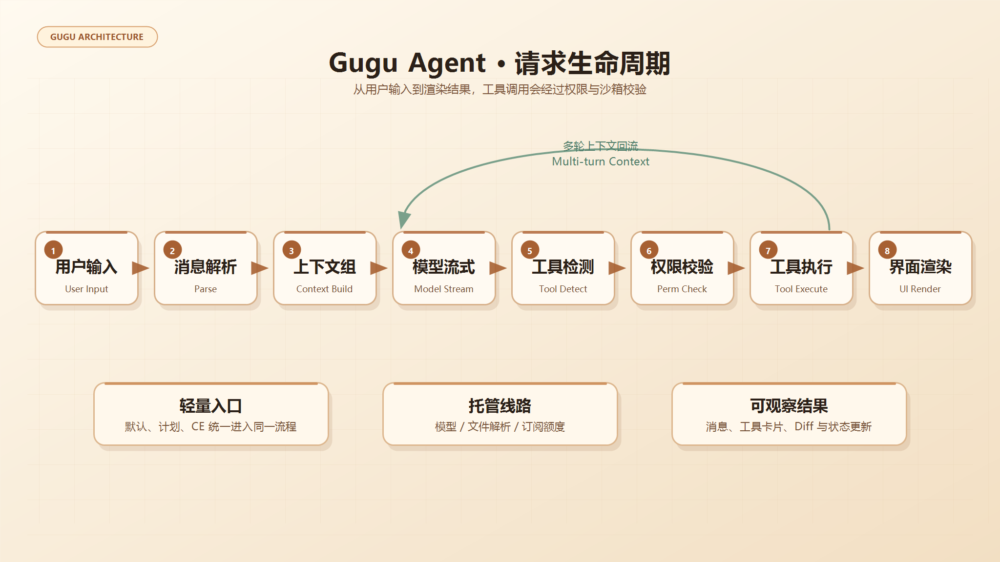<br><b>Request Lifecycle</b></td>
    <td align="center" width="25%">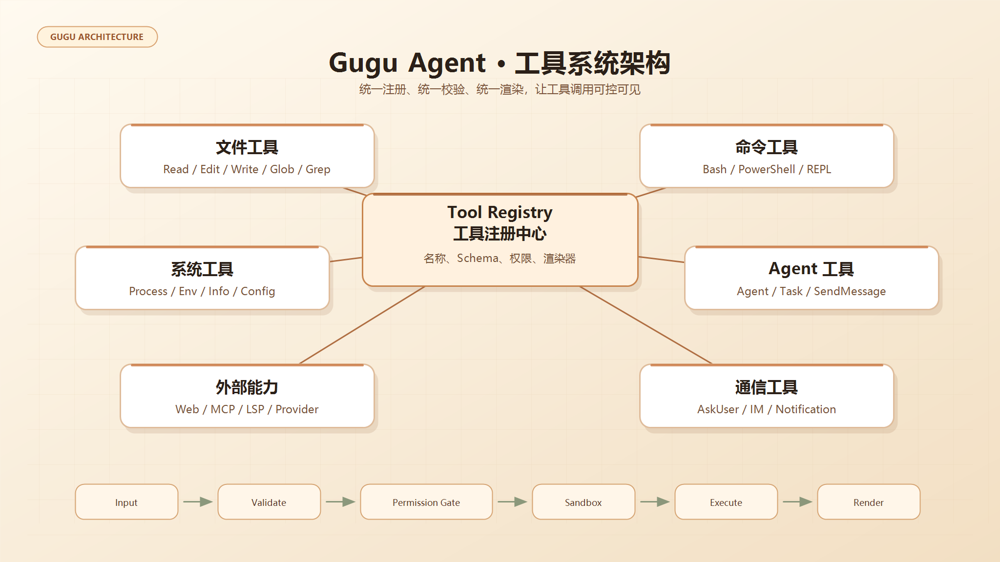<br><b>Tool System</b></td>
    <td align="center" width="25%">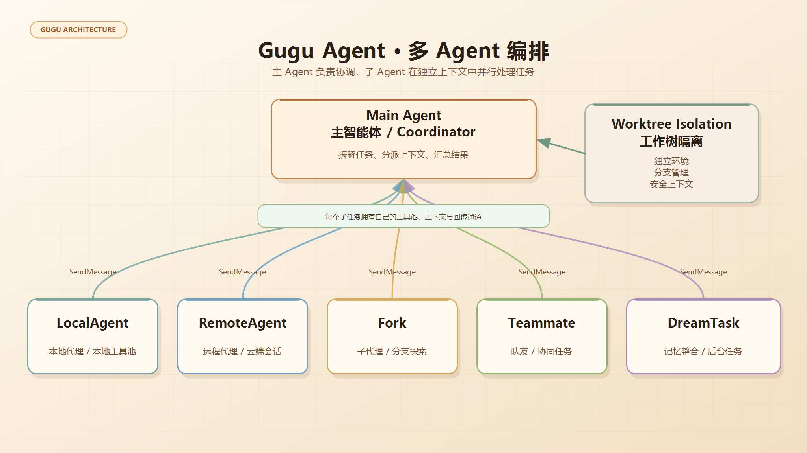<br><b>Multi-Agent</b></td>
  </tr>
  <tr>
    <td align="center" width="25%">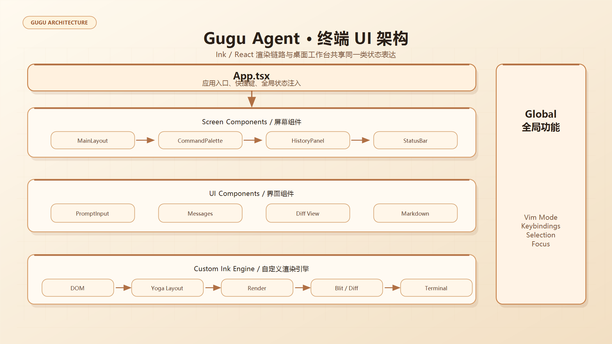<br><b>Terminal UI</b></td>
    <td align="center" width="25%">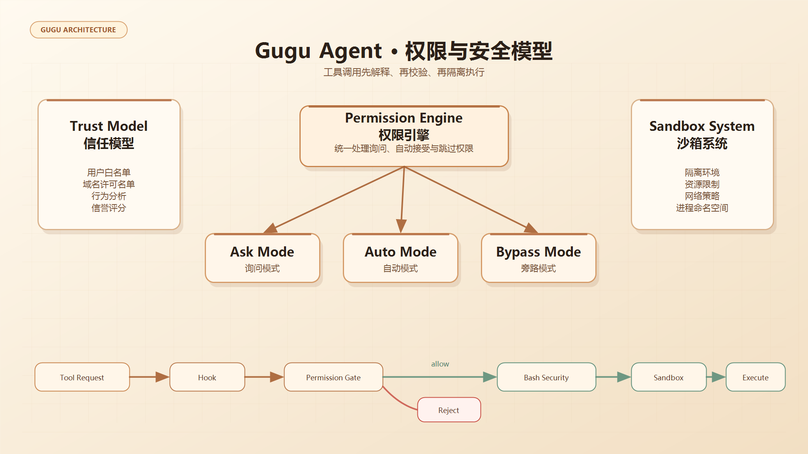<br><b>Permissions & Security</b></td>
    <td align="center" width="25%">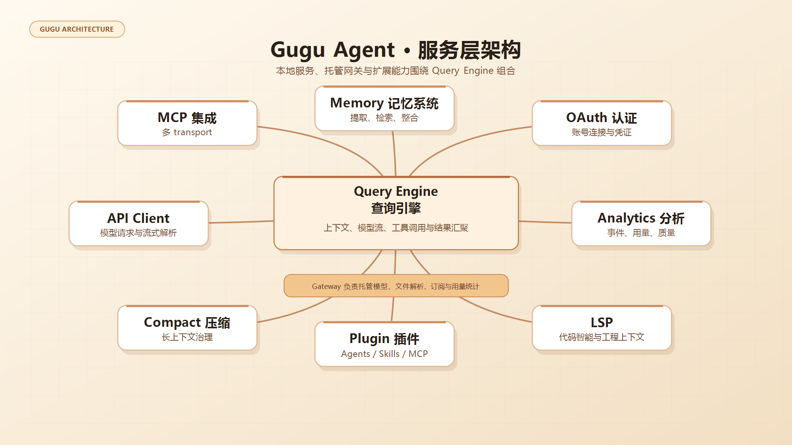<br><b>Services Layer</b></td>
    <td align="center" width="25%">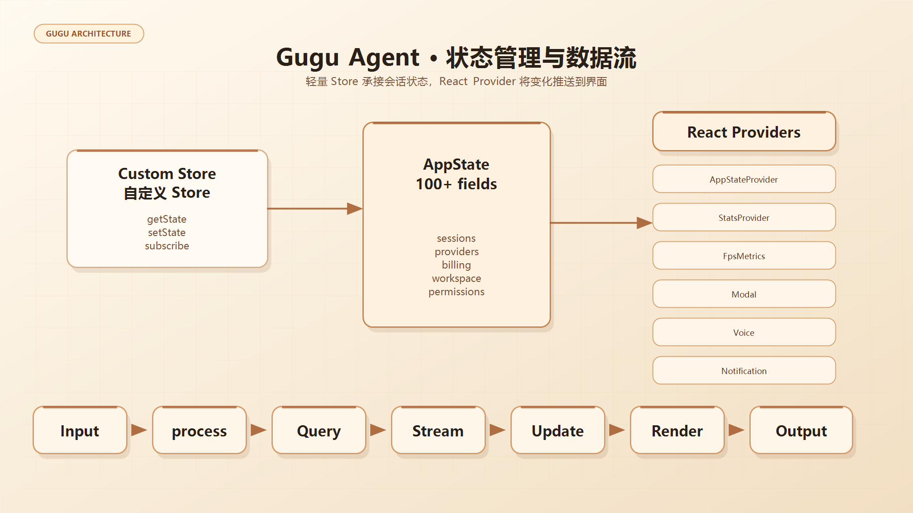<br><b>State & Data Flow</b></td>
  </tr>
</table>

---

## Download and Installation

Go to [Gitee Releases](https://gitee.com/xiyouwangluo/claude-code-gugu/releases) and download the latest Windows build.

If a browser or security product reports a warning, confirm that the file comes from this repository's Release page and compare the version and checksum information. The Windows package is still in early distribution, so some security products may flag it before the app has enough download reputation.

### Windows

1. Download `Gugu-Agent-*-Windows-x64.zip`.
2. Extract it to a stable folder.
3. Run Gugu Agent.
4. Select Gugu Managed on first launch to start the trial.

---

## Trial and Subscription

- New devices get a 7-day trial.
- When the trial expires or usage runs low, open `Settings -> Subscription` in the desktop app.
- Click purchase or renewal, choose a plan, and submit an order.
- After manual payment confirmation, you will receive an activation code.
- Return to `Settings -> Subscription` and enter the activation code to upgrade.

The current version uses manual activation-code fulfillment. After ICP filing, HTTPS domain setup, and company merchant accounts are ready, WeChat Pay and Alipay will be connected gradually.

---

## Development

### Install dependencies

```bash
bun install
cd desktop
bun install
```

### Start the local server

```bash
SERVER_PORT=3456 bun run src/server/index.ts
```

### Start the desktop frontend

```bash
cd desktop
bun run dev
```

### Start the Gateway

```bash
cd gateway
bun run dev
```

### Common checks

```bash
cd desktop && bun run test
cd desktop && bun run lint
cd gateway && bun run test
```

---

## Project Structure

```text
src/          CLI, local server, proxy, and core tool implementation
desktop/      Tauri 2 + React desktop app
gateway/      Gugu Managed gateway, subscription, orders, and admin dashboard
docs/         User documentation and design notes
```

---

## More Documentation

- [Desktop installation guide](docs/desktop/04-installation.md)
- [Third-party model configuration](docs/en/guide/third-party-models.md)
- [Agents usage guide](docs/en/agent/01-usage-guide.md)
- [Skills usage guide](docs/en/skills/01-usage-guide.md)
- [IM integration](docs/en/channel/index.md)
