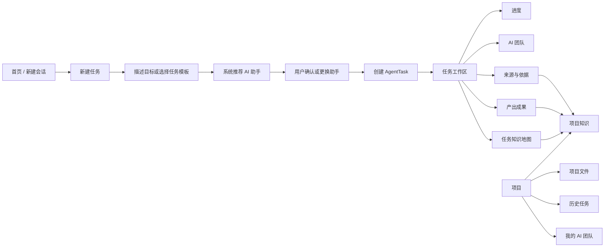
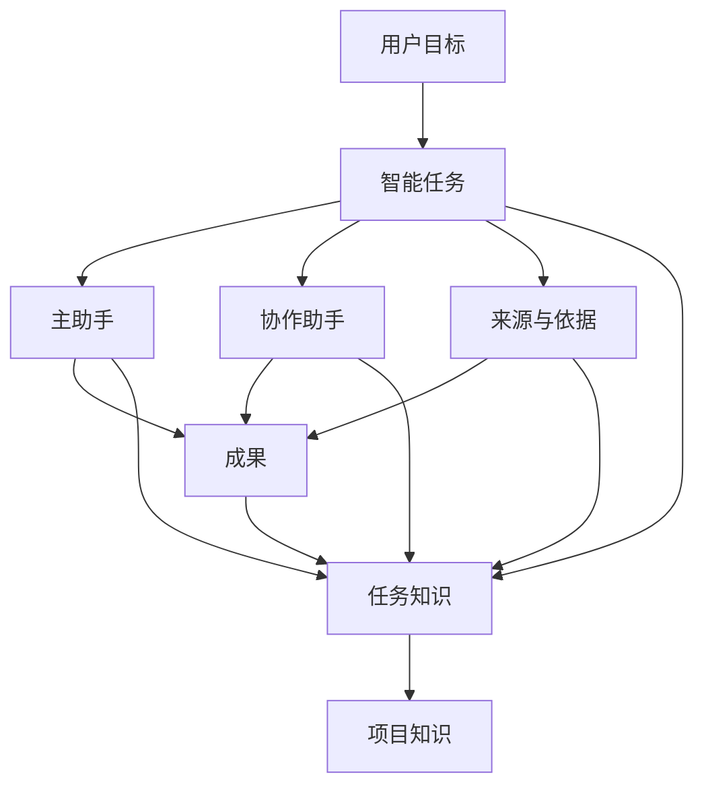

# Gugu 多角色 Agent 与项目知识可视化产品化方案

> **文档类型：** Canvas 版产品方案 / Codex 需求输入  
> **版本：** v1.0  
> **日期：** 2026-07-19  
> **适用对象：** 产品、设计、前端、后端、Agent 编排、Codex 代码审计

---

## 0. 一句话结论

Gugu 应当以“**我要完成什么任务**”作为主入口，但不能把多角色 Agent 和知识关系完全藏在后台。

正确的产品形态是：

- 用户先描述任务；
- 系统推荐最合适的主助手和协作助手；
- 用户在启动前能够看见、理解并确认；
- 任务执行过程中，持续展示“谁在工作、用了什么资料、做到哪一步”；
- 所有文件、网页、图片、对话、证据与产出，统一沉淀到可查看的“项目知识”中。

核心原则不是“把技术全部隐藏”，而是：

> **隐藏技术复杂度，保留工作透明度。**

---

## 1. 当前实现状态

根据现有技术说明，目前已经完成的是多角色 AgentTask 与知识沉淀的底层闭环，但产品入口尚未补齐。

### 1.1 已实现

- 支持通过运行时开关启用 AgentTask：

```powershell
$env:CC_GUGU_AGENT_TASK_RUNTIME="1"
rtk bun run tauri dev
```

- 可以通过自然语言创建指定角色任务，例如：

```text
创建一个 knowledge_worker AgentTask，整理当前项目资料并输出文档。
```

```text
创建一个 software_engineer AgentTask，检查并修复这个问题。
```

- 角色在任务创建时确定；同一任务中暂不支持中途切换主角色。
- AgentTask 创建后，输入框上方会显示任务状态条。
- 工作台的“证据”页能够查看来源、知识沉淀和轻量知识地图。
- 普通历史会话或没有 AgentTask 的会话，不显示上述任务能力。

### 1.2 尚未产品化

- 用户不能从 UI 直接创建带角色的任务。
- 用户不能在创建任务前看见“推荐由谁完成”。
- 用户不能直观知道当前任务有哪些助手正在参与。
- 没有全局“项目知识”入口。
- “设置 → Agents”并不是本次 Role Pack 的用户入口。
- 当前体验依赖环境变量和特定自然语言命令，不适合普通用户。

### 1.3 当前核心问题

底层能力已经存在，但普通用户看不到，导致三个问题：

1. **不知道怎么开始。**  
   用户不知道应该输入什么命令，也不知道有哪些角色可用。

2. **不知道谁在工作。**  
   系统即使正确调用了角色，用户也缺乏感知与信任。

3. **不知道 AI 用了什么。**  
   文件、网页、图片、历史内容和产出之间的关系没有形成清晰的产品入口。

---

## 2. 目标用户与关键认知

### 2.1 主要用户

- 不懂 Agent、MCP、Role Pack、知识图谱等技术概念的普通用户；
- 运营、市场、文案、选品、设计、行政、项目管理等业务人员；
- 会使用 AI，但不愿意学习复杂工作流配置的用户；
- 需要“看得见过程”才能建立信任的用户。

### 2.2 重要认知修正

常见误区是：

> 普通用户不懂技术，所以应该把 Agent 和知识关系全部隐藏。

更接近真实需求的判断是：

> 普通用户不想配置技术，但希望看见 AI 正在如何工作。

因此，产品既不能把技术名词直接丢给用户，也不能只给一个黑盒聊天框。

用户需要回答以下几个直觉问题：

- 现在是谁在帮我？
- 为什么推荐这个助手？
- 还有哪些助手参与？
- AI 看了哪些文件和网页？
- 哪些内容是事实来源，哪些是 AI 推断？
- 产出的文档、图片和结论放在哪里？
- 这些知识以后还能不能继续使用？

---

## 3. 产品设计原则

### 原则一：任务优先，角色可见

首页不要求用户先理解角色，而是先说“我要做什么”。

但在任务真正启动前，必须展示：

- 推荐主助手；
- 推荐原因；
- 擅长能力；
- 可能参与的协作助手；
- 用户可更换或确认。

### 原则二：系统推荐，用户确认

不要求用户从空白页面配置 Agent。

默认流程：

1. 用户描述目标；
2. 系统识别任务类型；
3. 推荐主助手与协作助手；
4. 用户确认或更换；
5. 创建任务。

### 原则三：过程默认透明，但不过载

执行过程中默认显示轻量信息：

- 当前主助手；
- 协作助手；
- 当前阶段；
- 已引用资料数量；
- 最近一步动作。

详细推理、完整日志、工具调用可放在二级入口，不塞满主界面。

### 原则四：知识可见、可追溯、可复用

用户上传、选择或由 Agent 检索到的文件、网页、图片、历史对话和产出，应统一进入“项目知识”。

每个知识项至少能够回答：

- 从哪里来；
- 被哪个任务使用；
- 被哪个助手使用；
- 产生了哪些结论或产物；
- 最近更新时间；
- 是否存在冲突或过期风险。

### 原则五：产品语言替代技术语言

| 技术名称 | 面向用户的名称 |
|---|---|
| AgentTask | 智能任务 / 工作任务 |
| Agent | AI 助手 / 专业助手 |
| Role Pack | 助手类型 / AI 团队模板 |
| Multi-Agent | AI 团队协作 |
| Knowledge Graph | 项目知识 / 工作地图 |
| Evidence | 来源与依据 |
| Memory | 项目记忆 |
| Skill / MCP | 工具能力 |
| Orchestrator | 自动协作 / 任务协调 |

---

## 4. 推荐信息架构



### 4.1 一级入口

左侧“项目”区域建议新增两个明确入口：

1. **项目知识**
2. **我的 AI 团队**

不要把这两项只放进“设置”。它们是日常工作能力，不是低频系统配置。

### 4.2 新建会话与新建任务的区分

- **新建会话：** 普通对话，不强制创建 AgentTask。
- **新建任务：** 有目标、角色、进度、资料和产出的完整工作闭环。

首页可同时保留两个入口，但视觉上应突出“新建任务”。

---

## 5. 新建任务流程

### 5.1 第一步：用户说明要做什么

提供两种方式：

- 自然语言输入；
- 常用任务模板。

任务模板示例：

- 写一份文档
- 分析一批数据
- 制作短视频方案
- 整理项目资料
- 检查并修复代码
- 做市场调研
- 撰写邮件
- 制作 PPT

### 5.2 第二步：推荐助手

系统根据目标推荐主助手，并展示可理解的信息。

示例：

> **推荐：短视频运营助手**  
> 擅长：选题、前三秒钩子、脚本、分镜、平台差异化发布。  
> 推荐原因：你正在制作产品宣传视频，并已选择项目中的品牌资料。

操作：

- `使用该助手`
- `更换助手`
- `查看能力详情`

### 5.3 第三步：展示协作团队

默认只突出一个主助手，协作助手折叠展示。

示例：

- 主助手：短视频运营助手
- 协作助手：资料整理助手、视觉策划助手

用户可以：

- 接受推荐；
- 移除某个协作助手；
- 增加一次“专业复核”；
- 查看每个助手负责的工作。

### 5.4 第四步：确认使用的知识

创建任务前展示简短的资料范围：

- 当前项目文件夹；
- 用户选中的文件；
- 历史任务成果；
- 是否允许联网检索；
- 是否允许使用项目记忆。

示例：

> 本任务预计使用：产品介绍 3 份、历史视频脚本 8 份、品牌图片 12 张。  
> 联网检索：开启。

### 5.5 第五步：启动任务

确认后创建 AgentTask。

由于当前架构中主角色在任务创建时锁定，界面需要明确提示：

> 主助手将在任务创建后锁定。需要更换主助手时，可复制为新任务并重新选择。

不要让用户在执行中途点击一个看似可切换、实际无效的角色按钮。

---

## 6. 任务工作区设计

### 6.1 顶部任务状态条

输入框上方的任务状态条建议固定展示：

- 任务名称；
- 当前阶段；
- 主助手头像与名称；
- 协作助手数量；
- 已引用资料数量；
- 当前状态：分析中 / 等待确认 / 执行中 / 已完成 / 失败。

示例：

```text
短视频宣传方案  ·  脚本规划中
主助手：短视频运营助手  ·  2 位协作助手  ·  已使用 11 项资料
```

点击状态条打开右侧工作台。

### 6.2 右侧工作台标签

建议统一为五个标签：

1. **进度**
2. **AI 团队**
3. **来源与依据**
4. **任务知识**
5. **成果**

#### 进度

显示：

- 当前阶段；
- 已完成步骤；
- 正在执行的步骤；
- 等待用户确认的内容；
- 失败或阻塞原因。

#### AI 团队

显示：

- 主助手；
- 协作助手；
- 每个助手负责什么；
- 当前谁正在工作；
- 为什么被选中。

角色卡片示例：

```text
短视频运营助手（主助手）
负责：选题、脚本结构、平台适配
当前状态：正在整理前三秒钩子
```

```text
资料整理助手（协作）
负责：读取项目文件、提取产品卖点
当前状态：已完成
```

#### 来源与依据

显示任务使用过的：

- 文件；
- 网页；
- 图片；
- 历史对话；
- 数据表；
- 代码；
- 用户直接输入。

每一项都需要保留来源、时间、引用位置和使用状态。

#### 任务知识

这里不是展示复杂数据库，而是展示“这次任务形成的关系”。

例如：

```text
产品卖点
├─ 来源：产品介绍.docx
├─ 被使用：短视频运营助手
├─ 形成：脚本第 2 段
└─ 关联：目标用户、前三秒钩子、功能演示
```

支持两种视图：

- 列表视图：默认，适合普通用户；
- 关系视图：可选，用节点连线展示。

#### 成果

集中显示：

- 最终文档；
- 中间草稿；
- 图片；
- 表格；
- 代码修改；
- 用户确认版本。

所有成果都应能回溯到所使用的来源和参与助手。

---

## 7. 项目知识入口

### 7.1 定位

“项目知识”是项目级资产中心，不等同于单次任务的“证据”标签。

它应当统一管理：

- 用户主动上传的资料；
- 项目文件夹中的文件；
- Agent 检索并被用户保留的网页；
- 任务产生的文档、表格、图片与代码；
- 已确认的项目结论；
- 历史任务沉淀；
- 资料之间的关系。

### 7.2 入口位置

建议放在左侧项目树中：

```text
项目
├─ 对话
├─ 任务
├─ 项目知识
├─ 项目文件
└─ 我的 AI 团队
```

### 7.3 项目知识首页

顶部概览：

- 文件数量；
- 网页数量；
- 图片数量；
- 历史成果数量；
- 最近更新时间；
- 存在冲突或过期风险的知识数量。

主要区域：

- 最近使用；
- 按主题分类；
- 按任务分类；
- 按来源类型分类；
- 关系地图；
- 待确认知识。

### 7.4 知识卡片

每个知识项建议展示：

- 标题；
- 类型；
- 来源；
- 创建者或采集者；
- 被哪些任务使用；
- 被哪些助手使用；
- 关联成果；
- 最近更新时间；
- 可信状态：用户确认 / 自动提取 / 待核实 / 存在冲突。

### 7.5 关系地图

关系图不应成为唯一视图，也不应默认展示成密集的“蜘蛛网”。

建议采用逐层展开：

```text
任务：新品宣传视频
├─ 助手：短视频运营助手
├─ 助手：资料整理助手
├─ 来源：产品介绍.docx
├─ 来源：历史脚本.md
├─ 图片：产品正面图.png
└─ 成果：视频脚本 v3.md
```

用户点击某一节点后，再展开下一层关系。

---

## 8. 我的 AI 团队入口

### 8.1 定位

“我的 AI 团队”是角色的可见产品入口，用于让用户理解有哪些助手、分别能做什么。

它不是传统的开发者 Agent 配置页。

### 8.2 助手卡片需要展示

- 名称；
- 头像；
- 一句话定位；
- 擅长任务；
- 可用工具；
- 默认知识范围；
- 最近参与的任务；
- 示例输入；
- 是否为系统助手或用户自定义助手。

示例：

```text
短视频运营助手
擅长：选题、脚本、分镜、平台适配、前三秒钩子
适合：抖音、小红书、B站产品宣传
示例：为这款产品设计一条 30 秒抖音视频
```

### 8.3 三种使用方式

1. **系统自动推荐**：默认方式。
2. **用户主动选择**：在新建任务时更换助手。
3. **用户创建助手**：高级能力，基于模板创建，不要求填写复杂系统提示词。

### 8.4 创建自定义助手

不要让用户从空白 Prompt 开始。

使用表单化引导：

- 它主要帮助你做什么？
- 它应该熟悉哪些资料？
- 它可以使用哪些工具？
- 它输出内容时偏向什么风格？
- 哪些事情需要先征求你的确认？

系统自动生成角色配置，用户可在高级设置中查看原始配置。

---

## 9. 角色与知识的关系



核心关系：

- 任务决定需要哪些角色；
- 角色使用资料完成工作；
- 资料、过程和成果形成任务知识；
- 经确认的任务知识沉淀到项目知识；
- 后续新任务可以继续调用项目知识。

---

## 10. 关键交互文案

### 10.1 推荐助手

```text
我建议由“短视频运营助手”负责这项任务。
它擅长选题、脚本、分镜和平台适配。
```

### 10.2 协作助手

```text
本任务还会邀请“资料整理助手”协作，负责读取项目文件并提取卖点。
```

### 10.3 角色锁定

```text
任务创建后，主助手将保持不变。
需要更换时，可以复制为新任务并重新选择。
```

### 10.4 知识入口

```text
本任务使用过的文件、网页、图片和成果，都会保存在“项目知识”中。
```

### 10.5 来源说明

```text
这条结论来自 2 份项目文件和 1 个网页来源。
```

### 10.6 知识冲突

```text
项目中存在两条不一致的信息，暂未自动合并，请确认采用哪一条。
```

---

## 11. 分阶段实施计划

## P0：补齐最小可用入口

目标：不依赖环境变量和特殊命令，普通用户能创建并看见角色任务。

### 必做

- [ ] UI 中加入“新建任务”入口；
- [ ] 支持自然语言描述任务目标；
- [ ] 系统推荐主助手；
- [ ] 用户可查看推荐原因并更换助手；
- [ ] 创建 AgentTask 时传入确定的角色；
- [ ] 状态条显示主助手名称和任务状态；
- [ ] 工作台新增“AI 团队”标签；
- [ ] 工作台保留“来源与依据”标签；
- [ ] 无 AgentTask 的普通会话保持现有体验；
- [ ] 取消普通用户对环境变量的依赖。

### 验收标准

- 用户不输入 `knowledge_worker`、`software_engineer` 等内部角色名，也能完成角色任务创建；
- 创建前能看见推荐助手；
- 创建后始终能看见当前主助手；
- 用户能打开助手卡片并理解其职责；
- 现有 AgentTask 运行逻辑不被破坏。

---

## P1：项目知识产品化

目标：让用户看见 AI 用了什么，并将任务资料与成果沉淀为项目资产。

### 必做

- [ ] 左侧项目区域新增“项目知识”入口；
- [ ] 将现有证据数据升级为项目级知识索引；
- [ ] 支持文件、网页、图片、历史对话和成果分类；
- [ ] 显示知识来源、使用任务、参与助手和关联成果；
- [ ] 提供列表视图；
- [ ] 提供轻量关系视图；
- [ ] 支持“用户确认 / 自动提取 / 待核实 / 冲突”状态；
- [ ] 任务知识可选择性沉淀到项目知识。

### 验收标准

- 用户能从项目入口查看所有已沉淀资料；
- 任一成果都能回溯到来源；
- 任一来源都能查看被哪些任务使用；
- 关系图不是唯一入口，普通用户不必理解图数据库。

---

## P2：我的 AI 团队与自定义助手

目标：让用户理解并管理长期可复用的助手。

### 必做

- [ ] 左侧项目区域新增“我的 AI 团队”；
- [ ] 展示系统助手和用户助手；
- [ ] 提供助手模板；
- [ ] 支持表单化创建自定义助手；
- [ ] 支持为助手绑定默认项目知识；
- [ ] 支持设置工具权限和确认规则；
- [ ] 在任务创建页调用这些助手。

---

## P3：协作与复核增强

目标：在不破坏“主角色创建后锁定”的前提下，增加多角色协作体验。

### 可选方向

- [ ] 创建任务时选择协作助手；
- [ ] 执行中发起“请另一位助手复核”；
- [ ] 将复核作为子任务，而不是直接切换主角色；
- [ ] 展示角色之间的分工和交付关系；
- [ ] 记录每个助手产生的结论与修改。

---

## 12. 建议数据模型

以下为产品概念模型，Codex 应结合现有仓库结构映射，不要求照搬命名。

```ts
type SmartTask = {
  id: string;
  projectId: string;
  title: string;
  intent: string;
  status: "draft" | "running" | "waiting_user" | "completed" | "failed";
  primaryAgentId: string;
  participantAgentIds: string[];
  knowledgeScopeIds: string[];
  createdAt: string;
  updatedAt: string;
};

type AgentProfile = {
  id: string;
  name: string;
  description: string;
  specialties: string[];
  tools: string[];
  defaultKnowledgeScopeIds: string[];
  examples: string[];
  source: "system" | "user";
};

type KnowledgeItem = {
  id: string;
  projectId: string;
  title: string;
  type: "file" | "web" | "image" | "conversation" | "artifact" | "fact";
  sourceUri?: string;
  confidenceState: "confirmed" | "extracted" | "needs_review" | "conflict";
  createdByAgentId?: string;
  relatedTaskIds: string[];
  relatedArtifactIds: string[];
  createdAt: string;
  updatedAt: string;
};

type KnowledgeRelation = {
  id: string;
  fromId: string;
  toId: string;
  relationType:
    | "used_by"
    | "produced_by"
    | "supports"
    | "conflicts_with"
    | "derived_from"
    | "belongs_to";
};
```

---

## 13. 异常与边界处理

### 没有匹配助手

系统使用通用助手，并提示：

```text
暂时没有完全匹配的专业助手，我会先使用通用助手完成任务。
```

### 用户中途想换主助手

当前架构不支持直接切换时：

```text
这个任务的主助手已经锁定。你可以复制为新任务，并重新选择助手；现有资料和进度会一并带过去。
```

### 知识来源缺失

```text
这条结论没有可追溯来源，暂时标记为“待核实”。
```

### 知识冲突

不得自动覆盖，应并列展示并请求确认。

### 隐私与权限

- 助手只能读取用户明确授权的项目资料；
- 项目知识必须显示来源范围；
- 外部网页与本地私有文件需要区分；
- 删除源文件时，提醒相关任务和成果可能失去依据；
- 不同项目的知识默认隔离。

---

## 14. 不建议的设计

- 不要把 Role Pack 只放在“设置 → Agents”；
- 不要要求普通用户记忆内部角色名；
- 不要只靠 Prompt 触发角色；
- 不要让用户先创建 Agent，再考虑任务；
- 不要把知识图谱默认展示成密集节点图；
- 不要完全隐藏角色和来源；
- 不要在主任务中伪装支持角色切换；
- 不要把完整工具调用日志直接展示给普通用户；
- 不要把“有技术能力”误认为“已经形成产品体验”。

---

## 15. Codex 审计与实施任务

下面这段可以直接交给 Codex：

```text
请结合当前 Gugu 仓库，对《Gugu 多角色 Agent 与项目知识可视化产品化方案》进行代码级审计。

背景：
1. P0-P11 的 AgentTask、角色绑定、证据沉淀和轻量知识地图底层闭环已基本完成。
2. 当前普通用户无法从 UI 创建带角色的任务，也没有全局“项目知识”入口。
3. 角色在 AgentTask 创建时确定，同一任务暂不支持中途切换。
4. “设置 → Agents”不是本次 Role Pack 的产品入口。
5. 产品目标是“任务优先、角色可见、知识透明”，面向不懂 Agent 的普通用户。

请先审计，不要直接大范围重构。输出：

A. 现有能力映射
- AgentTask 创建入口在哪里；
- 角色定义、角色推荐和角色绑定分别在哪里；
- 任务状态条在哪里；
- 工作台和证据标签在哪里；
- 轻量知识地图的数据来源和组件在哪里；
- 项目、会话、任务、角色、证据、产物的数据结构在哪里。

B. 与方案的差距
- 新建任务 UI 缺什么；
- 推荐助手和更换助手需要补什么；
- AI 团队标签需要补什么；
- 项目知识入口需要补什么；
- 哪些数据已经存在，只缺 UI；
- 哪些需要新增持久化结构；
- 哪些会影响现有会话兼容性。

C. 最小实施方案
优先给出 P0：
1. 新建任务入口；
2. 任务意图输入；
3. 助手推荐与确认；
4. AgentTask 创建；
5. 状态条显示角色；
6. 工作台新增 AI 团队标签。

要求：
- 不依赖用户输入内部角色名；
- 不依赖环境变量才能体验；
- 不破坏普通历史会话；
- 不伪造任务中途切换角色能力；
- 尽量复用现有状态、组件和存储；
- 明确列出修改文件、依赖、风险、测试和回滚方式。

D. P1 预研
给出“项目知识”入口的数据模型与迁移建议，但暂不要求立即完整实现。

最终输出格式：
1. 仓库现状；
2. 差距表；
3. P0 文件级改造计划；
4. P0 验收测试；
5. P1 数据模型建议；
6. 风险与待确认项。
```

---

## 16. 最终产品心智

用户看到的不是：

> 我正在配置一个 Multi-Agent + Knowledge Graph 系统。

而是：

> 我创建了一项工作。  
> 系统给我安排了合适的 AI 助手。  
> 我看得见谁在做、用了什么、做到哪一步。  
> 做完的资料和成果，会沉淀到我的项目知识里，下次还能继续用。

这就是 Gugu 从“技术闭环”走向“普通用户能理解、能信任、能持续使用的产品闭环”的关键一步。
