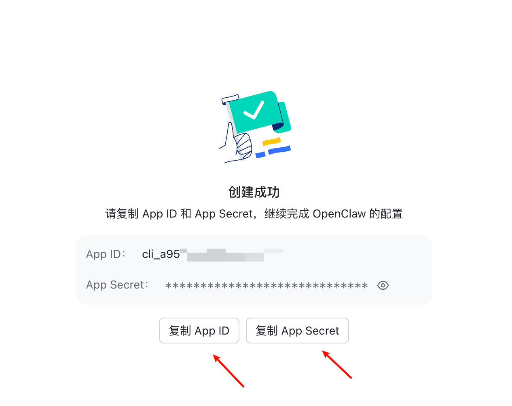
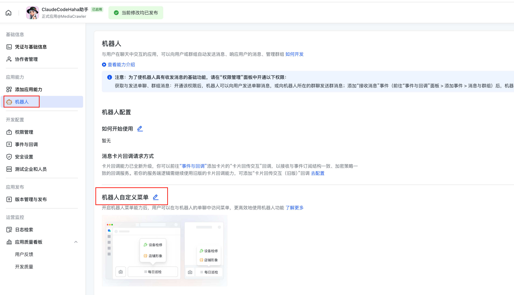
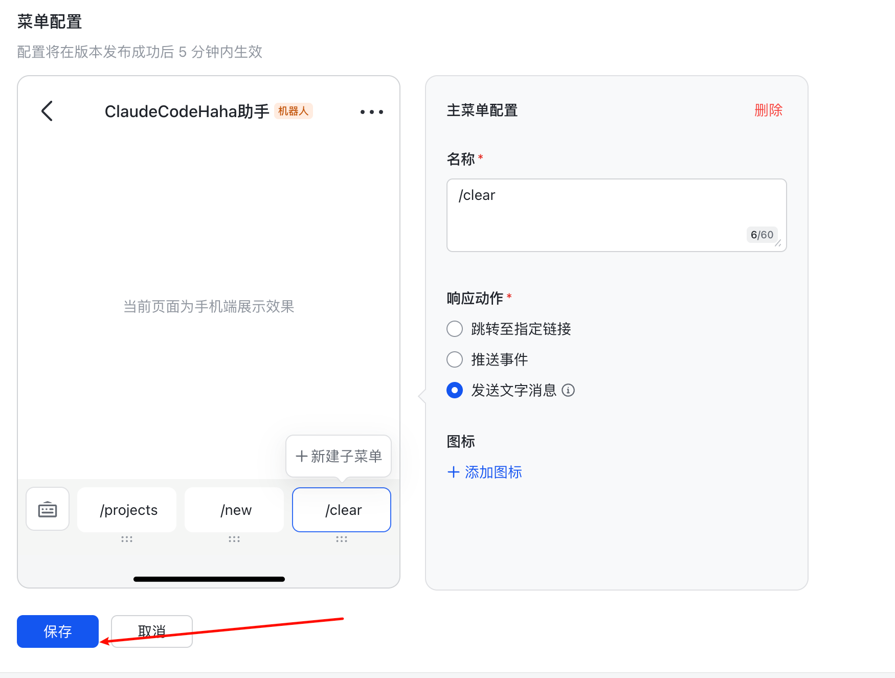
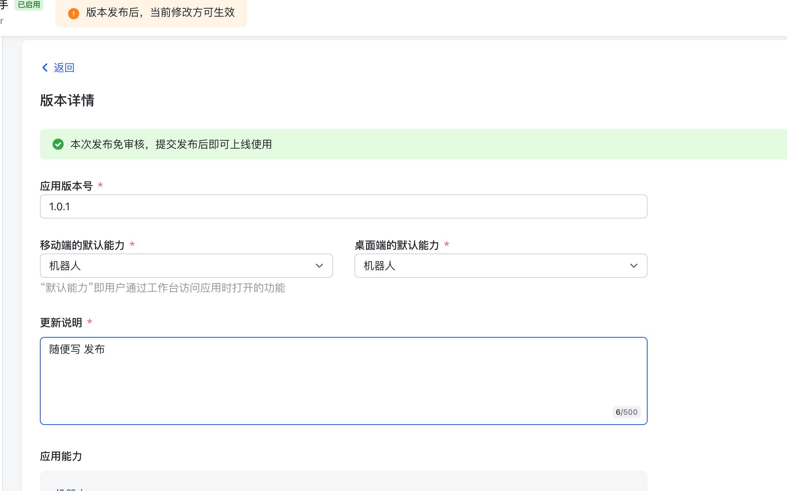
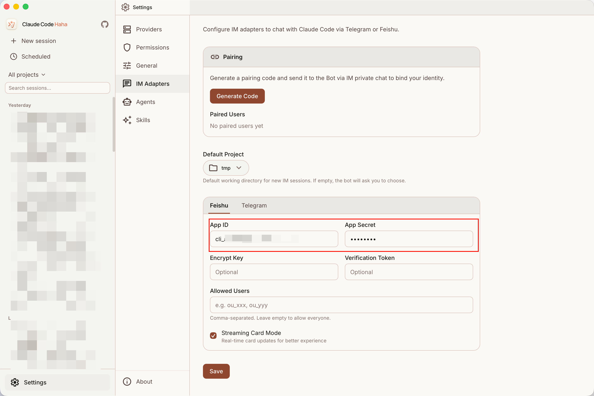
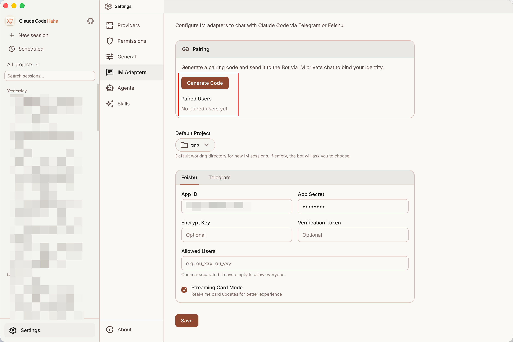
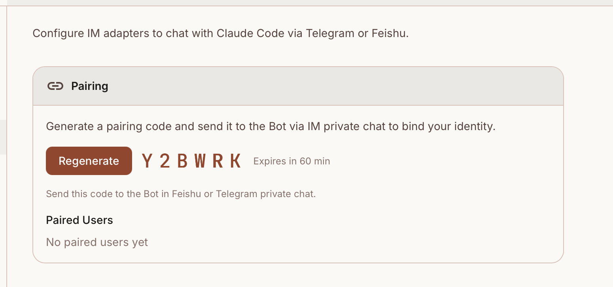
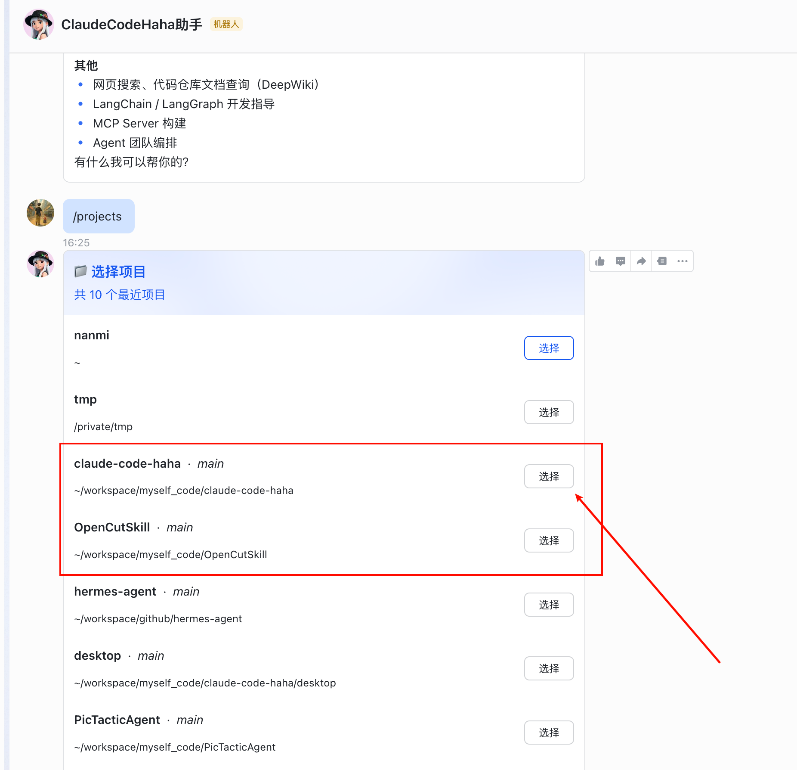
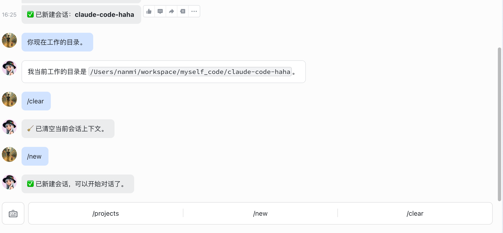

# 飞书接入

> 飞书 Adapter 的接入教程。官方已经提供了**预配好权限的模板机器人**，跟着下面几步点一点就能完成接入。

## 适用场景

飞书方案适合在中国区环境下通过企业自建应用私聊 Claude Code。当前实现只处理 `p2p` 私聊，不处理群聊。

实现入口：`adapters/feishu/index.ts`

## 先分清两个“飞书”

- **飞书开发者后台（网页）**：创建应用、拿 App ID / App Secret、开启机器人能力、配置事件和权限、发布安装。入口是 [open.feishu.cn/app](https://open.feishu.cn/app?lang=zh-CN)。
- **飞书 App（手机/电脑聊天客户端）**：像平时聊天一样私聊机器人，发送配对码和测试消息。

下面步骤里说“开发者后台”，指网页管理台；说“飞书 App”，指手机或电脑里的聊天软件。

## 1. 一键创建飞书机器人

直接打开下面的链接创建机器人——这是官方为 OpenClaw 提前配好所有权限（消息、事件、卡片回调等）的模板，省去手动配 scope 和事件订阅：

👉 [立即创建飞书机器人](https://open.feishu.cn/page/openclaw?form=multiAgent)


随便给你自己的机器人取一个名字，点击创建：



创建成功后，把 **App ID** 和 **App Secret** 保存下来，接着去配置机器人菜单。

## 2. 配置自定义菜单（/projects /new /clear）

进入[飞书开发者后台](https://open.feishu.cn/app?lang=zh-CN)，选择刚创建的机器人，进入机器人配置页：


进入「机器人菜单」开始配置：



依次添加 3 个命令：

**/projects** — 切换最近使用的项目


**/new** — 开启新对话


**/clear** — 清空上下文



三个都配好后点击保存：


最后点击「创建新版本并发布」让菜单生效：



**命令作用说明：**

- `/projects`：列出最近使用的项目，支持切换当前会话绑定的目录
- `/new`：开启新对话
- `/clear`：清空当前会话上下文

## 3. 在 Gugu Agent 桌面端填写

### 3.1 填写 App ID / App Secret

打开桌面端 `设置 → IM 接入 → 飞书`，把前面拿到的两把钥匙填进去：



### 3.2 保存并启动本地接入

填完 App ID / App Secret 后先做这两件事：

1. 点击页面底部的「保存」
2. 点击页面上方或飞书清单里的「启动/重启本地接入」

这一步很关键：飞书后台只负责把消息送出来，真正把消息转给本机 Claude 的是本地接入。只配置飞书后台但没有启动本地接入，手机端看起来能发消息，但桌面端不会继续处理。

如果不确定是否启动成功，可以点「检查配置」看本机诊断；正常情况下飞书通道应显示为已就绪。

### 3.3 生成配对码

点击「生成配对码」按钮，得到 6 位码：





生成新配对码后旧码会立即失效，请发送页面上最新的 6 位码。

## 4. 飞书机器人与桌面端配对

打开手机或电脑上的飞书 App，私聊刚才创建的机器人，按提示把上一步的 6 位配对码发给它：


看到配对成功提示后，就可以用飞书在手机上远程驱动桌面端 Gugu Agent 了：





## 支持的命令

除菜单按钮外，飞书 adapter 还支持文本命令和中文别名：

- `/help` 或 `帮助`
- `/status` 或 `状态`
- `/clear` 或 `清空`
- `/projects` 或 `项目列表`
- `/new` 或 `新会话`
- `/stop` 或 `停止`

## 权限审批

当 Claude 请求敏感权限时，adapter 会在飞书里发送交互卡片，点击「允许 / 拒绝」即可把结果回传给桌面端。

## 返回消息的表现

- 普通文本通过 `post` 消息发送
- 权限审批通过卡片发送
- 流式内容优先 patch 同一条消息
- 完成后按 30000 字左右分片

## 接入检查清单

普通用户不需要打开终端，按下面顺序检查即可。

### A. 本机 Gugu Agent

- 已打开 `设置 → IM 接入 → 飞书`
- 已填写 App ID / App Secret
- 已点击「保存」
- 已点击「启动/重启本地接入」
- 已生成配对码，并在飞书 App 里私聊 Bot 发送最新 6 位码

只有本地开发源码时才需要手动跑 `cd adapters && bun run feishu`。

### B. 飞书开发者后台（网页）

入口：[打开飞书开发者后台](https://open.feishu.cn/app?lang=zh-CN)

- 「添加应用能力」里已启用 `机器人`
- 「事件订阅」选择 `使用长连接接收事件`
- 事件里已添加 `im.message.receive_v1`（接收消息 v2.0）
- 如果使用项目选择或权限审批卡片，事件里还要添加 `card.action.trigger`
- 「权限管理 / API 权限」里已开通下面列出的 `im:message` 权限
- 修改事件或权限后，已经「创建版本并发布」，并把应用安装到当前企业/组织

### C. 先发什么测试

1. 先发送 6 位配对码，看到“配对成功”
2. 再发送 `你好`
3. 如果出现“正在思考中”但没有最终回复，说明飞书收发和配对已经通了，优先回到 Gugu Agent 点击「启动/重启本地接入」，再点「检查配置」

## 手动创建飞书应用时的权限

如果你没有用上面的一键模板，而是在飞书开放平台手动创建应用，需要逐项确认：

### 应用能力

- 启用 `机器人` 能力。

### 事件订阅

- 订阅方式：选择 `使用长连接接收事件`。
- 必须添加：`im.message.receive_v1`，也就是 `接收消息 v2.0`。
- 如果要使用项目选择/权限审批这些卡片按钮，再添加：`card.action.trigger`。

### 权限管理

纯文字私聊最少需要：

- `im:message.p2p_msg:readonly`：获取用户发给机器人的单聊消息。没有它，Bot 收不到你发的配对码。
- `im:message:send_as_bot`：以机器人身份发送消息。没有它，Bot 即使收到消息也无法回复。

可选能力：

- `im:resource`：截图发送、收发图片和文件时必须开通；纯文字聊天可以先不加。

改完权限和事件后，必须 `创建版本并发布`，并把应用安装到当前企业/组织。没有发布安装，手机端会看起来能发消息，但本地 adapter 收不到事件。

## 环境变量覆盖（可选）

```bash
export FEISHU_APP_ID="cli_xxx"
export FEISHU_APP_SECRET="xxx"
export ADAPTER_SERVER_URL="ws://127.0.0.1:3456"
```

## 常见问题

### 一键创建后的机器人权限够用吗？

OpenClaw 官方模板已预配 `im:message.p2p_msg:readonly`、`im:message:send_as_bot`、`im:resource`、`im.message.receive_v1`、`card.action.trigger` 等所需权限，**不需要再手动去配 scope 或事件订阅**。

### 收不到消息

优先检查：

- 本机是否点击过「启动/重启本地接入」
- 机器人是否已发布（菜单改完需要「创建新版本并发布」）
- 是否真的是和 bot 的私聊，而不是群聊
- 事件订阅是否包含 `im.message.receive_v1`
- 权限管理是否包含 `im:message.p2p_msg:readonly`

### 配对成功后一直“正在思考中”

这通常说明飞书消息已经送到了本机，但本机 Claude 会话没有正常返回。按顺序检查：

- 回到 `设置 → IM 接入 → 飞书`，点击「启动/重启本地接入」
- 点击「检查配置」，确认默认项目已设置、飞书通道已就绪
- 确认桌面端本身可以正常和 Claude 对话
- 如果你使用的是 API 环境变量，确认这些环境变量是在桌面 App 能读到的位置配置的，而不是只存在于某个终端窗口里

### 权限按钮点了没反应

通常是 `card.action.trigger` 没生效，重新在开发者后台发布一次版本即可。

### 一直提示未授权

- 配对码是否仍在 60 分钟有效期内
- 发的是不是桌面端当前这一枚（重新生成后旧的立即失效）
- `feishu.pairedUsers` 里是否已经写入当前 `open_id`

### 会话没恢复

检查 `~/.claude/adapter-sessions.json` 是否能正常写入，以及 Desktop server 里的 session 是否仍存在。

## 源码入口

- `adapters/feishu/index.ts`
- `adapters/common/pairing.ts`
- `adapters/common/session-store.ts`
- `adapters/common/ws-bridge.ts`
- `adapters/common/http-client.ts`
