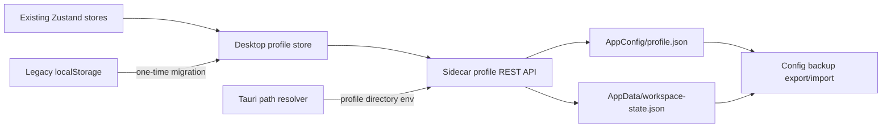

# Desktop User Profile And Persistence

## Summary

Build an app-owned persistence layer that automatically saves desktop preferences and recoverable work state, survives normal upgrades, migrates existing users without changing their choices, and offers an explicit way to remove local application data.

The design uses two bounded files instead of one monolith:

- `profile.json` in Tauri AppConfig for durable preferences.
- `workspace-state.json` in Tauri AppData for higher-churn recoverable state.

Provider, MCP, Agent, adapter, scheduled-task, and conversation data remain in their existing domain-owned files. Tokens and API keys are explicitly excluded from the profile files.

## Problem Frame

Desktop state is currently split across WebView localStorage, `~/.claude/settings.json`, `~/.claude/cc-haha/*.json`, and domain-specific files. Most settings survive upgrades today, but there is no single ownership contract, schema version, migration path, or reliable reset behavior. The recent theme conflict showed the practical consequence of two sources of truth.

The product contract is:

1. User choices save automatically without a global Save button.
2. Normal application updates preserve choices and recoverable work state.
3. Existing users keep their current values after migration.
4. Corrupt or unavailable profile storage must not prevent the app from starting.
5. Full data removal is explicit and does not run during an updater-driven replacement.

## Scope Boundaries

### In Scope

- Desktop-only appearance, language, layout, project-list, tab, draft, and tool-selection state.
- Versioned schemas, validation, atomic writes, migration, fallback, export/import, and reset.
- Tauri AppConfig/AppData path resolution passed to the sidecar.
- Windows updater/uninstaller verification and a cross-platform in-app data reset action.
- Browser development and tests through an explicit temporary profile directory.

### Out Of Scope

- Moving conversations, AgentTask events, evidence packs, providers, MCP, Agents, skills, plugins, adapters, or scheduled tasks into the profile files.
- Moving API keys or OAuth tokens into profile files.
- Cloud sync, multi-device sync, roaming accounts, telemetry, or analytics.
- Changing `gateway`.

### Deferred Follow-Up

- OS-backed secure storage migration for existing provider and OAuth secrets.
- Optional cloud backup after the local profile contract is stable.

## Current State

| Category | Current owner | Planned owner |
|---|---|---|
| Theme and language | localStorage, with historical overlap in `~/.claude/settings.json` | `profile.json`, with theme mirrored as a first-paint cache |
| Sidebar/workbench widths and collapsed state | localStorage | `profile.json` |
| Pinned/hidden projects and open tabs | localStorage | `workspace-state.json` |
| Composer drafts | localStorage, bounded to 50 drafts | `workspace-state.json`, preserving current limits |
| Agent run mode, workflow role, session runtime | localStorage | `profile.json` for defaults and `workspace-state.json` for session-specific choices |
| Model, effort, permission mode, default workdir | `~/.claude/settings.json` | Remains CLI/domain owned; profile must not duplicate it |
| Providers, attachment parser, adapters, MCP, Agents | Existing domain files | Remains domain owned and included through config backup |
| Tokens and API keys | Existing domain/auth files | Remains excluded from profile files |

## Key Decisions

1. **Sidecar owns file I/O.** The existing desktop UI already uses sidecar REST APIs, so profile persistence follows that path instead of adding a Tauri Store dependency or a second frontend-only storage system.
2. **Tauri chooses the production directory.** `desktop/src-tauri/src/lib.rs` resolves AppConfig/AppData and passes them to the sidecar through a dedicated environment variable. Tests and browser development provide an explicit temporary directory.
3. **One authoritative value per setting.** Once migrated, profile files win. Legacy localStorage is only a migration source. Theme may remain mirrored locally only to avoid a bright first frame while the sidecar starts.
4. **Separate durable preferences from high-churn recovery state.** Draft typing and tab changes must not rewrite the durable profile on every keystroke.
5. **Reuse current domain stores.** Existing Zustand stores keep their public behavior and delegate persistence to the profile store; no new generic settings framework is introduced.
6. **Atomic, serialized writes.** Validate with the installed Zod version, write a sibling temporary file, then rename under a per-file write lock. Keep one last-known-good backup after successful schema upgrades.
7. **Migration is one-way but non-destructive for one release.** Mark migration completion only after both files are durable. Keep legacy localStorage keys for rollback during the first release, but stop reading them after migration succeeds.

## High-Level Design

## Phased Delivery

| Phase | Delivery | Estimate |
|---|---|---:|
| C0 | Data contract, inventory, ADR, migration fixture | 1 day |
| C1 | Profile/state service, REST API, Tauri path handoff | 2 days |
| C2 | Appearance, language, layout migration | 2 days |
| C3 | Projects, tabs, drafts, and tool-state migration | 3 days |
| C4 | Backup/import, reset, updater/uninstaller behavior | 2 days |
| C5 | Upgrade E2E, corruption recovery, compatibility hardening | 2 days |

**Expected total:** 12 engineering days for one developer. Allow 2.5 calendar weeks including review and Windows/macOS verification. A narrower preferences-only release through C2 is usable after 5 days, but it does not yet satisfy the full work-state requirement.

## Implementation Units

### U1: Profile Contract And Path Ownership

**Phase:** C0

**Files:**

- `docs/decisions/desktop-user-profile-storage.md`
- `desktop/src/types/desktopProfile.ts`
- `src/server/types/desktopProfile.ts`

**Design:**

- Define versioned, bounded schemas for durable preferences and recoverable state.
- Document the ownership table and explicitly exclude domain data and secrets.
- Keep schema defaults aligned with current product behavior, including default theme `dark`.

**Tests:**

- Valid v1 profiles parse without dropping known fields.
- Unknown or malformed values fall back per field rather than invalidating the whole file.
- Oversized drafts and excessive draft counts are pruned to current limits.

### U2: Atomic Profile Service And REST API

**Phase:** C1

**Files:**

- `src/server/services/desktopProfileService.ts`
- `src/server/api/desktop-profile.ts`
- `src/server/router.ts`
- `src/server/__tests__/desktop-profile.test.ts`
- `desktop/src/api/desktopProfile.ts`

**Design:**

- Add read, section-patch, and reset operations for the two files.
- Serialize writes per file and use temp-file rename.
- On corrupt JSON, preserve the bad file with a timestamped suffix, restore the last-known-good backup when available, and otherwise return validated defaults.
- Do not expose arbitrary filesystem paths through the API.

**Tests:**

- First run returns defaults and creates files only on the first write.
- Concurrent patches to different sections do not lose data.
- Interrupted/corrupt writes recover from backup or defaults.
- Invalid and oversized payloads are rejected at the API boundary.
- Reset removes only app-owned profile/state files.

### U3: Tauri Directory Handoff

**Phase:** C1

**Files:**

- `desktop/src-tauri/src/lib.rs`
- `desktop/src-tauri/windows-installer-hooks.nsh`
- `desktop/src-tauri/tauri.conf.json`

**Design:**

- Resolve Tauri AppConfig and AppData directories during sidecar startup and pass them through app-owned environment variables.
- Keep the existing application identifier and WiX upgrade code stable.
- Do not add deletion to the existing pre-uninstall process-kill hook; deletion behavior is validated separately in C4.

**Tests:**

- Rust path-resolution checks cover Windows, macOS, and fallback errors.
- Sidecar startup receives both resolved directories in development and packaged modes.

### U4: Frontend Bootstrap And Legacy Migration

**Phase:** C2

**Files:**

- `desktop/src/stores/desktopProfileStore.ts`
- `desktop/src/stores/desktopProfileStore.test.ts`
- `desktop/src/components/layout/AppShell.tsx`
- `desktop/src/stores/settingsStore.ts`
- `desktop/src/stores/uiStore.ts`
- `desktop/src/stores/workbenchStore.ts`

**Design:**

- Load the profile during the existing AppShell bootstrap before restoring tabs.
- On first profile run, read and validate known legacy localStorage keys, patch the profile once, then mark migration complete.
- Mirror only the theme as a synchronous first-paint cache; profile remains authoritative after hydration.
- Low-frequency preference changes write immediately. Width changes commit at drag end rather than on every pointer move.
- If the profile API is unavailable, continue with current in-memory/local fallback and surface a non-blocking warning.

**Tests:**

- Existing local dark/color themes, language, and layout values survive first migration.
- A conflicting `~/.claude/settings.json` theme cannot override the desktop profile.
- Missing legacy values use product defaults.
- Failed migration does not mark completion or delete legacy values.
- A cleared WebView cache rehydrates the theme from profile on next launch.

### U5: Workspace And Tool-State Migration

**Phase:** C3

**Files:**

- `desktop/src/stores/tabStore.ts`
- `desktop/src/stores/sessionStore.ts`
- `desktop/src/stores/agentRunModeStore.ts`
- `desktop/src/stores/ceWorkflowRoleStore.ts`
- `desktop/src/stores/sessionRuntimeStore.ts`
- `desktop/src/components/chat/composerDrafts.ts`
- Focused tests beside each store/module above

**Design:**

- Move pinned/hidden projects, persistable tabs, drafts, and tool selections behind the profile store.
- Debounce draft persistence and flush on send, session switch, and window close.
- Keep draft tabs and terminal tabs non-persistent, matching current behavior.
- Preserve existing caps and pruning rules so state files remain bounded.

**Tests:**

- Restart restores the same persistable tabs and active tab.
- Draft text survives restart but clears after successful send.
- Pinned/hidden project state and per-session tool selections migrate without duplication.
- Rapid edits coalesce and the last value wins.
- A failed state write never blocks chat input or session switching.

### U6: Backup, Reset, And Uninstall Semantics

**Phase:** C4

**Files:**

- `src/server/services/configBackupService.ts`
- `src/server/__tests__/config-backup.test.ts`
- `desktop/src/pages/Settings.tsx`
- `desktop/src/api/configBackup.ts`
- `desktop/src-tauri/windows-installer-hooks.nsh`

**Design:**

- Export/import profile and recoverable state through the existing `guiPreferences` backup section with a format-version bump.
- Add an explicit Settings action to reset app-owned local profile/state after confirmation.
- On Windows, verify Tauri NSIS's application-data removal option and updater `/UPDATE` behavior instead of deleting blindly in hooks.
- On macOS, document that dragging an app to Trash cannot run cleanup code; the in-app reset action is the supported complete-data removal path.

**Tests:**

- Export/import round-trips profile values without secrets.
- Older v1 backup packages still import.
- Reset leaves CLI/domain files and conversations untouched.
- Windows manual uninstall with data removal deletes profile/state; updater replacement preserves them.

### U7: Upgrade And Recovery Hardening

**Phase:** C5

**Files:**

- `desktop/scripts/` focused persistence smoke script
- `.github/workflows/release-desktop.yml` only if CI packaging coverage is required
- `docs/desktop-user-data.md`

**Design:**

- Build an isolated packaged-app smoke that seeds v1 state, upgrades/relaunches, and compares the resulting profile.
- Exercise corrupt profile, unwritable directory, missing WebView cache, and downgrade fallback paths.
- Add diagnostics that report profile path, schema version, and last persistence error without exposing values or secrets.

**Tests:**

- Upgrade preserves all acceptance-fixture values.
- Relaunch after WebView cache loss restores durable preferences.
- Corrupt files recover without startup failure.
- Persistence errors are visible in diagnostics and do not leak configuration contents.

## Rollout

1. Release C1-C2 behind the existing startup fallback: profile is authoritative when healthy, legacy localStorage remains available for rollback.
2. Observe migration and write failures locally through diagnostics; no usage telemetry is added.
3. Ship C3 only after preference migration is stable.
4. Keep legacy keys for one release, then remove their readers in the following release after upgrade tests pass.

## Risks And Mitigations

| Risk | Mitigation |
|---|---|
| Two sources of truth reappear | Central ownership table; stores may cache but cannot independently hydrate persisted values |
| High-frequency writes damage performance or storage | Separate state file, debounce drafts, commit dimensions at drag end |
| Migration loses a user's current values | Validate per key, write first, mark migration second, retain legacy keys for one release |
| Updater is mistaken for uninstall | Use Tauri updater `/UPDATE` behavior and packaged E2E; never delete in generic pre-uninstall hook |
| macOS drag-to-Trash leaves data | Provide in-app reset and document platform limitation |
| Profile becomes a secret dump | Schema excludes secret fields; API rejects unknown secret-bearing sections |
| Profile corruption blocks startup | Backup, quarantine corrupt files, default fallback, non-blocking diagnostics |

## Definition Of Done

- Every desktop-owned preference has one documented durable owner.
- A user can change settings, restart, update, and retain the same values.
- Existing localStorage users migrate without a visible theme/language/layout change.
- Profile/state corruption cannot block startup.
- Export/import includes profile data and excludes secrets by default.
- Windows update preserves data; explicit uninstall data removal works.
- macOS has an explicit in-app reset path.
- Focused tests, desktop lint/build, packaged smoke, and `git diff --check` pass.
- `gateway` remains untouched.

## References

- Tauri AppConfig/AppData filesystem directories: https://v2.tauri.app/plugin/file-system/
- Tauri Windows installer and NSIS hooks: https://v2.tauri.app/distribute/windows-installer/
