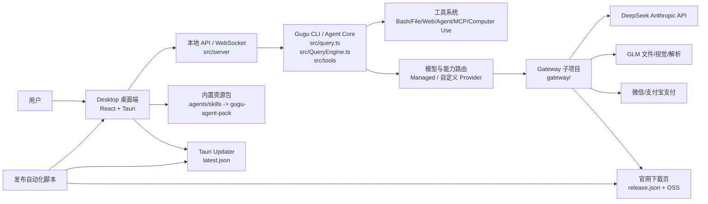
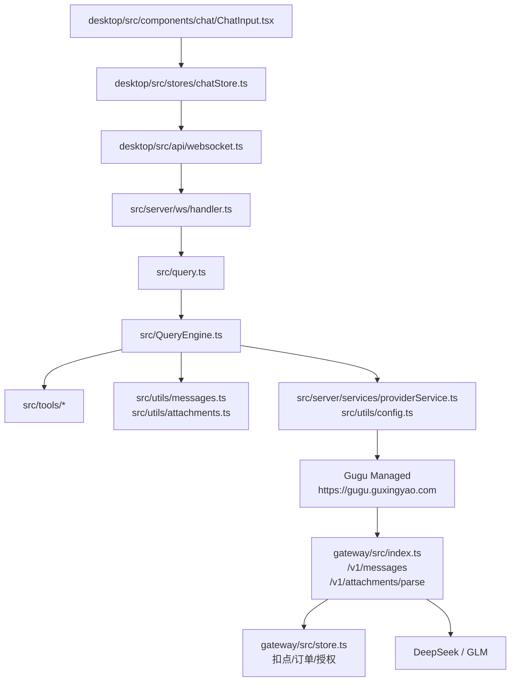
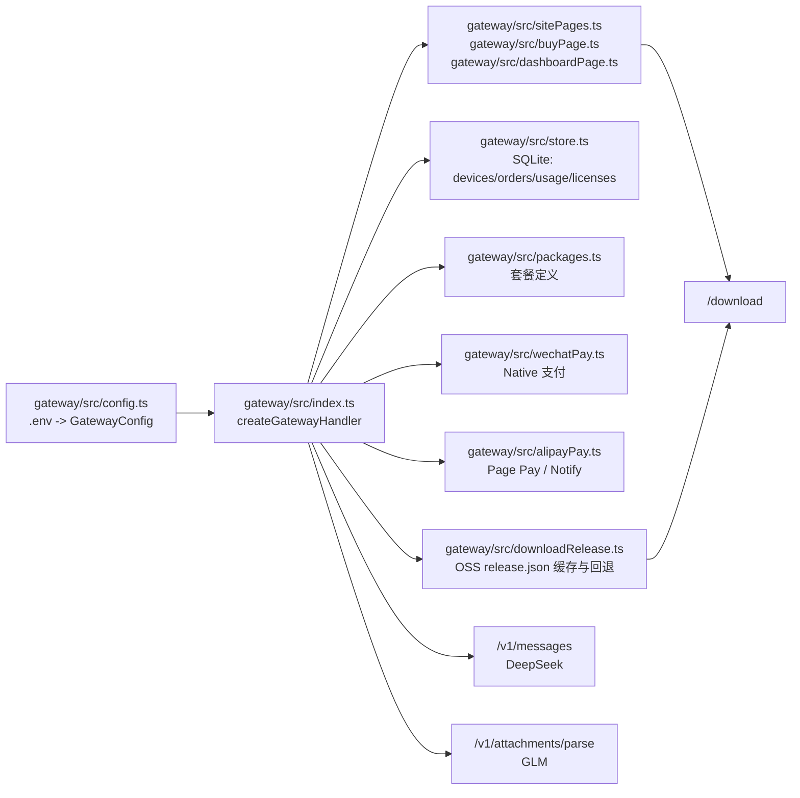
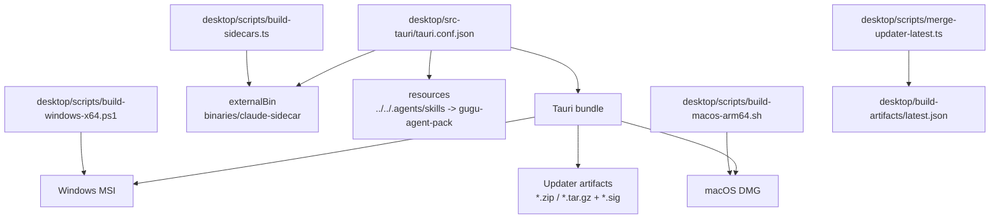
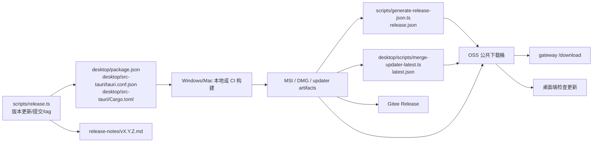
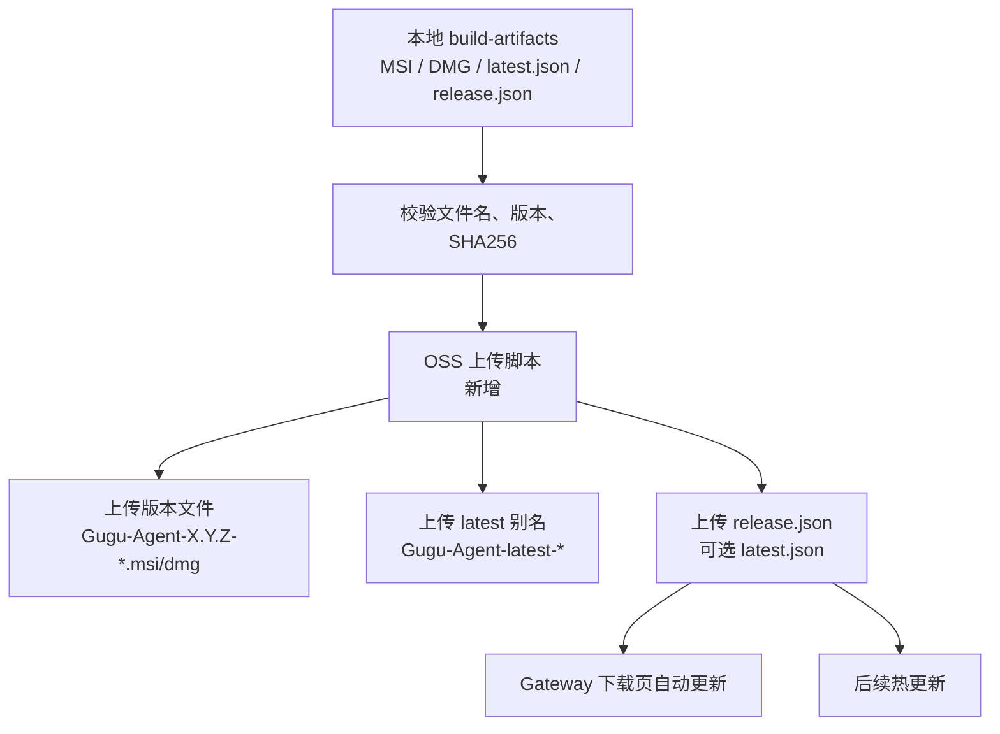

# Gugu Agent 项目知识图谱

生成时间：2026-05-24  
生成方式：`codegraph init -i .` + 重点文件复核  
CodeGraph 快照：3008 个文件，53779 个符号节点，140282 条关系边；语言覆盖 TypeScript、TSX、Rust、JavaScript、Python、YAML。

## 总览

项目实际上是三条主线叠在一起：

- 桌面产品线：`desktop/` 负责用户界面、Tauri 打包、内置 sidecar 与资源包。
- Agent/CLI 线：`src/` 负责会话、工具、模型路由、本地服务和桌面 WebSocket 通信。
- Gateway 线：`gateway/` 是独立 git 子项目，负责官网、下载页、支付、订阅、托管模型转发与后台。

## 运行时链路

关键观察：

- 桌面端不直接负责托管扣点，托管能力走 gateway。
- 大文件/压缩文件的用户体验，主要交界在 `desktop/src/stores/chatStore.ts`、`src/utils/attachments.ts`、`src/server/services/archiveExtractionService.ts`、`gateway/src/index.ts` 的附件限制。
- 记忆/会话丢失类问题要同时看桌面 store 和 `src/server/services/conversationService.ts`。

## Gateway 知识图谱

Gateway 当前值得记住的边界：

- `gateway/` 是 git 子项目，改完需要在 `gateway` 内提交，再回到父仓库提交子模块指针。
- 下载页优先读 `GUGU_DOWNLOAD_RELEASE_JSON_URL` 指向的 `release.json`；读取失败会回退 `.env` 静态下载配置。
- 支付订单在 `POST /v1/orders` 创建，微信/支付宝可以复用同一订单号切换支付方式。
- 运营后台仍然是人工兜底入口，自动支付失败不能影响人工发码。

## 桌面打包图谱

打包必须关注：

- `desktop/src-tauri/tauri.conf.json` 里 `resources` 当前把 `../../.agents/skills` 打成 `gugu-agent-pack`。agents、plugins、skills 如果继续放在这个包树下，发布包才能带上。
- `createUpdaterArtifacts` 依赖 Tauri updater 签名密钥；没有签名密钥时，本地 Windows 脚本会关闭 updater artifacts。
- `desktop/scripts/merge-updater-latest.ts` 负责把双平台 updater manifest 合并成 OSS 使用的 `latest.json`。

## 发布自动化图谱

Phase 1 已落地的节点：

- `scripts/generate-release-json.ts`：根据版本、artifact 或手工 SHA256 生成 `release.json`。
- `gateway/src/downloadRelease.ts`：读取 OSS `release.json`，带成功/失败缓存和静态配置回退。
- `gateway/src/index.ts`：`/`、`/download`、`/admin/api/download` 使用动态下载配置。

Phase 2 要做的最小闭环：

建议 Phase 2 只做 OSS 上传脚本，不碰 CI，不碰 Gitee Release：

- 输入：现有本地打包产物和 `release.json` / `latest.json`。
- 输出：OSS 上的版本文件、latest 别名、`release.json`、可选 `latest.json`。
- 安全：AccessKey 只从环境变量读，不写入仓库；默认 dry-run，真实上传需要显式参数。
- 回退：OSS 上传失败不影响本地 artifact；gateway 仍能回退旧配置。

## 重点文件索引

| 领域 | 文件 | 作用 |
| --- | --- | --- |
| 发布版本 | `scripts/release.ts` | 更新版本文件、校验 release notes、生成 commit/tag |
| 下载元数据 | `scripts/generate-release-json.ts` | 生成官网 `release.json` |
| 热更新元数据 | `desktop/scripts/merge-updater-latest.ts` | 合并 Tauri updater `latest.json` |
| Windows 打包 | `desktop/scripts/build-windows-x64.ps1` | 本地 Windows MSI 构建，签名缺失时处理 updater artifacts |
| macOS 打包 | `desktop/scripts/build-macos-arm64.sh` | Apple Silicon DMG 与 updater artifact 构建 |
| Tauri 配置 | `desktop/src-tauri/tauri.conf.json` | bundle、resources、updater endpoint、externalBin |
| Gateway 配置 | `gateway/src/config.ts` | `.env` 到 `GatewayConfig` |
| Gateway 主路由 | `gateway/src/index.ts` | 官网、支付、托管模型、后台 API |
| 下载配置 | `gateway/src/downloadRelease.ts` | 从 OSS 读取 `release.json` 并回退 |
| 官网页面 | `gateway/src/sitePages.ts` | 首页/下载页 HTML |
| 购买页 | `gateway/src/buyPage.ts` | 套餐、结算、微信/支付宝 UI |
| 支付 | `gateway/src/wechatPay.ts` / `gateway/src/alipayPay.ts` | 下单、签名、回调验签 |
| 桌面通信 | `desktop/src/api/websocket.ts` / `src/server/ws/handler.ts` | 前后端会话流 |
| 会话持久化 | `src/server/services/conversationService.ts` | 历史记录与恢复 |
| 附件处理 | `src/utils/attachments.ts` / `src/server/services/archiveExtractionService.ts` | 文件拖拽、压缩包、本地解析 |

## 风险雷达

- 子项目边界：`gateway/` 是 submodule，发布相关改动不能只提交父仓库。
- 资源打包：agents/plugins/skills 的打包边界是 `.agents/skills`，新增资源若放到别处，需要同步 Tauri resources。
- 热更新：`latest.json` 必须和签名 artifact 匹配；没有 `TAURI_SIGNING_PRIVATE_KEY` 时不要假装热更新产物完整。
- 下载页：`release.json` 是官网自动更新的入口，OSS 缓存策略会影响用户看到新版本的速度。
- 品牌文案：对外页面和桌面 UI 继续避免不必要的上游品牌描述，内部文件名短期保留不影响用户可见体验。
- 大文件：压缩包/大附件不应上传 gateway 托管解析；优先本地解压、本地目录分析，再按需调用模型。

## 后续工作记忆

Phase 2 开始时优先从这里切：

1. 新增 `scripts/upload-release-oss.ts`，只读环境变量，不保存密钥。
2. 复用 `scripts/generate-release-json.ts` 的命名规范与 SHA256 逻辑。
3. 上传时同时覆盖版本文件和 latest 别名。
4. 上传前校验 `desktop/src-tauri/tauri.conf.json` 版本、artifact 文件名、`release-notes/vX.Y.Z.md` 三者一致。
5. 完成后用 `gateway/src/downloadRelease.ts` 的现有测试方式补一条 release.json 远程更新验收。
